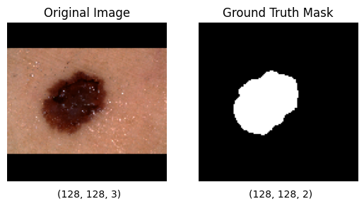

_45807152 LAUGHER, George_

# Improved UNet Model for Segmenting the ISIC Lesion Data Set
This recognition solution features an algorithm documented as an [Improved UNet Model](https://arxiv.org/pdf/1802.10508v1.pdf) and utilises the [2017 ISIC Challenge Dataset](https://challenge.isic-archive.com/data/#2017) to perform skin lesion segmentation.

## The Problem Scope
The utilisation of deep learning recognition systems in the medical field are becoming increasingly popular and in demand due to their increasing performance in recent years. In particular, with skin cancer being one of the most common types of cancer in Australia, efficient and effective skin cancer screening is vitally important. Thus, using a deep learning (DL) framework and inspiration from the [Improved UNet Model](https://arxiv.org/pdf/1802.10508v1.pdf) research paper, this recognition solution aims to segment images of skin lesions with a minimum [Dice similarity](https://en.wikipedia.org/wiki/S%C3%B8rensen%E2%80%93Dice_coefficient) coefficient of **_0.8_** when testing. The dice similarity coefficient in addition to the [Intersection over Union (IoU)](https://en.wikipedia.org/wiki/Jaccard_index) metric will be used to evaluate model performance and compare the expected segmentation mask to the models predicted mask. In both metrics, _1.0_ represents a _100% match_.

## Algorithm Description and Function
The improved UNet model is a convolutional neural network (CNN) that features a 'U' shape that decodes an input image through various convolution and context layers, then, re-encodes a segmentation mask through up-sampling and localisation layers. As shown in the below model architecture, the **localisation pathway** (_right-hand-side_) of the CNN receives gradient signals from the **context pathway** (_left-hand-side_) through injections at each level for enhanced deep learning.

Levels represent the vertical depth within the 'U' shaped with higher levels being of lower spatial resolution, but higher feature representation. In more detail, 3x3x3 convolution layers are used with a stride of 2 to reduce the resolution of the image during the context pathway. Furthermore, during the localisation pathway, up-sampled features are recombined with the features from the corresponding level of context aggregation via concatenation.

## How It Works
The recognition solution is implemented using TensorFlow _(version 2.9.1)_ and divided into multiple Python files,
* **modules.py** - contains Improved UNet model class and components. From here, the UNet CNN can be built.
* **dataset.py** - provides a data loader for the 2017 ISIC data. Performs pre-processing to image and mask data.
* **train.py** - used to train the Improved UNet model on the 2017 ISIC data. Provides useful plots, metrics and prediction comparisons to evaluate segmentation performance.
* **predict.py** - contains functions to predict segmentation mask from a trained model. Provides comparison plots to ground truth.
* **utility.py** - contains metric calculations used when training, validating and testing the Improved UNet model.
* **config.py** - provides the ability to adjust system parameters including pre-processed image dimensions and training epochs.

Through the training pipeline, firstly, the ISIC images and masks are loaded into the _dataset_ and pre-processing is performed. 
### Data Pre-Processing
In this case, pre-processing consisted of **resizing** the images to _width=128_, _height=128_ and _channels=3_. Due to the non-uniform nature of each image, the resizing was performed with padding to ensure no features were lost. The ground truth segmentation masks were also resized to dimensions of _width=128_, _height=128_ and _channels=1_ (black and white input image).

After the data was resized, each image was normalised such that its values ranged between _[0, 1]_.

Finally, one-hot encoding with 2 classes was mapped to the processed masks to formulate a mask shape of _(128, 128, 2)_ where the last 2 channels represented the Boolean segmentation of a lesion or non-lesion pixel.

See below for an example processed image and mask plot.

### Dataset Splitting
The ppre-processed dataset was then split into training, validation and testing subsets. This was done so in a _80/10/10_ breakdown to ensure adequate data to train the model with. Ideally, the split would be closer to _70/20/10_ however this could result in diminished training given the relatively small dataset of 2000 images.

### UNet Model Creation
The _modules.py_ file is then utilised to load in an Improved UNet Model with the resized image dimensions, 16 filters and a kernel size of 3x3. These configuration parameters were established within the [Improved UNet research paper](https://arxiv.org/pdf/1802.10508v1.pdf).

The model is then built by following the architecture identified and shown above with a vertical depth approach. The input layer is specified to be the dimensions of the input data images and the output layer is designed to be the same shape as the one-hot encoded lesion masks. For more information and model layer explanation, please see comments within _[modules.py](./modules.py)_.

The model summary can be seen [here](./figures/modelSummary.txt), altogether there are _2,949,538_ trainable parameters.

The model is then compiled using the _Adam_ optimiser and the _Binary Cross Entropy_ loss function, additionally, from the _utility.py_ file, dice coefficient and IoU were added as training metrics.

### Model Training
The model was then subjected to training using the training and validation subsets of data. 90 Epochs was found to be an adequate training duration as the model appears to dramatically flatten improvement at around 60 epochs (with much more being unnecessary). Given the GPU assisted computing system available, batch size was set to 64 to increase training speed.

Once the model was trained, it was exported as a trained TF model.

### Model Testing
Using the _make_prediction_ function within _[predict.py](./predict.py)_, the model can be tested using the reserved test data subset. Calling _make_prediction_ generates plots which compare the predicted lesion segmentation to the original image and ground truth segmentation. Furthermore, the dice coefficient and IoU metrics can be assessed.

## Results
Overall, the model performed very well and from investigating the training history, it is clear the loss was minimised as the dice coefficient and IoU metrics approached _1.0_.

Loss                       |  Dice Coefficient         |  Intersection Over Union
:-------------------------:|:-------------------------:|:-------------------------:
   |  | 

Evaluating the model performance resulted in the following testing metrics:

Dice Coefficient           |   Intersection Over Union (IoU)
:-------------------------:|:-------------------------:
**0.9528**                 |  **0.9104**

Furthermore, to visually evaluate the performance against 'unseen' data, the model was made to predict the segmentation mask from the test subset images. Below are the resulting comparisons between the original image, ground truth segmentation mask and the segmentation prediction. The dice coefficient and IoU metric for each prediction is also noted.

Prediction Evaluation      
:-------------------------:

As you can see, from visual inspection, the model has successfully segmented the image into lesion and non-lesion regions. Furthermore, the model having a dice coefficient of **_0.9528_** and IoU of **__0.9104__** indicates very accurate segmentation. These results are greater than the dice coefficient target of _0.8_ indicating successful and adequate training for the scope of this problem.

### Reproducibility of Results
From experimental testing, these results have been very replicable and indicate a foundationally strong CNN model.

### Further Improvements
To further optimise this model and generate even more accurate predictions, several factors can be adjusted. Firstly, data augmentation can be introduced to synthetically increase the sample size available. Existing images could be flipped or rotated such that more data is available for training.
As evident in the above graphs, it is unlikely the model made will benefit from additional epochs, and as such, model adjustments could be made to increase precision. This could include expanding the input image dimensions from 128x128 to 256x256 or beyond.

## Dependencies
The following dependencies are required:
* TensorFlow _(version 2.9.1)_
* matplotlib _(version 3.5.3)_
* glob _(version 3.5)_
* numpy _(version 1.22.4)_

## References
* Brain Tumor Segmentation and Radiomics Survival Prediction: Contribution to the BRATS 2017 Challenge (https://arxiv.org/abs/1802.10508)
* Sørensen–Dice coefficient (https://en.wikipedia.org/wiki/S%C3%B8rensen%E2%80%93Dice_coefficient)
* Jaccard Index (https://en.wikipedia.org/wiki/Jaccard_index)
* Detection of Skin Cancer Based on Skin Lesion Images Using Deep Learning (https://www.ncbi.nlm.nih.gov/pmc/articles/PMC9324455/)

