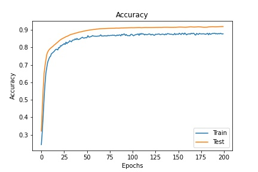
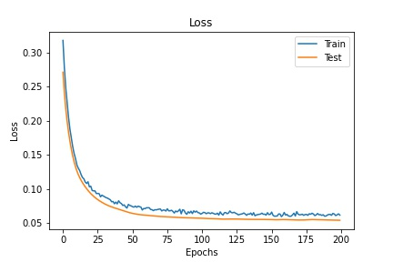

# GCN Model Classification Using the Facebook Network Dataset

## Problem

Creating a multi-layer graph convolutional network model to conduct a semi-supervised multi-class node classification on the Facebook Large Page-Page Network.

### Facebook Large Page-Page Network

The dataset is an undirected page-page graph of Facebook sites. In which the nodes represent official Facebook pages, and the edges, the mutual likes between sites. 
The set includes pages from the categories: politicians, governmental organisations, television shows, and companies.

#### Summary of Dataset:

- Number of nodes = 22,470
- Number of edges = 171,002
- Density = 0.001
- Transitivity = 0.232

## Algorithm Description 

The model implemented a graph convolutional network, as described by Thomas N. Kipf (2016).
It uses the three matrices provided in the Facebook dataset: 
- an N x N adjacency matrix
- an N x D feature matrix
- an N x E label matrix
Where N is the number of nodes, D the number of features per node, and E the number of classes.

This data is loaded and preprocessed, before it is used to build and train the GCN model.
The preprocessing also includes normalisation of the adjacency matrix, for better scalability.

### How It Works

- The algorithm works by splitting the processed data into a train, validate, test split, of 20:20:60. As the goal is to use a semi-supervised learning approach, the labelled data is to be kept to a smaller ratio to the unlabelled data, hence the choice of a 20:20:60 split. This was done by random sampling and applying a mask to the datasets.

- The GCN model applies a weight to the inputs (the adjacency matrix and features) in order to create the multiple layers of the GCN. The final layer produces a prediction of the classes, which can then be visualised using a t-SNE plot.

### Dependencies

- Tensorflow 2.5.0
- Python 3.9.6
- numpy 1.20.3
- matplotlib 3.4.2
- scikit-learn 0.24.2

### Example Results

## Visualisation
A t-distributed Stochastic Neighbour Embedding (t-SNE) plot was used to visualise the result.

## References

Mayachita (2020). Training Graph Convolutional Networks on Node Classification Task. Retrieved from:
<https://towardsdatascience.com/graph-convolutional-networks-on-node-classification-2b6bbec1d042>

B. Rozemberczki, C. Allen, and R. Sarkar, “Multi-scale Attributed Node Embedding,” arXiv:1909.13021 [cs, stat], Mar. 2021, arXiv: 1909.13021. [Online]. Available: <http://arxiv.org/abs/1909.13021>

Thomas N. Kipf, Max Welling, Semi-Supervised Classification with Graph Convolutional Networks, 2016)
