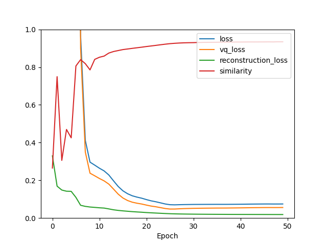
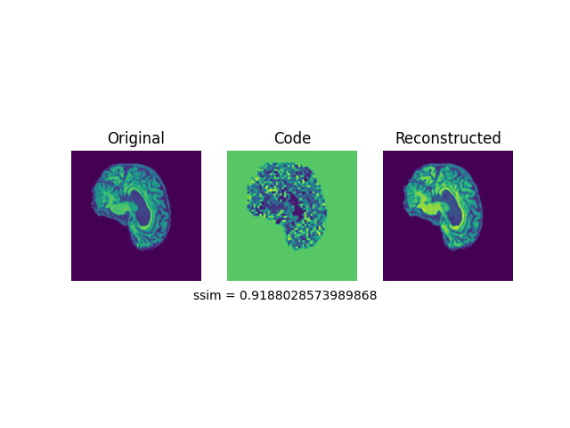
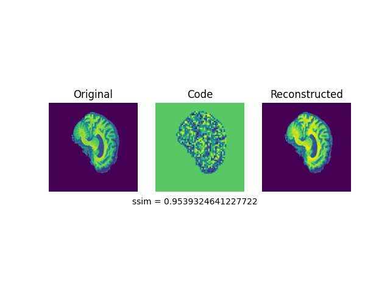
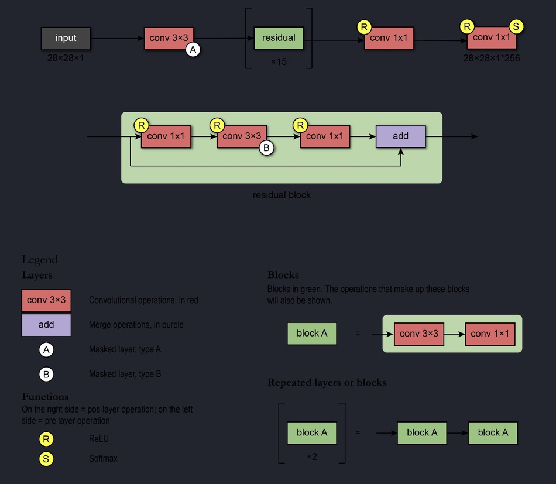
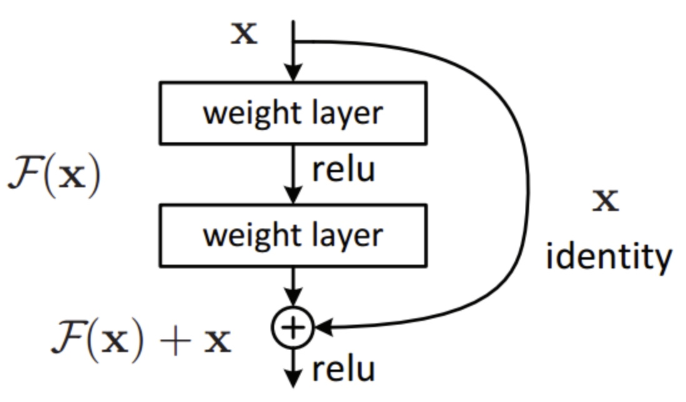
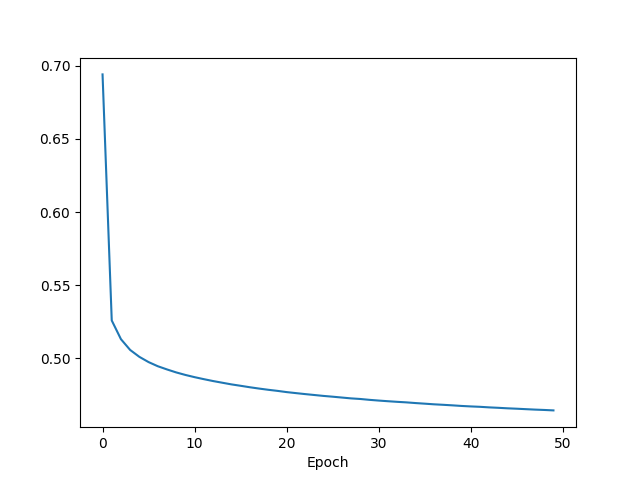
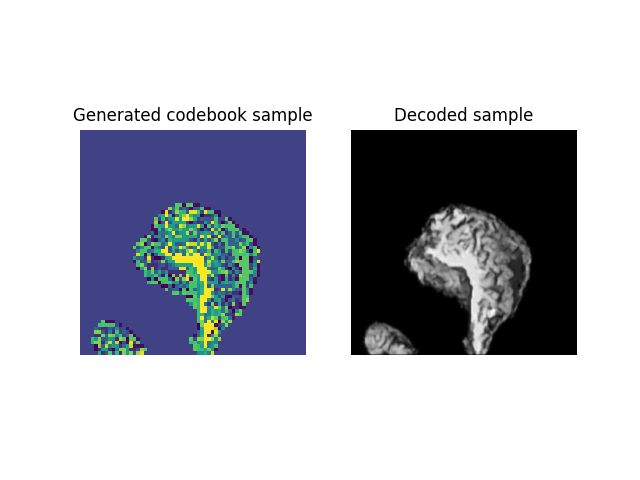
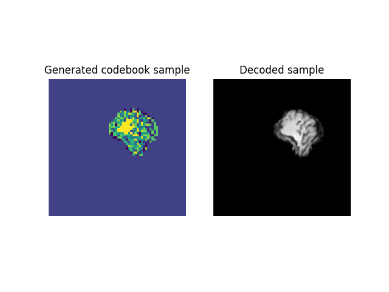
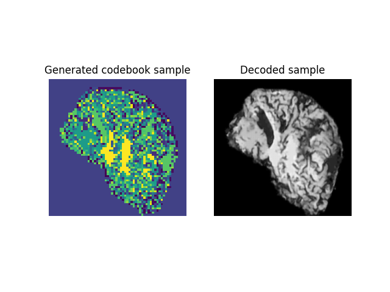
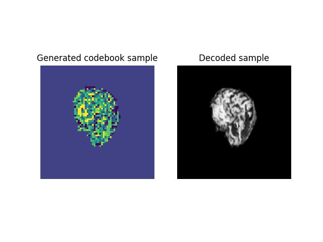

# **VQVAE on ADNI dataset to generate new brain samples**
## **Overview**
This project aims to create a generative model for the ADNI dataset using VQVAE and PixelCNN. We use VQVAE to create discrete latent codebooks for which we will feed into PixelCNN to learn how to generate new codebook images that will decode into new brain images. We look to achieve this by getting at least 0.6 SSIM in the VQVAE model.

# **Models**

## **VQVAE Model**
---
<p align="center"></p>

The image above depicts the high-level structure of a VQVAE model which consists of an encoder, vector quantisation layer which includes the discrete latent space and codebook vectors and a decoder. 

This is essentially an extension of the VAE model (image below) in which we feed input into the encoder to generate the latent vector representation then build out latent space by enforcing a uniform prior and determining the posterior for the latent space. Then we feed this through the decoder to reconstruct the image.

<p align="center"></p>

With the VQVAE we incorporate the vector-quantisation layer and use discrete latent representation and a discrete codebook. The codebook stores the latent vectors associated with a corresponding index. We use this to quantise the autoencoder to compare the output of the encoder to the codebooks and the we decode closest codebook vector in euclidean distance to reconstruct the image.

**Loss**
<p align="center"></p>

According to the paper there are 3 key loss metrics associated with the VQVAE model: total loss, vector quantisation loss and the reconstruction loss. The total loss is the combined loss from the VQ layer and the reconstructions. There are 2 components for the VQ loss: commitment and codebook. The codebook loss is just the L2-norm error to move the embedding/codebook vectors and commitment loss is to ensure the encoder commits to a codebook as the codebooks do not learn as fast as the encoder. 

check below

we encode the input image then learn the discrete latent space which maps the embedding space then we deocode the image using the embedded codebooks. 

### **VQVAE results**
---
The graph below shows the total, VQ loss and reconstruction loss. We observe that we get really great results within 2 epochs. That is high SSIM, but then this drops off in the next epoch but rises again to over 0.9 average SSIM by 20 epochs. We will run into the issue of overfitting the dataset as we only get incremental improvements after 20 epochs

<p align="center"></p>

<p align='center'> <strong>30 epochs</strong> </p>

<p align="center"></p>

<p align='center'> <strong>50 epochs</strong> </p>

<p align="center"></p>

## **PixelCNN Model**
---
<p align="center"></p>

PixelCNN is a generative model that uses convolutional and residual blocks to generate images by iteratively calculating the distribution of prior pixels to generate the probability of later pixels.

The input image first gets passed through the convolutional layer which generates receptive fields to learn features for all pixels at the same time. We need to also use masks to restrict the connections between layers. For the initial layer we use mask 'A' to restrict connections to the pixels that have already been predicted. The subsequent layers will use mask 'B' to allow connections only from predicted layers to the current pixels. This ensures that we adhere to requirement of conditional independence of pixels. 

Then we pass the initial convolution layer to residual blocks. These layers are essentially trying to learn the true output by learning the residuals of the true output. We achieve this by skipping the connections between layers. 

<p align="center"></p>

**Loss:** We use the Sparse Categorical Crossentropy loss to quantify the loss of each pixel

uses convolutional layers to learn features for all pixels at the same time. We also use masks 'A' to restrict connections to the pixels that have already been predicted and 'B' to allow connections from predicted colours to current pixels as to adhere to the conditional independence of the pixels.

### **PixelCNN results**
---
The following is the loss plot of the PixelCNN model. We notice that the loss decreases significantly in the beginning and only has incremental improvements after 20 epochs.

<p align="center"></p>

<p align='center'></p>

<p align='center'></p>

<p align='center'></p>

<p align='center'></p>

Observing the reconstructions that we obtain from the generative samples are not the best compared to the real ADNI brains. However, we do get incremental improvements with hyperparameter tuning and training for more epochs. We found that a VQVAE model with less codebook/embedding space but a larger latent space yielded better results for the PixelCNN.

### **Data processing**
There is not much data pre-processing required for the ADNI dataset. Using the cleaned ADNI dataset on COMP3710 blackboard the train and test data are already seperated accordingly so we will simply use those splits. There are ~20000 images for the train set and ~9000 images for the testing set. We also normalise the images by dividing the pixel intensity values by 255.0. This scales the data to be between (0, 1) to ensure that all the images have the same distribution. This in turn allows us to better understand the underlying structure/features of the images.

# **Example usages**
**Creating new VQVAE model**
```
vqvae_trained = vq_train(train_data=train_data, test_data=test_data, train_var=train_var, vq_trained=None, img_shape=img_shape, latent_dim=32, embed_num=32, result_path=result_path, vq_epoch=vq_epoch)
```

**Loading existing model:** Initialise new VQVAE model from VQVAE_model class in modules.py and load the weights
```
vq_trained = VQVAE_model(img_shape, train_var, latent_dim=latent_dim, no_embedding=embed_num)
vq_trained = vq_trained.load_weights()

vqvae_trained = vq_train(train_data=train_data, test_data=test_data, train_var=train_var, vq_trained=vq_trained, img_shape=img_shape, latent_dim=32, embed_num=32, result_path=result_path, vq_epoch=vq_epoch)
```

**Generating visualisations for VQVAE reconstructions**
```
VQVAE_result(vqvae_trained, test_data)
```

**Creating PixelCNN model**

To load existing model perform the same steps but with PixelCNN class and then load weights and pass in the trained PixelCNN model into the pcnn_trained argument 
```
pcnn_trained = pcnn_train(vqvae_trained, train_data, result_path, pcnn_trained=None, pcnn_epoch=pcnn_epoch)
```

**Generate new brain images**
```
generate_PixelCNN(vqvae_trained, pcnn_trained, n=10)
```

## **Dependencies**
---
This project was completed with the following modules for which you should install in order to run the scripts in this repo.
- tensorflow 2.9.2
- tensorflow-probability 0.17.0 (crucial to get stable version against your tensorflow version)
- numpy 1.23.3
- matplotlib 3.5.3


### **References**
- https://arxiv.org/pdf/1711.00937v2.pdf
- https://arxiv.org/pdf/1601.06759v3.pdf
- https://pedroferreiradacosta.github.io/post/auto_encoder/
- https://keras.io/examples/generative/vq_vae/
- https://keras.io/examples/generative/pixelcnn/


Comments 

can be slightly larger show high level models and describe a little can assume AI background

Pull request pretty much straightforward list whats in each file medium sized 2 sentences ish


<p>With this project we wanting generate new samples of brain images using VQVAE to create discrete latent codebooks for which we will then feed into a PixelCNN model to create the new images. We will use the ADNI dataset to train the VQVAE model to successfully encode and decode images with at least >0.6 SSIM. The model uses Vector-Quantisation (VQ) layer to learn the embedding space with L2-norm distances. Then we feed the resulting codebooks to train a PixelCNN model to generate new codebooks which will hopefully decode into new brains. It achieves this by taking the probability distribution of prior examples to learn the probability distribution of new samples. The output of this is used as a probability distribution from which new pixel values will be sampled to generate the desired image.</p>