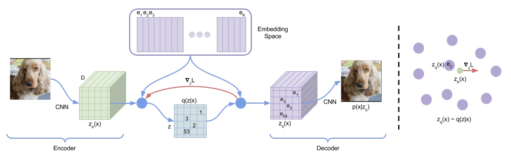
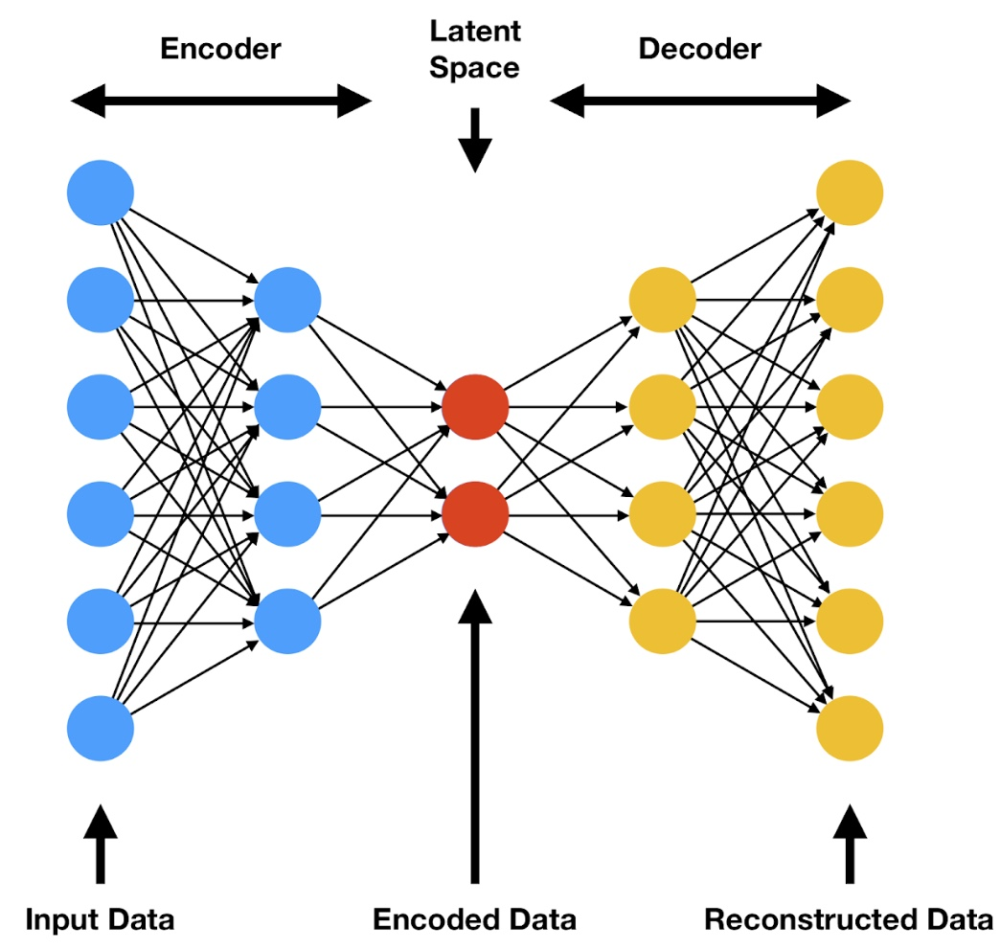
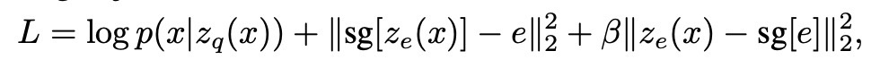
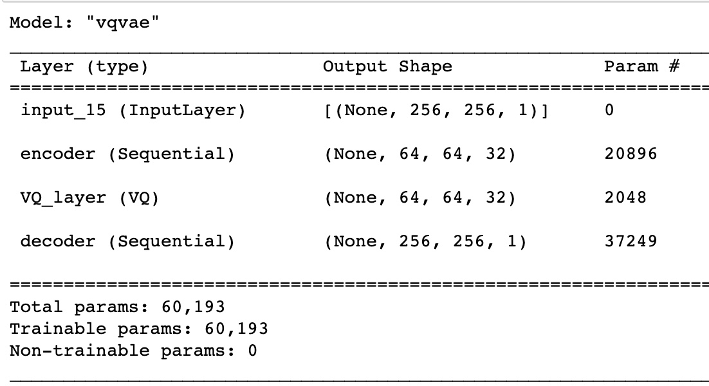
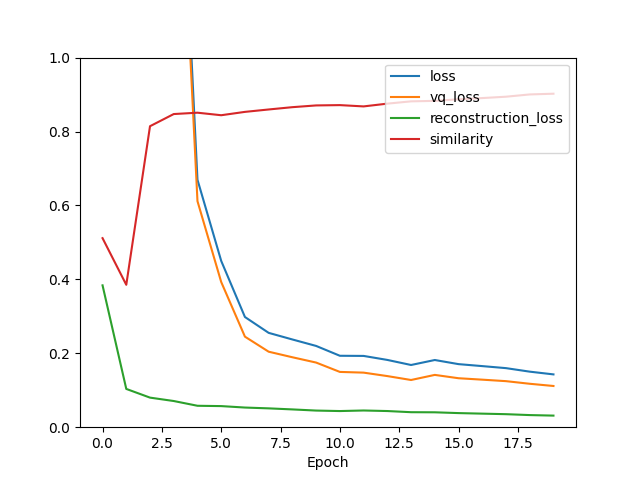
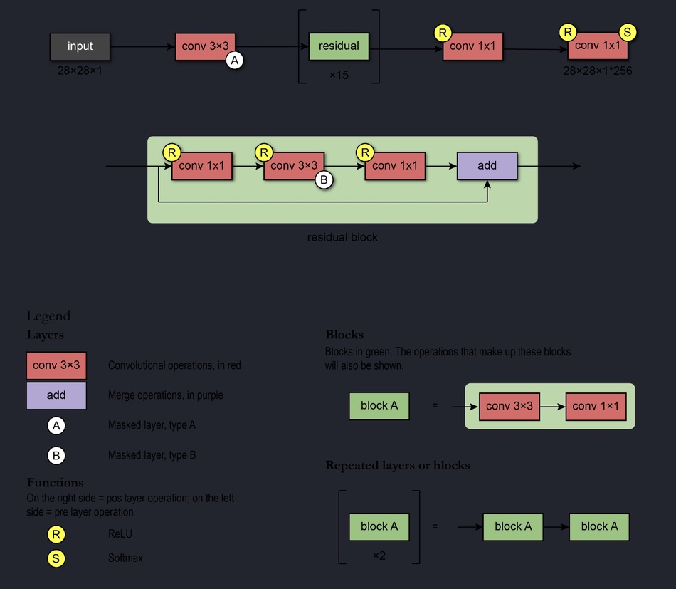
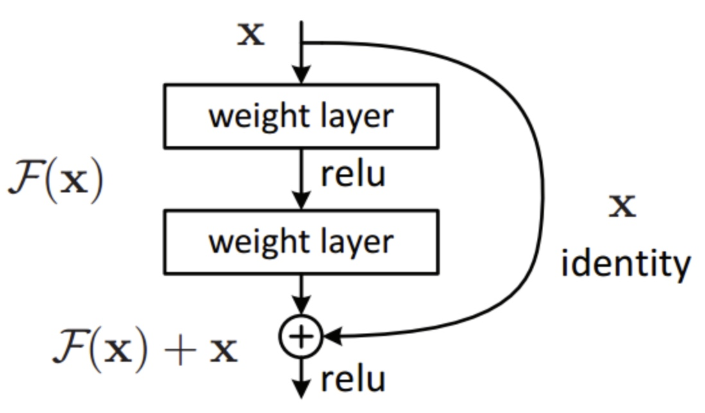
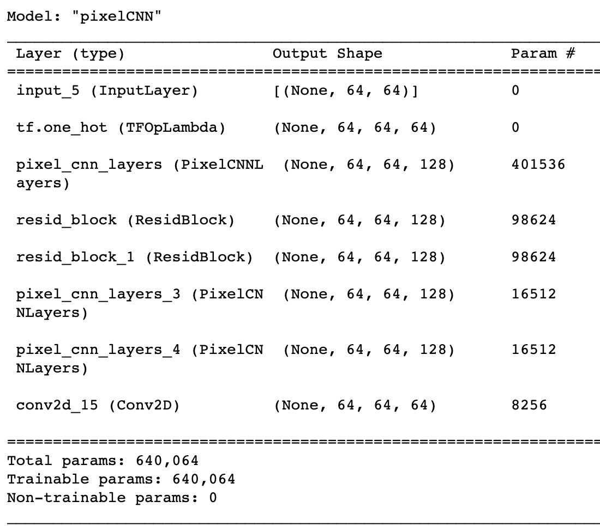

# **VQVAE on ADNI dataset to generate new brain samples with PixelCNN**
## **Overview**
This project aims to create a generative model for the ADNI dataset using VQVAE and PixelCNN. We use VQVAE to create discrete latent codebooks for which we will feed into PixelCNN to learn how to generate new codebook images that will decode into new brain images. We look to achieve this by getting at least 0.6 SSIM in the VQVAE model.

# **Models**
## **VQVAE Model**
<p align="center"></p>

The image above depicts the high-level structure of a VQVAE model which consists of an encoder, vector quantisation layer which includes the discrete latent space and codebook vectors and a decoder. 

This is essentially an extension of the VAE model (image below) in which we feed input into the encoder to generate the latent vector representation then build out latent space by enforcing a uniform prior and determining the posterior for the latent space. Then we feed this through the decoder to reconstruct the image.

<p align="center"></p>

With the VQVAE we incorporate the vector-quantisation layer and use discrete latent representation and a discrete codebook. The codebook stores the latent vectors associated with a corresponding index. We use this to quantise the autoencoder to compare the output of the encoder to the codebooks and the we decode closest codebook vector in euclidean distance to reconstruct the image.

**Loss**
<p align="center"></p>

According to the paper there are 3 key loss metrics associated with the VQVAE model: total loss, vector quantisation loss and the reconstruction loss. The total loss is the combined loss from the VQ layer and the reconstructions. There are 2 components for the VQ loss: commitment and codebook. The codebook loss is just the L2-norm error to move the embedding/codebook vectors and commitment loss is to ensure the encoder commits to a codebook as the codebooks do not learn as fast as the encoder. We also scale the commitment loss with the beta parameter but as the VQVAE paper suggests, the model is quite robust to changes in this parameter.

### **VQVAE results**
---

We initially started with fitting with a large codebook and small latent space but the VQVAE demonstrated some erratic loss behaviour after a few steps but it still eventually converged to high SSIM. However, we did some hyperparameter tuning and found that with a latent space of 32 and 64 embeddings yielded the best performance in SSIM score with the least amount of epochs. We obtain >0.6 SSIM within 2 epochs and gain incremental improvements subsequently

<p align='center'> <strong>VQVAE model structure</strong> </p>
<p align="center"></p>
<p align='center'> <strong>Loss Plot</strong> </p>
<p align="center"></p>

<p align='center'> <strong>30 epochs</strong> </p>

<p align="center"></p>

<p align='center'> <strong>50 epochs</strong> </p>

<p align="center"></p>

## **PixelCNN Model**

<p align="center"></p>

PixelCNN is a generative model that uses convolutional and residual blocks to generate images by iteratively calculating the distribution of prior pixels to generate the probability of later pixels.

We pass the input image into a convolutional layer which generates receptive fields to learn features for all pixels at the same time. We need to also use masks to restrict the connections between layers. For the initial layer we use mask 'A' to restrict connections to the pixels that have already been predicted and subsequent layers use mask 'B' to allow connections only from predicted layers to the current pixels. This ensures that we adhere to requirement of conditional independence of pixels. 

Then we pass the initial convolution layer to residual blocks. These layers are essentially trying to learn the true output by learning the residuals of the true output. We achieve this by skipping the connections between layers. 

<p align="center"></p>

**Loss:** We use the Sparse Categorical Crossentropy loss to quantify the loss of picking the discrete codebooks.

### **PixelCNN results**
---
We experimented with tuning the number of convolutional layers and residual blocks of our model to see if the model would perform better, but it resulted with marginal improvements. The most significant hyperparameter to tune for the PixelCNN is the VQVAE model and subsequently the codebook/embeddings as that is how the PixelCNN model is trained. As such we experimented with a few variations of the VQVAE model and found that latent space of 32 and 128 codebooks obtained the best generated samples. We observe that the reconstructions that we obtain from the generative samples are not the best compared to the real ADNI brains; we are only able to roughly capture the shape of the brain and some details
<p align='center'> <strong>PCNN model structure</strong> </p>
<p align="center"></p>
<p align='center'> <strong>Loss plot</strong> </p>
<p align="center"></p>

<p align='center'></p>

<p align='center'></p>

<p align='center'></p>

<p align='center'></p>

### **Data processing**
There is not much data pre-processing required for the ADNI dataset. Using the cleaned ADNI dataset from (https://cloudstor.aarnet.edu.au/plus/s/L6bbssKhUoUdTSI) the train and test data are already seperated accordingly so we will simply use those splits. There are ~20000 images for training and ~9000 images for testing. The following folder structure should be used for the data

```
|'root_path/'
|       'train/'
|           'images.png'               
|               ...
|       'test/'
|           'images.png'
|               ...
```


We also normalise the images by dividing the pixel intensity values by 255.0. This scales the data to be between (0, 1) to ensure that all the images have the same distribution. This in turn allows us to better understand the underlying structure/features of the images.

## **Scope for improvements**
As can be seen, the decoded images from the generated samples are quite poor. We can improve on this by training for more epochs as the results obtained were only trained on <50 epochs which is minimal for a PixelCNN. This was because I had to do all the training on my own computer as Rangpur environment was not stable. Additionally, increasing the number of codebooks and increasing the size of the latent space. This would allow more spacing between classes as such we would have better performance in generating higher resolution samples.

# **Example usages**

**Reading input data:**
Where root_path is where your image data is following the folder structure described in data processing section.
```
(train_data, test_data, train_var) = load_data(root_path, batch_size)
```

**Creating new VQVAE model:** where img_shape is the size of your inputs.
```
VQVAE = VQVAE_model(img_shape, train_var, latent_dim=32, no_embeddings=64)
VQVAE.compile(optimizer=keras.optimizers.Adam(learning_rate=2e-4))
print(VQVAE.get_model().summary())
```

**Training model and plotting losses**
```
vqvae_trained = vq_train(train_data=train_data, test_data=test_data, train_var=train_var, vq_trained=None, img_shape=img_shape, latent_dim=32, embed_num=32, result_path=result_path, vq_epoch=vq_epoch)
```

**Loading trained VQVAE:** Initialise new VQVAE model from VQVAE_model class in modules.py and load the weights
```
vq_trained = VQVAE_model(img_shape, train_var, latent_dim=latent_dim, no_embedding=embed_num)
vq_trained = vq_trained.load_weights('path to weights')
VQVAE.compile(optimizer=keras.optimizers.Adam(learning_rate=2e-4))
```

**Training loaded model:** feed the VQVAE model with loaded weights into the vq_trained argument
```
vqvae_trained = vq_train(train_data=train_data, test_data=test_data, train_var=train_var, vq_trained=vq_trained, img_shape=img_shape, latent_dim=32, embed_num=32, result_path=result_path, vq_epoch=vq_epoch)
```

**Generating visualisations for VQVAE reconstructions**
```
VQVAE_result(vqvae_trained, test_data)
```

**Creating PixelCNN model:** using the trained VQVAE model
```
pcnn = PixelCNN(VQVAE.encoder.output.shape[1:-1], VQVAE)
pcnn.compile(optimizer=keras.optimizers.Adam(learning_rate=3e-4), loss=keras.losses.SparseCategoricalCrossentropy(from_logits=True))
```

**Training PixelCNN model and plotting losses:** 
```
pcnn_trained = pcnn_train(vqvae_trained, train_data, result_path, pcnn_trained=None, pcnn_epoch=pcnn_epoch)
```

**Loading trained PixelCNN:** similar to loading weight for VQVAE
```
pcnn = PixelCNN(VQVAE.encoder.output.shape[1:-1], VQVAE)
pcnn.load_weights('path_to_weights')
pcnn_trained = pcnn_train(vqvae_trained, train_data, result_path, pcnn_trained=pcnn, pcnn_epoch=pcnn_epoch)
```

**Generate new brain images using PixelCNN**
```
generate_PixelCNN(vqvae_trained, pcnn_trained, n=10)
```

## **Reproduce results**
```
root_path = 'AD_NC'
img_shape = 256
vq_epoch = 20
pcnn_epoch = 20
batch_size = 32
result_path = 'results'

(train_data, test_data, train_var) = load_data(root_path, batch_size)

vqvae_trained = vq_train(train_data=train_data, test_data=test_data, train_var=train_var, vq_trained=None, img_shape=img_shape, latent_dim=32, embed_num=64, result_path=result_path, vq_epoch=vq_epoch)
VQVAE_result(vqvae_trained, test_data)

pcnn_trained = pcnn_train(vqvae_trained, train_data, result_path, pcnn_trained=None, pcnn_epoch=pcnn_epoch)
generate_PixelCNN(vqvae_trained, pcnn_trained, 10)
```

## **Dependencies**
This project was completed with the following modules for which you should install in order to run the scripts in this repo.
- tensorflow 2.9.2
- tensorflow-probability 0.17.0 (crucial to get stable version against your tensorflow version)
- numpy 1.23.3
- matplotlib 3.5.3

## **References**
- https://arxiv.org/pdf/1711.00937v2.pdf
- https://arxiv.org/pdf/1601.06759v3.pdf
- https://pedroferreiradacosta.github.io/post/auto_encoder/
- https://keras.io/examples/generative/vq_vae/
- https://keras.io/examples/generative/pixelcnn/