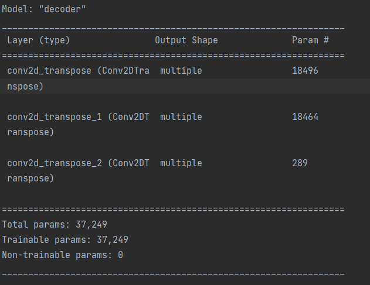

# Generative Model of ADNI Brain Data Using VQ-VAE + PixelCNN

This project implements a generative model of the ADNI brain dataset, using a Vector-Quantised 
Variational Autoencoder (VQ-VAE), and a PixelCNN prior. Essentially, what this means is that a 
discrete, latent space can be learned by the VQ-VAE model, as a reduced representation of the ADNI 
brain dataset, from which, new discrete representations may be randomly generated, through the 
PixelCNN. These new representations may be decoded by the VQ-VAE again, to generate entirely new 
brain images.

## Algorithms/Models Background

### VQ-VAE

To understand VQ-VAEs, let us first review VAEs, i.e. Variational Autoencoders. Variational 
Autoencoders are an unsupervised deep learning model that learn a probability distribution over the 
latent space. The latent space refers to a reduced representation of the model inputs, from 
which, (ideally) near-identical reconstructions of the input may be formed.

The defining factor of a VQ-VAE, is that it learns a *discrete* latent distribution 
instead.

This discrete representation is given by a collection of vectors known as a 'codebook', that 
are created via a Vector Quantization layer. These vectors are also known as embeddings, with 
the codebook/latent space also being known as an embedding space (see below).


From [[1](#references)]

This embedding space is initialised via a uniform distribution, and is learned during training 
via the following loss function (defined in [[1](#references)]):

$L = \log p(x|z_q(x)) + \||sg[z_e(x)] - e\||_2^2+\beta\||z_e(x)-sg[e]\||_2^2$, where:

- $sg$ refers to the stop-gradient operator, which treats its input as a constant during forward 
  computation, (i.e. stopping the computation of its gradient, as it would effectively be 0), 
  hence detaching it from the computational graph.
- $z_e(x)$ and $z_q(x)$ denote the encoded and decoded inputs (where $x$ is the input of the 
  network)
- $e$ denotes an embedding that is 'closest' (with respect to the Euclidean norm) to the encoded 
  input

The three terms of $L$ represent $3$ different losses, each for the different components of the 
network.

The left-most term simply denotes the reconstruction loss between the output and the input of 
the network.

The middle term reflects the 'distance' between the encoded input and the 'nearest' embedding.

The last term attempts to 'commit' the encoder to the closest embedding.

At this point, it is clear that while images may be re-constructed, with a constant uniform 
prior, image generation appears infeasible. This is where the PixelCNN comes in.

### PixelCNN
PixelCNN is an autoregressive neural network model. This essentially means it learns recursively.
Specifically, it (starting from the top left pixel and working to the bottom right) predicts the 
value of the next pixel, based on the values of the previous pixel.


From [[1](#references)]

To achieve this, the PixelCNN uses the concept of a 'mask'.

A mask essentially 'zeros out' all pixels upto the current pixel, to allow the PixelCNN to 
implement its autoregressive behaviour. There are two types of masks:

- Type "A" - zeros out all previous pixels including the current
- Type "B" - zeros out all previous pixels excluding the current

Type "A" masks are used once in the first convolutional layer, with Type B masks being used 
thereafter.


From [[4](#references)]

## Dataset - ADNI Brain

The ADNI Brain Dataset contains RGB images of size 256x256 of brain images of people with or 
without Alzheimer's Disease.

The data was obtained from this link: https://cloudstor.aarnet.edu.au/plus/s/L6bbssKhUoUdTSI

The data is separated into a train and test folder (see below):

```
ADNI_AC_NC_2D
    AD_NC
        train
            AD
            NC
        test
            AD
            NC
```

It should be noted however that one merely requires a train and test folder, as discussed in
[Usage](#usage).

This data was normalised to a range of [0, 1], and shifted by a value of 0.5. No further 
pre-processing was conducted.

A 70/30 split was made on the training data to generate a validation set. This was done to allow 
for hyperparameter tuning and independent SSIM calculations. The test set was generated to to 
identify model generalisability of the VQ-VAE, through the calculation of SSIM values (for 
individual reconstructions and a mean value across the entire test set).

## Final Model Architectures





## Training/Validation - Hyperparameter Tuning & Model Selection

All final hyper-parameter values may be found as constants at the top of `train.py`.


## Testing + Reconstructions


## Usage

Essentially, all that is required to use this model is to specify the path to your dataset in 
the constant `FILE_PATH`, located in `train.py`. Using `tf.Dataset` functions, the code will 
automatically ignore all labels for Alzheimer's vs non-Alzheimer's. Hence, all that is required 
is to ensure there exist separate folders already for training and testing data.

Then, for any hyperparameter tuning or model selection, simply modify any of the constants at 
the top of the `train.py` file.

To use the models pre-trained, simply refer to `predict.py`. All reconstructions and generations 
of images is conducted here.

To change any data pre-processing, please refer to `dataset.py`

For all information on model/layer architecture, please refer to `modules.py`.

### Dependencies

- `tensorflow >= 2.10.0`
- `tensorflow-probability >= 0.18.0`
- `numpy >= 1.23.0`
- `matplotlib >= 3.5.2`
- `pandas >= 1.5.1`

To ensure correct dependencies are met, one may run the following command:

> pip install -r requirements.txt

## References
This project took influence from the original VQ-VAE paper, the PixelCNN Prior paper, a 
VQ-VAE + PixelCNN Keras tutorial, and an article about PixelCNN (but only really foucssing on 
the mask types section) (Links below).

- [1] https://arxiv.org/abs/1711.00937 - VQ-VAE Paper
- [2] https://arxiv.org/abs/1601.06759v3 - PixelCNN Paper
- [3] https://keras.io/examples/generative/vq_vae/ - Keras Tutorial
- [4] https://towardsdatascience.com/autoregressive-models-pixelcnn-e30734ede0c1 - PixelCNN Article
