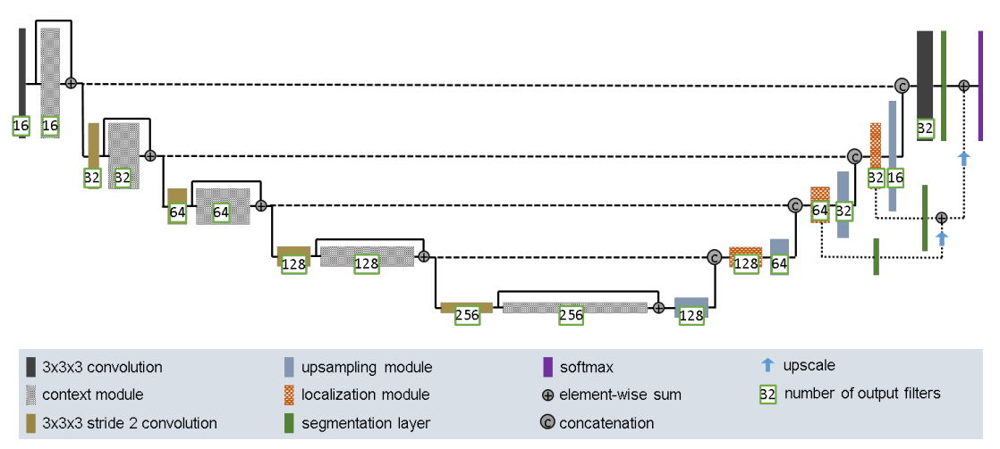
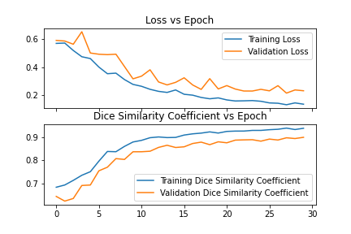
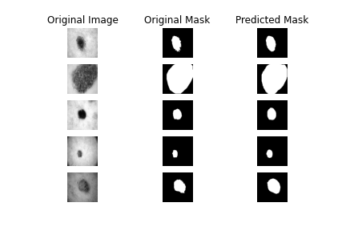

# Improved Unet Model Implementation

## Description and Solution to Problem
The algorithm is an implementation of the [Improved UNet](https://arxiv.org/abs/1802.10508v1) that segments the [ISIC Dataset](https://challenge.isic-archive.com/data/#2016) with a minimum [Dice Similarity Coefficient](https://en.wikipedia.org/wiki/S%C3%B8rensen%E2%80%93Dice_coefficient) of 0.8 on the test set. The problem that this algorithm solves is being able to segment lesions so that they can be identified. Using the Improved UNet structure, a model was built and trained on the ISIC Dataset so that now it is able to detect any unseen lesion with a minimum dice similarity coefficient of 0.8. This is really important in the field of computer vision and could perhaps be used in the future by robots operating on patients with lesions.

## How it works
The main function in [train.py](train.py) is responsible for running all the code using the different modules built in the other files. Using [dataset.py](dataset.py) first the data is loaded in from the given paths, processed by resizing the data and split into training, validation and testing sets. Not all the files were of the same size so they were resized so that they would all fit into the model. The train, val, test split is 80, 10, 10 because the dataset was quite small so training was allocated the majority and validation and testing was allocated enough to produce reliable results. Then with [modules.py](modules.py) the model is built, compiled, and fitted. The model that is built is the same one from the paper with the architecture looking as follows.

 

 The model and all the princples of how it works is described in this [paper](https://arxiv.org/abs/1802.10508v1). The [saved model](model/saved_improved_unet_model), its [architecture](model/model_architecture.txt) and [training](model/model_training.txt) can be found at the hyperlinks. The loss and dice similarity coefficient metrics plots are given below.

 

Then the model was tested on a test set with the predictions looking as follows with a dice similarity coefficient over 0.9 printed out to the output.

### Reproduicility of Results
In [train.py](train.py) change line 11 and 12 to the path to the ground truth masks and the original image data. The ground truth masks and the original image data that was used are from the [ISIC Dataset](https://challenge.isic-archive.com/data/#2016), task 1 training data and training ground truth. On line 30 change the path to where you want the model to be saved. Running train.py should produce all results.

### Dependencies
- Python version 3.7.15
- Matplotlib version 3.2.2
- Tensorflow version 2.9.2
- cv2 version 4.6.0
- numpy version 1.21.6