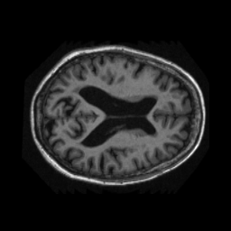
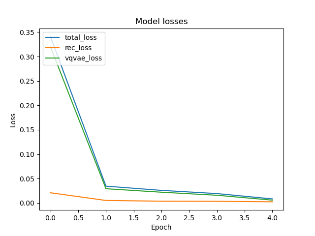
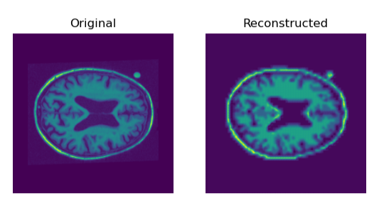
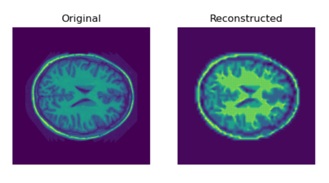

# VQ VAE on the OASIS brain dataset

## The algorithm

### Description
A Vector-Quantized Variational Autoencoder, commonly known as a VQ VAE, is a generative model which utilises vector quanitization in order to learn and comprehend patterns of data, in this case, in relation to Magnetic Resonance Imaging (MRI) of brains in the OASIS dataset. 

### Problem to solve
The VQ VAE aims to learn and understand discrete representations of the images produced by the MRI of brains. After training, the model should be able to generate accurate images of the brain, based on certain features of brains that the model found in training.

### How it works
The VQ VAE model architecture is comprised of three main parts, an encoder, VQ layer and then a decoder. The encoder and decoder both contain three convolutional layers. The decoder is the same as the encoder, except reversing its operations. The general idea is as follows. First, the encoder takes some input data and encodes it into the latent vector representation. The VQ layer then takes this vector and selects embeddings based on distance and outputs a quantized vector of the same size. This quantized vector is then passed through the decoder and the decoder attempts to recreate the original input, which in this case is an MRI of a brain.

Figure 1 [1]: Architecture of VQ VAE model

## Requirements

### Dependencies
The following are required, with their respective versions mentioned. In some cases, a different version may be suitable; however, these have not been tested so are not encouraged.
- `python` == 3.10.6
- `numpy` == 1.23.4
- `tensorflow` == 2.10.0
- `matplotlib` == 3.5.2

### Reproducibility of results
In order to run the files, a minor modification needs to be made. In dataset.py, lines 16-22 (inclusive) contain the paths to the relevant data. Line 16 will need to be modified by the user who runs the program to ensure it is pointing to the correct directory on their local machine. Steps to take:
1. Download the OASIS data from https://cloudstor.aarnet.edu.au/plus/s/n5aZ4XX1WBKp6HZ/download
2. Extract the data to a chosen location
3. Copy the path to the keras_png_slices_data folder and enter that as the value of the `path` variable on line 16.

### Pre-Processing of Data
Prior to creating and training the model, there is some pre-processing performed on the data. The images are loaded and then processed through residual extraction and then normalisation. Residual extraction shifts the distribution so that the mean is 0 (i.e. distribution is centred around 0). The normalisation occurs so that each pixel value is converted to be a value within the range [0, 1].

## Training, Validation and Testing Splits
The splits used were as provided in the downloaded OASIS dataset:
- Training: 9664 files (85%)
- Validation: 1120 files (10%)
- Testing: 544 files (5%)

## Results
In order to train the model, the training data is run through the model. Two randomly selected images from the original training data are displayed below.

The testing data was then run against the trained model to verify the model's results. After running the entire testing set through, an SSIM value of 0.67 was achieved. The following loss graph was found. This is a good result as the losses decreased after every epoch, which means the model's accuracy was increasing.

The following sets of images display the original test image (as downloaded) and the reconstructed image (generated by the model). These were randomly selected from the test set. As can be seen, these are visually very similar, and thus, it can be concluded that the VQ VAE model produced a reasonably clear image of the expected MRI of each brain.

## References
[1] Park, S. (2021) Architecture of VQ VAE model, An overview on VQ-VAE: Learning Discrete Representation Space. Available at: https://medium.com/analytics-vidhya/an-overview-on-vq-vae-learning-discrete-representation-space-8b7e56cc6337 (Accessed: October 21, 2022). 
