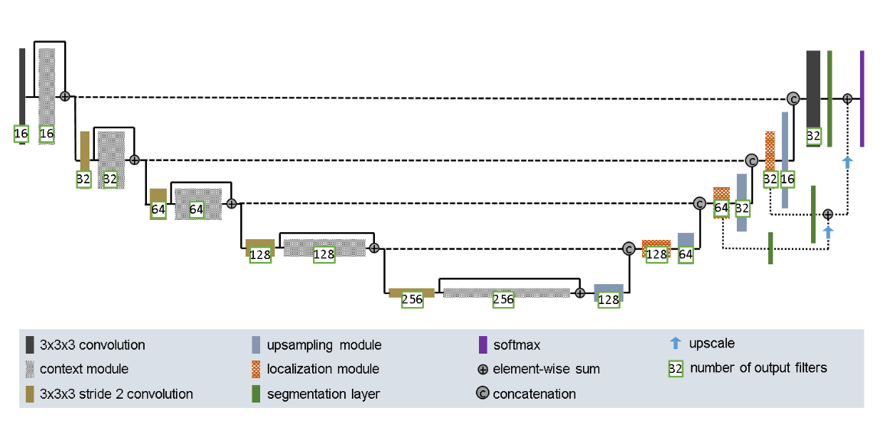
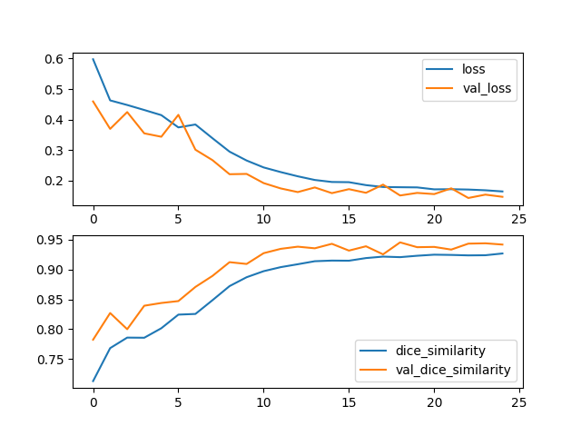
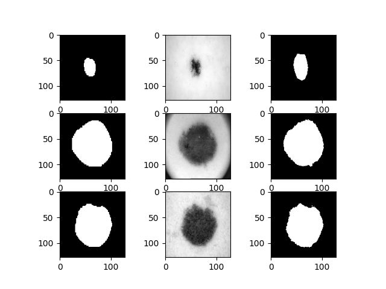

# Using an Improved UNET to segment the ISIC dataset
#### by Aravind Punugu (45827422)

## Introduction

The ISIC dataset contains images of skin lesions and mask to isolate the skin
lesion for improved analysis. The goal of this task is to use Neural networks
to generate the mask for skin lesion images. There are various attempts at
using neural networks to segment medical images such as [1], and [2]. Both of
these use a U shaped network where the first part is downsampling the image,
and then we concatenate the results with the upsampling part. The model used in [1]
is known as U-Net. In this project, the neural network made in [2] is used for
the segmentation task. [2] Uses improves upon the U-Net model. The figure below
describes the model being constructed in `improved_unet.py`.

<p float="left">

<center>


Figure 1: Visualization of the model being used [2]
</center>
</p>

## Method
The data requires little processing as the ground truth and real images are
already seperated. The script `data_preprocess.py` loads the data into memory.
It resizes all the images to `128x128` in order to be able to fit them into memory
as well as to reduce training time. `improved_unet.py` contains two functions,
one to create the model as described in [2], and the other to calculate the
Dice Similarity Coefficient (DSC). DSC is used in order to be able to gauge the
similarity of the predicted mask with the real mask. Finally main.py brings them
all together by loading the dataset, creating the model, training it and running
it through the test set while plotting training metrics such as loss, and DSC for
training and validation sets. It also plots a few example masks generated by the
neural network.

## Result
The model was trained for 25 Epochs, with the Adam optimizer, with the default
learning rate and the Binary Crossentropy Loss function.

<p float="left">
<center>

Figure 2: Training metrics, top is loss function, bottom is DSC



Figure 3: Example masks generated. Left is Generated, middle is original, right is actual mask
</center>
The test set achieved a DSC of 0.901.
</p>

## Usage
In order to use the scripts provided, you'd need to change the `home`, `data_folder`
and `gt_folder` paths provided in the main.py script. `home` is the parent folder to
`data_folder` and `gt_folder` (gt = groundtruth). Once you've done that, you can
just run the main.py script which will automatically run, train and test the model.

## Dependencies
The following dependencies need to be installed in order to use these scripts
```
    opencv : pip install opencv-python
matplotlib : pip install matplotlib
```

## References

1. O. Ronneberger, P. Fischer, and T. Brox, “U-net: Convolutional networks for
biomedical image segmentation,” in International Conference on Medical Image
Computing and Computer-Assisted Intervention. Springer, 2015, pp. 234–241.

2. F. Isensee, P. Kickingereder, W. Wick, M. Bendszus, and K. H. Maier-Hein, “Brain
Tumor Segmentation and Radiomics Survival Prediction: Contribution to the BRATS
2017 Challenge,” Feb. 2018. [Online]. Available: https://arxiv.org/abs/1802.10508v1
