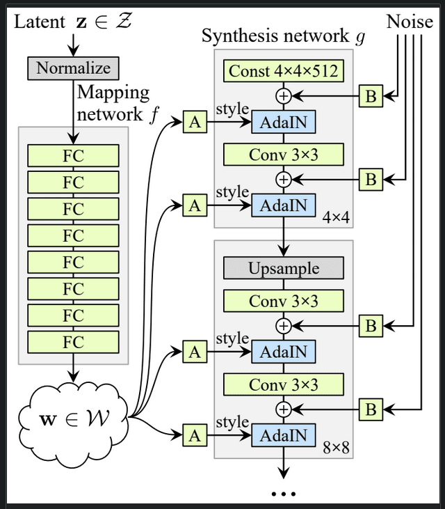
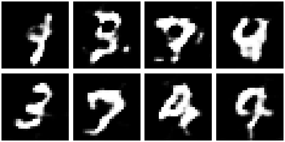
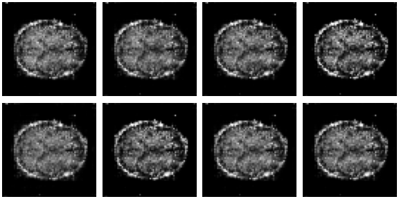
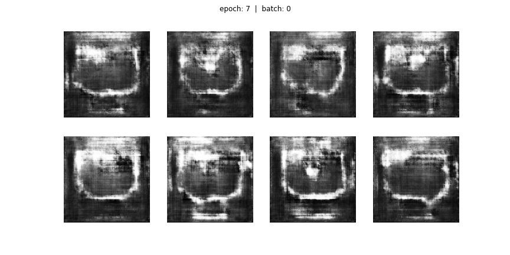
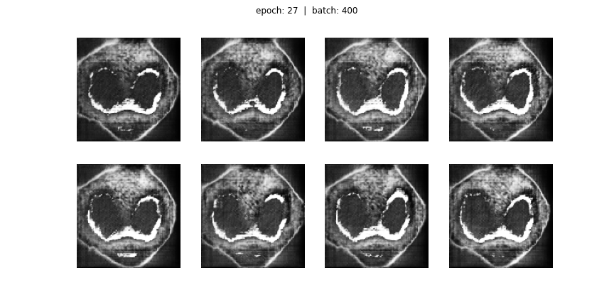

# 45828894 StyleGAN

Create a generative model of the OASIS brain or the OAI AKOA knee data set using StyleGAN [10] or
StyleGAN2 [11] that has a “reasonably clear image”

## Dependencies
 - tensorflow==2.5.0
 - jupyterlab
 - matplotlib
 - tqdm
 - imageio

## Driver Script
├── Task7_StyleGan  
│   ├── MNIST_Style.ipynb  
│   ├── OASIS_Brain.ipynb  
│   ├── AKOA_Knee.ipynb  
│   ...

For the brain and knee dataset, make sure to extract their data into `Task7_StyleGan/AKOA_Analysis/` and `Task7_StyleGan/keras_png_slices_data/` respectively before following the following steps.

Each of these files are standalone jupyter notebooks.  
Simply open any notebook and execute `Run all`.  
Results will be produced in `.gif` format under the current folder.

## Description

StyleGAN is the current state-of-the-art realistic image generation model. Example can be found on the website https://thispersondoesnotexist.com/.
Rather than using a traditional topdown convolution layer setup. It is feeding the input through a mapping layer instead.
Then applying the style through AdaIN to achieve navigate-able feature space. Addition noise is also inputed throughout the network to increase entropy in fine details.

My implementation of the StyleGAN consists of two main models: Generator and Discriminator.

### Generator

This is where I implemented the StyleGan structure, it attempts to create fake images in order to trick the discriminator.
It starts of by generating random noise, but slowly it will get better and better at creating fake images.

### Discriminator

This is like a classifier, but rather than identifying objects, it identifies if an image is real or fake.

The two models will constantly attempt to exploit each other's weakness and improve together.
The best possible result is when the generator creates an image so realistic that the discriminator can only have at best a 50/50 chance guess.

### Attempted datasets

In this task I have attempted three datasets
1. MNIST handwriting digits
2. OASIS Brain MRI
3. OAI AKOA Knee MRI

As I am originally unfamiliar with the StyleGAN framework, it is a lot easier to start from MNIST dataset.
As it is very small in size (28x28), therefore it is faster to train and better for debugging.

## Results

### MNIST
After success with MNIST dataset has been achieved, I moved onto Brain dataset and Knee dataset afterwards.

### OASIS Brain
With Brain dataset, the images are \`reasonably clear\`, but there was immediate mode collapse after the first epoch.

### OAI AKOA Knee
With the Knee dataset, the images are also \`reasonably clear\` and there are still variation. But after the 7th epoch or so, mode collapse strike again.

This is the result before mode collapse

This is the result after mode colapse

## References
 - https://arxiv.org/pdf/1812.04948.pdf
 - https://www.tensorflow.org/api_docs/