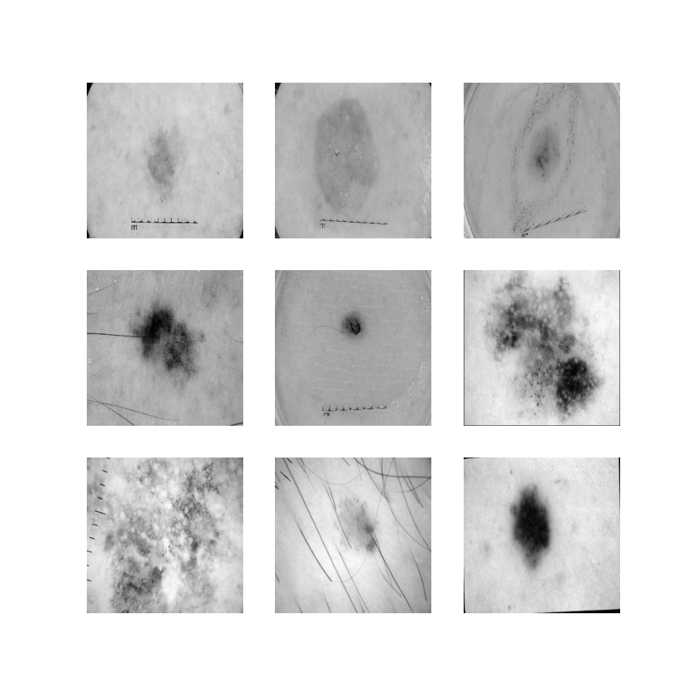
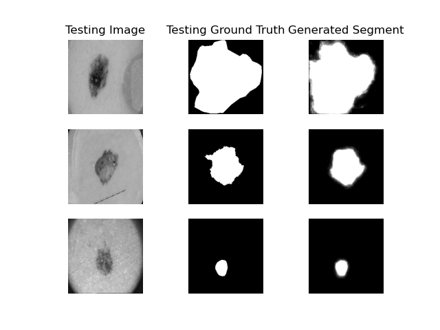
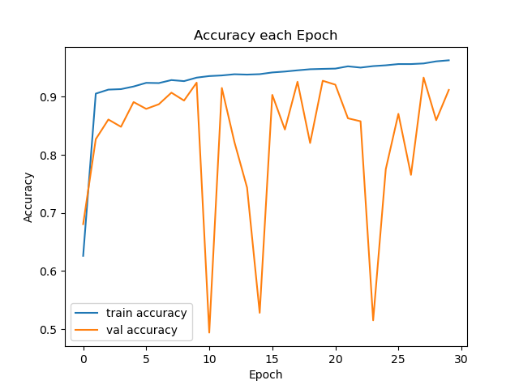
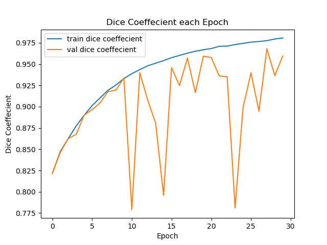

# Improved UNET for ISICs Image Segmentation

## Introduction

This repository fits an Improved U-Net style neural network to the ISIC database of lesion images and image masks in order to generate image segments given lesion images as input.

## Data Pre-processing

The images and masks are loaded in decoded and normalised outputting 256 X 256 X 1 images. The data is also split into a 60/20/20 train/test/validation split. Images are converted to the 256*256 height and width dimensions to ensure all images have the same dimensions when being passed into the model and the images are loaded in greyscale and normalised to pixel values between 0 and 1 to improve the models performance. The loaded input images and image masks can be seen in the figures below (after all pre-processing except normalisation).

*figure 1: Example Input Image Data*

*figure 2: Example Mask Ground Truth Data*

## Improved U-Net architecture

The Improved U-Net model [1] Is very similar to the original U-Net architecture but with a few extra modules. Like the original U-Net the improved U-Net architecture is roughly split into encoding and decoding parts. The encoding section downsamples the image through with convolutional layers however unlike the original U-Net each encoding block also contains a context module and the result of a block is the sum of the convolutional layer and the context module. A context module contains convolutional layers separated by dropout layers to dilute the data. The decoding section upsamples the image taking into account the results from encoding blocks to generate segments which are combined for the final result. The general layout of this model can be seen in the figure below. Improvements not specifiedin the original archtecture have also been implemented such as the addition of many leakyRelu and normilisation layers.

*figure 3: Improved U-Net architecure [1]*

## Prerequisites

For the driver.py script to run correctly it is required that the input image dataset be in the 'ISIC2018_Task1-2_Training_Input_x2' directory in the root directory and the ground truth mask dataset be in the 'ISIC2018_Task1_Training_GroundTruth_x2' directory in the root directory. If the datasets paths are different then the dir and mask_dir variables must be changed to match the input and mask directories respectively.

## Dependencies

1. Python 3.8.8
2. conda 4.10.1
3. tensorflow 2.6
4. keras 2.6
5. matplotlib 3.3.4

Must also have CUDA compatible graphics card with cuDNN and CUDA toolkit installed

## Hardware and Operating System

Model was developed on a windows 10 machine using

* 8gb Nvidia gtx1070 GPU
* 16gb ram
* Intel Core i7-6700K Processor

Builds without at least these requirements and without cuda integration with tensorflow may not be able to develop the model

## Usage

Running the driver.py will load the input dataset from the 'ISIC2018_Task1-2_Training_Input_x2' and the ground truth dataset from 'ISIC2018_Task1_Training_GroundTruth_x2'. The model will be trained on this data over 30 epochs. This may take some time. It will then plot some results aswell as ouput the average dice coeffecient over the testing split.

## Ouput

*figure 4: input and ground truth images against generated results*

The model generates a dice coeffecient of over 0.8 for all values in the testing set with an average dice coeffecient of 0.9636 over the testing set. Fig 4 shows some training images and ground truths next to the segmentation generated by the model.

The below figures show the models performance over the epochs. Although the validation metrics weren't as smooth as the training metrics, the validation performance after 30 epochs was close to the testing performance although the best performance was seen just before the 30th epoch.

*figure 5: train and validation accuracy each epoch*

*figure 6: train and validation dice coeffecient each epoch*

## References

[1] F. Isensee, P. Kickingereder, W. Wick, M. Bendszus, and K. H. Maier-Hein, “Brain Tumor Segmentation
and Radiomics Survival Prediction: Contribution to the BRATS 2017 Challenge,” Feb. 2018. [Online].
Available: https://arxiv.org/abs/1802.10508v1
