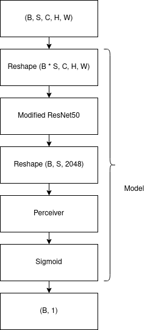
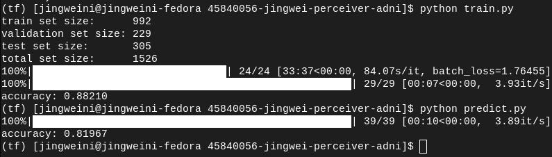
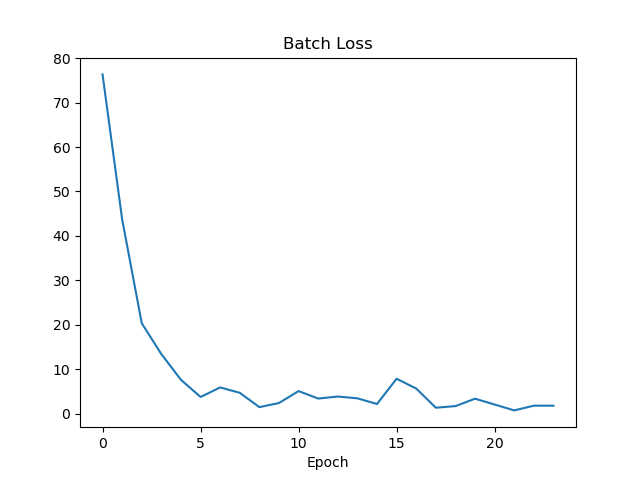

# Perceiver for Classification of ADNI Brain Data

## Model Description
The ADNI brain dataset consists of cross-sectional scans of patients' brains. Each scan is a grayscale 240 x 256 image. The scan either belongs to a patient with Alzheimer's disease or a patient without the disease. We want the model to be able to classify scans as containing Alzheimer's or being absent of Alzheimer's. As there are only two possibilities, the model is designed as a binary classifier. Furthermore, each brain-scan in the dataset is part of a sequence of 20 scans of the same brain. This is important information that the model can make use of. Ideally, we require some mechanism for processing these images in a sequence.

The Perceiver model is a transformer-based model that can be used to process sequential data - it makes very little assumptions about the type of input data.<sup>[1]</sup> Rather than feeding a Perceiver with a sequence of raw images, it is more effective to feed the Perceiver with feature vectors. We can produce feature vectors from images using a CNN. I decided to use ResNet50 with the last fully-connected layer removed. This outputs a 2048-dimension vector. We can further take advantage of ResNet50 through the PyTorch library with transfer learning by using pre-trained weights from training on ImageNet. Another change to ResNet50 that has to be made is adding a conv2d layer to the beginning of the model that takes in 1-channel images and outputs 3-channels. This conv2d layer is otherwise identical to the existing conv1 layer in ResNet50. It is necessary to add this layer because the ADNI data is grayscale.

Additionally, as part of preprocessing the data, each image is cropped to 224 x 224 which are the ImageNet dimensions and the images are also standardized with a pre-calculated mean and standard deviation.

### Quick diagram of model: inputs and outputs


B = batch size, S = sequence length (20), C = image channels (1), H = image height (224), W = image width (224)

## Results
The model can achieve good results with only a few epochs of training (~5). Below is an example of training the model over 24 epochs.



The first accuracy value is the validation set accuracy and the second is the testing set accuracy, both over 80%. The training time is quite quick at only 30 minutes for 24 epochs (trained on Nvidia GTX 1070). For training, validation and testing, I have split the data like so: 65% for training, 15% for validation and 20% for testing, this is because most of the data should go towards training with a small subset for validation and testing each. The testing set is always kept apart from the other two sets and never used for validation or training. This ensures that the validation set is never used for hyper-param tuning.

### Batch losses for the above training



## Dependencies (requirements.txt)
```
numpy==1.21.5
torch==1.12.1
torchvision==0.13.1
perceiver-pytorch==0.8.3
matplotlib==3.5.1
tqdm==4.64.0
```

## How to train (reproducibility)
1. In `dataset.py`, edit `dataset_dir` to the path of your `AD_NC` dataset.
2. With the dependencies installed, run
```
python train.py
```
This will begin training the model. When finished, the validation accuracy will be printed and a plot of batch losses will be saved to the working directory as `batch_losses.png`. The model will also be saved as `model.pkl`. You can run
```
python predict.py
```
to see the test set accuracy.

The `predict()` function in `predict.py` is an example of how to use the trained model.

[1]: https://arxiv.org/abs/2103.03206

## References
1. https://arxiv.org/abs/2103.03206
