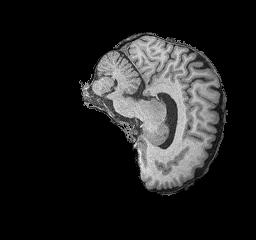
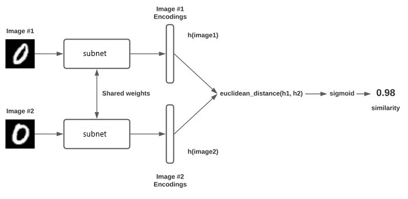
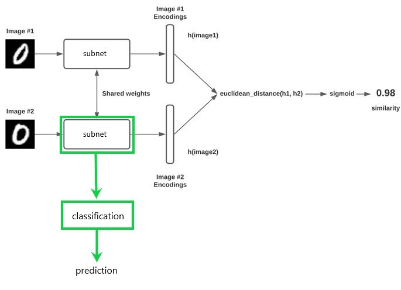
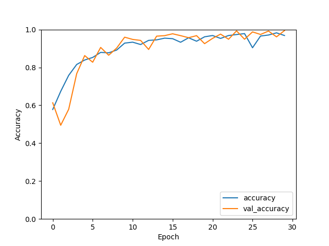
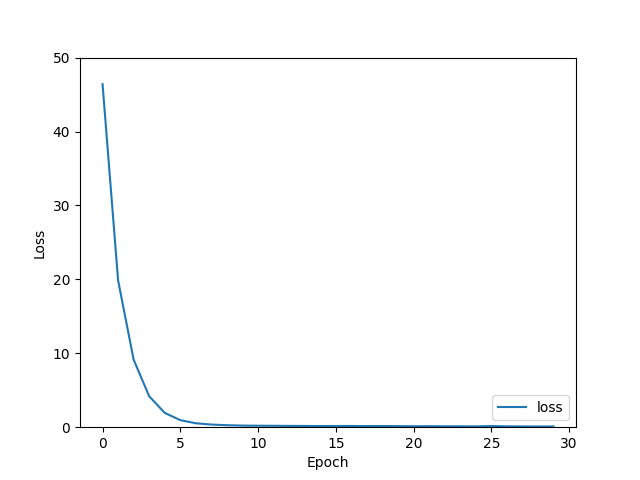
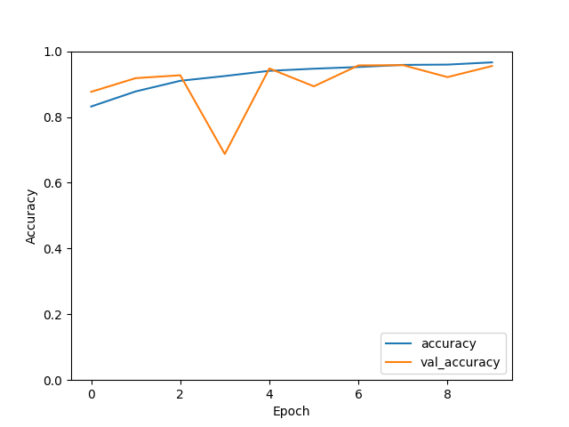

# Siamese Neural Networks
## Model

A Saimese neurel network is a form twin network, consisting of two identical subnetworks. The networks have the same configurations, parameters and weights, hence identical. A pair of images is passed through each network, thus computing the features of each image. The similarity is then computed by passing the feature pairs through a euclidian distance function. The aim of the network is to produce a value such that we know if the images are similar or different, say 0 for different 1 for same.

## Loss Function

Due to the nature of SNN's, cross entropy functions do not work. Given this there are other types of loss function used in SNN's. Mainly there are two types that are most commonly used

### Triplet Loss

Triplet Loss works by using three input values, an anchor value, postitve value, and negative value. The anchor is a baseline value, and the postitive value is of the same class as the anchor, whilst the negative is of a different class. The anchor is compared to the positive and negative values, and the loss function minimises the distance from positive values, and maximises differences to negative values.

### Constrastive Loss

Contrastive loss simply takes to inputs and computes the euclidian distance between the image features. Points with similar features will have a low euclidian distance, and vice versa for points with disimilar features.

# Using an SNN to classify Azleimers Disease

It is possibe to classify a brain scans as either Alzeimers Disease or Cognitave Normal through the use of a SNN. To do this we need a dataset of image pairs to train the model. The pairs will be either two CN’s or a CN and an AD, and have a corresponding label (0 for two CN’s, 1 for combination). After training the model, given a pair of image, the model can then either classify the pairs as either two CN’s or a CN and an AD. 

At this point we can only tell if two images are CN or a combination of CN and AD. However we want to have a model that we can pass a singular scan into, and know whether the scan has AD or is a CN. To accomplish this we take the trained subnetwork, and re train the subnet with a classifier. Once trained this model is cabable of classifiying a brain scan.

# Data
## SNN Data
The data used to train this model is the ADNI dataset. The dataset consists of a training set, containing ~10000 images of cognitave normal brain scans (or normal controls) and ~10000 images of brain scans of patients with alzeihmers disease. The test set contains ~4500 of each type. In order to train the SNN, the train data is split into 80% for training, and 20% for validation. However the data its raw form is not suitable for training an SNN, as we need image pairs and labels. Therefore we must build the image pairs when loading the data. This is done in [dataset.py](./dataset.py), and is well documented in the code. In short we take all the image paths, create the pairs and labels corresponding to the pair, turn them into tensorflow datasets, and then shuffle the dataset before spltting into 80% train 20% validation. No test set is generated from the image pairs, as we only test the final classifacation model. Further given the large amount of data, 20% is a suitable amount of data to validate on.
### Example Pair (AD | CN)

 

Label:  
1 as it is a pair of different classifications

## Classification Data
To test and train the classification model we must build a new dataset. One that just contains singular images, and a corresponding label for whether the image is AD or CN (0 or 1). We again use a 80/20 train validation split, and use the entire test set to evaluate the model after training.
### Example Input (AD)

Label:  
0 as it is an AD image

# Model Architecture
## SNN

The architecture of the Siamese neural network presented in this report follows the general SNN architecture. There is a subnetwork, a euclidian distance layer, and then a classification layer. However the choice of subnetwork design is the critical part of an SNN. Due to large effect the subnetwork design has on the output of the model, I experimented with two different subnetwork designs before settiling on the final architecture. ResNet50 was initially used at the subnetwork, but this produced underwhelming results both when evaluating the SNN and the classification model. However, during research I encountered the following paper, [Using Deep Siamese Neural Networks for Detection of Brain Asymmetries Associated with Alzheimer’s Disease and Mild Cognitive Impairment](https://www.ncbi.nlm.nih.gov/pmc/articles/PMC6874905/), which was attempting to use an SNN to detect brain asymmetries. Though this is not the exact problem being solved, the data is relatively similar. I.e single colour channel brain scans. In the paper they used a 6 layer fully connected network. Using what was learnt from that paper a 6 layer fully connected neural network was used for the subnetwork, producing significantly better results. Each layer uses L2 kernel regularization to avoid over/underfitting the model. Each layer also uses ReLu activation. 

    subnet = k.Sequential(layers=[
            kl.Flatten(input_shape=(height, width, 1)),
            kl.Dense(1024, activation='relu',kernel_regularizer='l2'),
            kl.Dense(1024, activation='relu',kernel_regularizer='l2'),
            kl.Dense(1024, activation='relu',kernel_regularizer='l2'),
            kl.Dense(1024, activation='relu',kernel_regularizer='l2'),
            kl.Dense(1024, activation='relu',kernel_regularizer='l2'),
            kl.Dense(1024, activation='relu',kernel_regularizer='l2'),
        ], name='subnet'
    )

The Euclidian Distance layer is a custom layer, created with the following function:

    def distance_layer(im1_feature, im2_feature):
        tensor = kb.sum(kb.square(im1_feature - im2_feature), axis=1, keepdims=True)
        return kb.sqrt(kb.maximum(tensor, kb.epsilon())) 

The loss function chosen was the contrastive loss function (chosen as this was also used in the referenced paper), for which the code was sourced from [Image similarity estimation using a Siamese Network with a contrastive loss](https://keras.io/examples/vision/siamese_contrastive/):

    def contrastive_loss(y, y_pred):
        square = tf.math.square(y_pred)
        margin = tf.math.square(tf.math.maximum(1 - (y_pred), 0))
        return tf.math.reduce_mean((1 - y) * square + (y) * margin)

Lastly the Adam optimizer with a learning rate of 0.0001 was used.  

## Classification

The classification takes the trained subnet model from the SNN, and retrains the model using a classification layer

    image = kl.Input((128, 128, 1))
    tensor = subnet(image)
    tensor = kl.BatchNormalization()(tensor)
    out = kl.Dense(units = 1, activation='sigmoid')(tensor)

This model is trained using the adam optimiser with a 0.0001 learning rate. Given we are doing binary classification (0 or 1), binary cross entropy loss function is used

# Results
## SNN

  

## Classification

# Dependencies
## Python Packages

This project will require you have the following python packages:

- TensorFlow  
- Keras  
- Matplotlib  

## CUDA/cudNN

Though it is possible to train this model without a proper GPU, it is recomended you do so. The following [guide](https://developer.nvidia.com/cudnn) will go over the setup of cudNN to allow tensorflow to utalise your GPU.

## Data

The [ADNI MRI dataset](https://cloudstor.aarnet.edu.au/plus/s/L6bbssKhUoUdTSI) is required to train and test this model. Once downloaded update the DATA_PATH global variable in [dataset.py](./dataset.py) to point to the location of the ADNI_AD_NC_2D folder.

# References

The following were used for both learning about SNN's, but also to get a better understanding of how to apply an SNN to the particular problem. 
1. [Keras.io Siamese Network](https://keras.io/examples/vision/siamese_network/)  
1. [Image similarity estimation using a Siamese Network with a contrastive loss](https://keras.io/examples/vision/siamese_contrastive/)
1. [Siamese Neural Networks for One-shot Image Recognition](https://www.cs.cmu.edu/~rsalakhu/papers/oneshot1.pdf)  
1. [Using Deep Siamese Neural Networks for Detection of Brain Asymmetries Associated with Alzheimer’s Disease and Mild Cognitive Impairment](https://www.ncbi.nlm.nih.gov/pmc/articles/PMC6874905/)
1. [A friendly introduction to Siamese Networks](https://towardsdatascience.com/a-friendly-introduction-to-siamese-networks-85ab17522942)