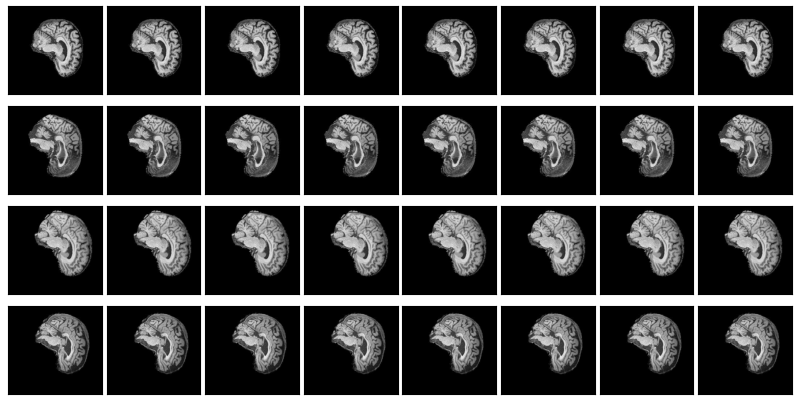
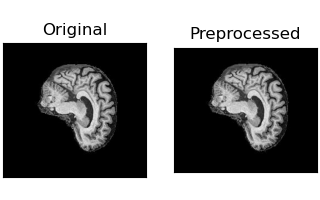
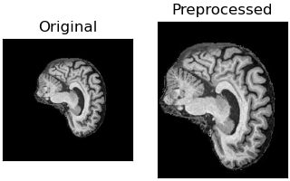
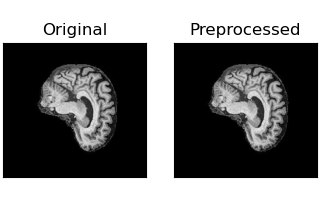
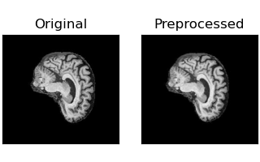
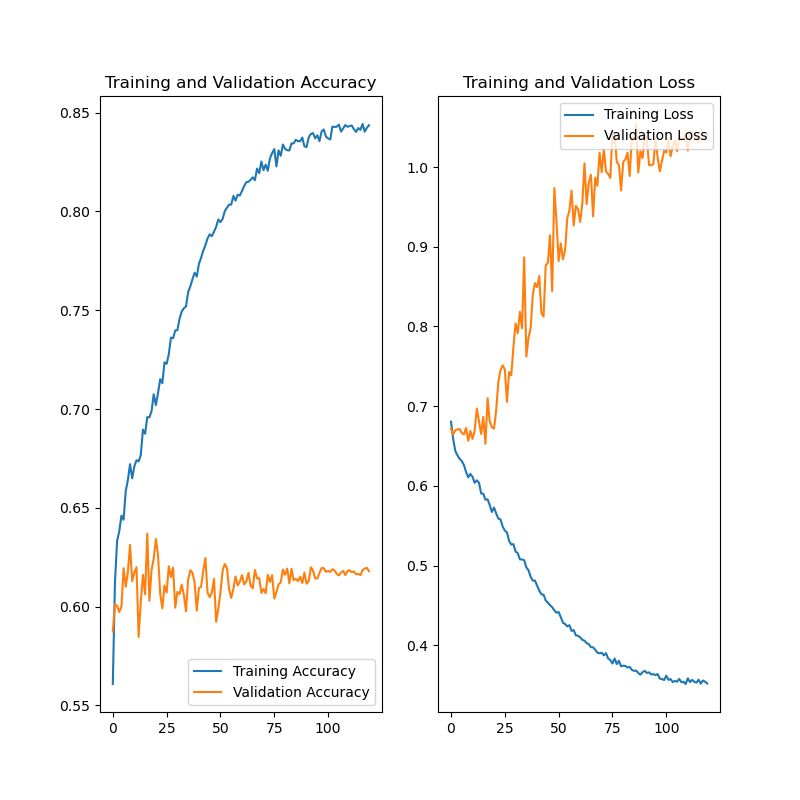
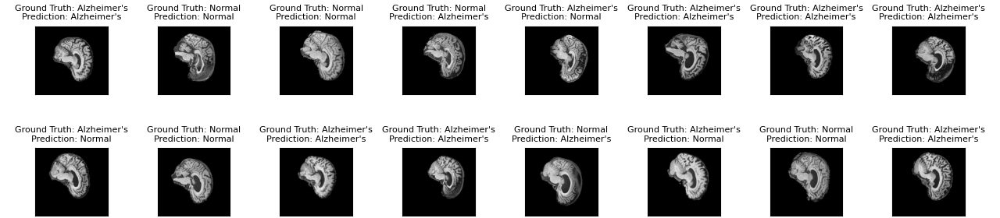

# Classifying Alzheimer's Disease Diagnoses Using Vision Trainsformer

This project attempts to classify the [ADNI](https://adni.loni.usc.edu/) brain dataset into AD (Alzheimer's Disease) and NC (Normal Cognitive). It uses a Vision Transformer network (ViT) as proposed by the paper [An Image is Worth 16x16 Words](http://arxiv.org/abs/2010.11929). The original paper is implemented with JAX, but I used Tensorflow, so I used the implementation by [Saptashwa Bhattacharyya](https://towardsdatascience.com/understand-and-implement-vision-transformer-with-tensorflow-2-0-f5435769093). The dataset was split into 3 groups: 21000 images for training, 6000 for validation, and 3000 for testing. Results were somewhat dissapointing, as I only achieved a validation accuracy of 61.79%, and a testing accuracy of 57.04%. I even tried multiple different preprocessing techniques, but these only made the accuracy worse.

## Vision Transformer


The ViT first splits the image into a grid of patches to be processed individually.


Now that the image is split into patches, the network does not know the location of each patch. So, a trainable vector with information about the location of each patch is embedded into the now-flattened patchs. The embedded patches are then fed into the transformer itself. Transformers (not just ViTs) use a mechanism called attention which can be trained to adjust the weights based on input, unlike a traditional network where the weights are fixed after training. This is what allows ViTs to outperform CNNs on large datasets. After the transformer encoder, the data is fed into a basic MLP, which classifies the image.


## Data



The ViT is trained on the [ADNI](https://adni.loni.usc.edu/) brain dataset. Each image has a label depending on whether or not the patient has Alzheimer's (AD vs NC). Each file name is formatted as `{patient-id}_{scan-num}.jpeg`. This means that each patient has multiple scans of their brain.

### Dataset Splits

The dataset is already split into 21000 images for training, and 9000 images for testing. However, I needed a third split for validation. I used a python program, `split_data.py`, which randomly takes images from the training set and puts them into the validation set. It makes sure that a given patient ID is only in either testing or validation, to avoid accidental data duplication. I then ended up with 6000 images for validation, and 3000 for testing.

### Data Preprocessing

I attempted several preprocessing methods to improve accuracy, but only a few actually helped. Out of the following, only Simple Crop and Normalisation were used in the final implementation.

#### Simple Crop

At first, I used patches that were 32X32 pixels. However, the height of the images was 240 pixels, which does not divide evenly into 32. To fix this, I cropped the top and bottom 8 pixels using a `Cropping2D` layer, giving a new height of 224 pixels. This had the added benefit of lowering the number of pixels the model had to process.



#### Tracked Crop

I noticed that about half of each image was just a black background, and the position of the brain varied from image to image. By getting the average position of every non-black pixel, I obtained the 'centre' of each brain, then cropped around that. This was implemented in a custom Keras layer called `TrackCrop`.



#### Normalisation

To normalise the data, I used a `Normalization` layer, which calculates the mean and variance of the entire dataset. This is, however, quite slow, so I used the function `adapt()` to calculate the values in advance, then saved them to a text file.



#### Data Augmentation

To minimise overfitting, I attempted data augmentation. I used a `RandomTranslation` and `RandomZoom` layer, and filled empty space with black.



## Training

As per the [Medium Article](https://towardsdatascience.com/understand-and-implement-vision-transformer-with-tensorflow-2-0-f5435769093), I started with a learning rate of 0.002, and decreased it using the `ReduceLROnPlateau` function. Training was done on a Nvidia V100, using the UQ Getafix cluster, ran for 120 epochs, with a batch size of 32. The following hyperparameters were used:

* Transformer Layers - 6
* Patch Size - 16
* Hidden Size - 64
* Number of Heads - 4
* MLP Dimension - 128
* Dropout - 0.1
* Embedded Dropout - 0.2

Training took over an hour. Training loss was 0.3520, and accuracy was 84.37%. Validation loss was 1.0421, and accuracy was 61.79%. The final learning rate was 0.000014757.




## Testing

Testing accuracy was 57.04%, and testing loss was 1.1585.



## Running The Model

### Installation

Tensorflow was installed using instructions from [the Tensorflow website](https://www.tensorflow.org/install/pip). `environment.yml` contains every required package, which can be installed using:

```
conda env create -n {Environment Name} -f environment.yml
```

There is also an environment variable that needs to be set:

```
export LD_LIBRARY_PATH=$LD_LIBRARY_PATH:$CONDA_PREFIX/lib/
```

However, this can be automatically set whenever the environment is activated using:

```
mkdir -p $CONDA_PREFIX/etc/conda/activate.d
echo 'export LD_LIBRARY_PATH=$LD_LIBRARY_PATH:$CONDA_PREFIX/lib/' > $CONDA_PREFIX/etc/conda/activate.d/env_vars.sh
```

If you run the program in a Slurm job, you will still need to manually set the variable, but I wrote `init_conda.sh` to make this quicker.

### Configuring The Model

Parameters are stored in `config.yaml`, which can be modified to change the model. The most important thing to change is `data_dir`, which controls where the dataset and model weights will be stored.

### Training

To train the model, run

```
python train.py
```

The loss accuracy graph will be stored in `/images`, and the model weights will be stored in the data directory.

### Testing

After the model has been trained, run

```
python predict.py
```

to generate testing information. Graphs and images will be stored in `/images`.