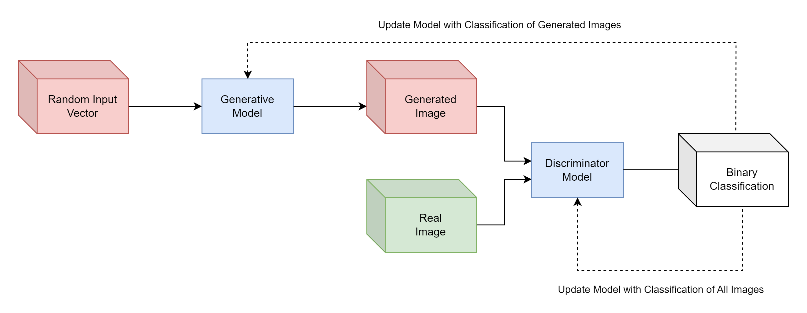
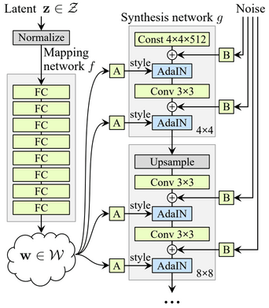
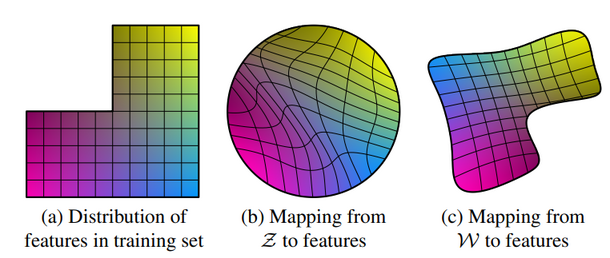
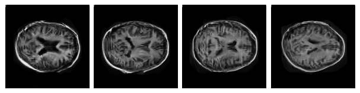
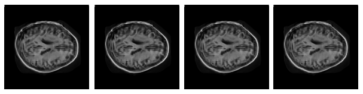
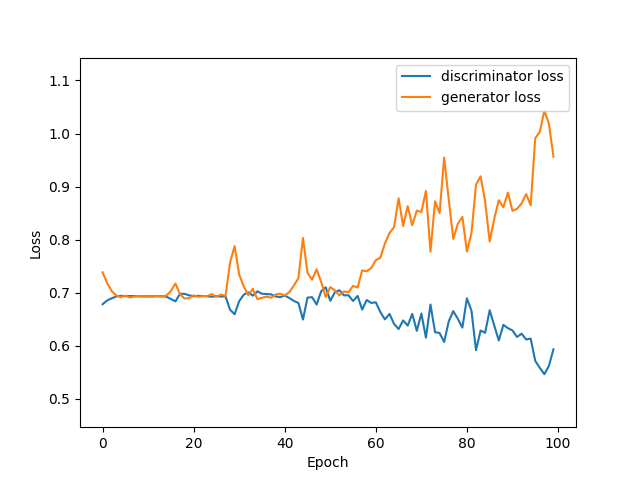

# **Image Generation of MRI Brains using StyleGAN**
# Problem
This report will attempt to artificially generate 'reasonably clear' images of MRI Brain Scans, using the OASIS Brain data set. This will be done using the StyleGAN variant of a General Adversarial Network (GAN). GANs are commonly used to artificially produce realistic data sets, including image data.

# Algorithm Description
## General Adversarial Networks
GANs are built using two seperate sub-models competing in a zero-sum game. The generator model attempts to take random inputs from latent space and produce realistic outputs, whereas the discriminator model takes data inputs, either real or generated, and attempts to classify them by their origin. The models are trained together and once the generator is producing satisfactory examples, can be abstracted from the model to produce outputs. (J. Brownlee. 17/06/2019)

## StyleGAN
StyleGAN is an improvement on the GAN model that uses a Style-Based Generator Architecture. These include a feature mapping network that takes latent dimension $Z$ inputs and converts them to an intermediate latent space $W$. These values are input into a learned affine transform [A] layer, which converts them to styles that control the generator in an Adaptive Instance Normalisation layer (AdaIN). The AdaIN layers normalise each input. Noise is also applied inside the generator with a learned scaling factor in [B] layers.

The Generator architecture consists of a  constant input layer, to which noise and AdaIN layers are applied, then a convolutional layer before another set of noise and AdaIN layers. Then Multiple generator blocks continually upscale the image, then apply convolution noise and AdaIN twice each before the next block.

The Discriminator Architecture is unchanged from a standard Deep Convolutional GAN (DCGAN), which takes in the image input and applies repeated convolutional layers and downsampling, before a final Dense classification layer. (T. Karras, S. Laine, T. Aila. 29/03/2021)

### Feature Mapping
The Mapping network $f$ is made up of 8 Fully Connected Layers such that $f(z) = w$. The learned mapping network allows $w$ inputs to more closely represent the distribution of features in the original training set. (T. Karras, S. Laine, T. Aila. 29/03/2021)

### Affine Transformation and Adaptive Instance Normalisation (AdaIN)
$w$ values are input into learned affine transformation [A] layers that produce learned scale and bias variables style variables $(y_s, y_b)$ for use in Adaptive Instance Normalisation in each convolutional layers. For an instance $x_i$, this is computed with the formula

$$\text{AdaIN}(x_i, y) = y_{s,i} \cdot \frac{x_i = \mu(x_i)}{\sigma(x_i)} + y_{b,i}$$

### Noise Inputs
Noise layers apply noise to the image with a per-channel learned scaling factor

# Data

## Source and Import
Data is sourced from the OASIS MRI Dataset, sourced from the Course Help/Resources section on blackboard. It contains roughly 10,000 images of MRI Brain Scans at different vertical slices. After download and Extraction, the subdirectories of the `keras_png_slices_data` directory should contain 6 subdirectories. All images from the `keras_png_slices_train`, `keras_png_slices_validate` and `keras_png_slices_test` should be moved into a new subdirectory with any name. All original subdirectories should then be deleted for proper usage with the model.

## Preprocessing
Minimal data preprocessing was utilized for this problem. The data was imported as grayscale, as this requires less computation time with only one channel. All image data was also scaled to the interval $[0,1]$ to increase computational efficiency. Translating, rotating, reflecting and scaling images were all considered in order to increase the robustness of the model such that it may output images that are not always centred and scaled perfectly, however this was deemed unnecessary as MRI images are already consistent in these metrics, so applying the transformations would affect the usefullness of the model.

## Training Validation and Testing splits
As the StyleGAN seeks to generate believable looking images using the zero-sum game between the generator and the discriminator, splitting the data set would only decrease the size of available data and reliability of the model. It may have some use in order to test stand-alone discriminator robustness, but there is little purpouse for this project. As such all images were placed in the same subdirectory and not split. 

# Results
## Outputs
The following outputs were produced while training the StyleGAN for 100 epochs with the default optimization hyperparameters. They are taken from the model during consectutive epochs 96, 97, 98 and 99.

Outputs from different epochs are shown here because the model suffers from severe mode collapse, with outputs from the same epoch looking near-identical. For example below are four outputs from epoch 99, each with unique noise inputs and latent dimension random inputs.

## Loss Plot

Below is the loss plot of the training run that produced the above images. 

The generator and discriminator losses do tend to diverge towards the end of the training, However the hyperparameters from this session do remain the default because it produces reasonable looking output while being more stable than attempts with higher learning rates. It completes the training in roughly 2 hours on my local machine (NVIDIA RTX 3080 / 16GB RAM).

## Reproducability

While the exact results are not reproducable without model weights, training the model should provide reasonably clear images of a similar quality with the default training variables, provided the losses do not start to diverge. In this rare case, it is best to re-train.

# Usage

## Dependencies

Python 3.10.4\
Tensorflow 2.10.0\
Matplotlib 3.5.2

## Variables

The following global variables in `predict.py` can be modified to change file I/O locations, output variables and training variables.

`INPUT_IMAGES_PATH`: the relative path to the input image data directory from the `predict.py` file. the directory must contain a subdirectory with the images to be readable.      

`INPUT_GENERATOR_WEIGHTS_PATH`: the relative path to a `.h5` file containing generator weights. Set to "" to instead train the model

`INPUT_DISCRIMINATOR_WEIGHTS_PATH`: the relative path to a `.h5` file containing discriminator weights. Set to "" to instead train the model

`OUTPUT_IMAGES_PATH`: the relative path to a directory in which to save image outputs. Set to "" to not save images

`OUTPUT_WEIGHTS_PATH`: the relative path to a directory in which to save model weights during training. Set to "" to not save images

`OUTPUT_IMAGES_COUNT`: the number of output images to save each training epoch

`PLOT_LOSS`: `True` if a plot of generator and discriminator loss                

`EPOCHS`: number of epochs to train for

`BATCH_SIZE`: number of images in training batches

# References

Face image generation with StyleGAN. Soon-Yau CHeong. Date Created: 01/07/2021, Last Modified: 20/12/2021. https://keras.io/examples/generative/stylegan/

A Style-Based Generator Architecture for Generative Adversarial Networks. Tero Karras, Samuli Laine, Timo Aila. Date Published: 29/03/2021. https://arxiv.org/abs/1812.04948

A Gentre Introduction to Generative Adversarial Networks (GANs). Jason Brownlee. Date Published: 17/06/2019. https://machinelearningmastery.com/what-are-generative-adversarial-networks-gans/