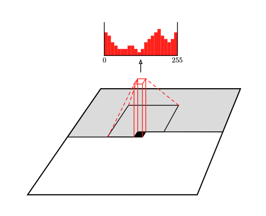

# Generative model of OASIS brain data set using VQVAE

## Introduction
In this folder I have implemented the scripts for generating new images from the OASIS brain data set using VQVAE and I have used PixelCNN as the autoregressive generative model.

## VQVAE
VQVAE was proposed in the paper Neural Discrete Representation Learning[1]. A normal VAE has an encoder, decoder, and a latent space with a prior (continuos). Similar to VAE, the VQVAE has an encoder and a decoder but the latent space is discrete rather than continous. The other difference is that the prior is learnt using a Vector Quantised layer[1]. It works in the following way: an image is passed into the encoder and the output of encoder is mapped to the codebook vector which is closest (according to L2 Norm), and once all the codebook indices are learnt which can be used to get the discrete latent vectors from codebook, we pass it to the decoder which regenerates the image.

Figure showing the VQVAE architecture[1]


## PixelCNN
We use the PixelCNN model to generate new novel images. First we train the VQVAE model to learn how to reconstruct images, which will leave us with a trained decoder and a codebook. Then, we will train the PixelCNN model. After that we will go pixel by pixel to generate a new latent space for a novel image, which we will input to the vqvae decoder to finally receive a novel image.

I have used the architecture mentioned in the Pixel Recurrent Neural Network[2] to create the PixelCNN. In brief, the architecture includes a masked convolutional layer and then 15 residual blocks, followed by chain of Relu-Conv layers, and then output layer. 

Figure of PixelCNN predicting value of next pixel based on neighbouring values[3]




## OASIS Dataset

We are using preprocessed OASIS brain MRI data for this project. The mask images present in the data used for image segmentation are ignored along with the validation data. 

I am resizing the data from 256x256 to 64x64 to improve performance. Despite this, the novel images generate are clear. During the process of loading the data, I normalise it to get the values between 0 and 1.

Note: If using collab to run the project, run the below given commands to get the dataset and then run predict.py:

```
!wget 'https://cloudstor.aarnet.edu.au/plus/s/tByzSZzvvVh0hZA/download'
!unzip 'download'
```

But if running locally, change TRAIN, TEST in predict.py to the location where your data is stored, and run predict.py

## Training

I am training VQVAE for 30 epochs with a batch size of 64 and plotting the losses. Also, the value of beta in initializing vector quantizer is chosen to be 1 after trying many values, as this gives the best performance in lesser number of epochs. It should be between 0.25 and 2 according to the paper.


Image showing reconstructed image with SSIM = 0.79, (>0.6 condition satisfied)


I am training PixelCNN for 100 epochs with a batch size = 128 and plotting the losses


## Novel Image Generation

I am generating fake brain images using VQVAE along with PixelCNN and they closely resemble images in the dataset.
I am plotting new generated image against image from test dataset below.


## Dependencies

* Python: 3.7.15
* Tensorflow: 2.9.2
* Tensorflow-probability: 0.16.0
* Matplotlib: 3.2.2
* Numpy: 1.21.6
* Glob

## References

[1] A.v. Oord, O. Vinyals, and K. Kavukcuoglu, 2018. Neural Discrete Representation Learning. [Online]. Available at: https://arxiv.org/abs/1711.00937 

[2] A.v. Oord, N. Kalchbrenner, and K. Kavukcuoglu, 2016. Pixel Recurrent Neural Networks, [Online]. Available: http://arxiv.org/abs/1601.06759

[3] A.v. Oord, N. Kalchbrenner, O. Vinyals, L. Espeholt, A. Graves, and K. Kavukcuoglu, 2016. Conditional Image Generation with PixelCNN Decoders, [Online]. Available: http://arxiv.org/abs/1606.05328

[4] S. Paul, 2021. Vector-Quantized Variational Autoencoders on Keras website, [Online]. Available: https://keras.io/examples/generative/vq_vae/
 

