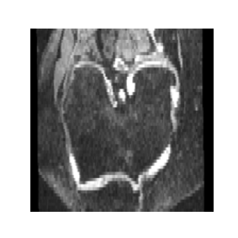
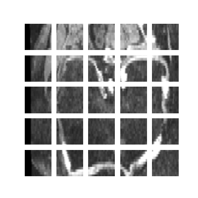

# | OAI AKOA | Perveiver Transformer | 46252665 |

## Dataset

OAI AKOA Knee MRI Images
Osteoarthritis Initiative (OAI) Accelerated Osteoarthritis (OA) Knee MRI 2D 
Images (~16K images, 1.7 GB). The caption of the images contained the 
information regarding the left or right knee information. Original resolution
of the image were 260 x 288.

 

## Installation

Install Conda/Miniconda

```
conda activate tf
conda env update --file tf.yml --prune
```

or

```
pip install -r requirements.txt
```

## Step's

Download OAI AKOA Knee dataset, unzip images in `/data/` folder.

Run the driver file to pre-process, train and visualise.

```
python main.py
```

Hyper-parameters can be controlled in `settings/congfig.py`

| Parameter     | Description   |
| ------------- |--------------:|
| PATH      | Path of the OAI AKOA Knee Dataset|
| TEST_SPLIT | Split for test/train |
| IMAGE_SIZE | Size of image for training |
| AUG_FACTOR | Value for flipping upside down in augmentation |
| AUG_VAL | Value for flipping left right in augmentation |
| BLUR_AUG | Blur intensity value |
| CLASSES | Number of classes to detect by the perceiver transformer |
| LEARNING_RATE | Step size at each iteration |
| MOMENTUM | Accumulates the gradient of the past steps to determine direction|
| BATCH_SIZE | Number of training examples utilized in one iteration |
| EPOCHS | Number of passes of the entire training dataset |
| DROPOUT | Number of randomly selected neurons are ignored during training |
| PATCH_SIZE | Size of a patch eg: 40x40 |
| LATENT_DIMENSION | Size of the latent array |
| PROJECTION_DIMENSION | Size of the positional embedding |
| TRANSFORMER_HEADS | Number of times attention module repeats its computations in parallel |
| TRANSFORMER_BLOCKS | Number of transformer stacks in the perceiver |
| ITERATIONS | Number of iterations in the perceiver |
| EPSILON | Factor for numerical stability |
| MONITOR | Specify the performance measure to monitor |
| PATIENCE | Number of epochs to wait before early stop if no progress on the validation set |
| VALIDATION_SPLIT | Ration of hypothetical testing set to predict the fit of the model |

## Dependencies

* tensorflow
* numpy
* imgaug
* scikit-learn
* opencv-python
* graphviz
* pydot
* matplotlib

## Perceiver Transformer


The perceiver mixes the latent self-attention mechanism with the cross-attention
mechanism. The input data only enters through the transformer through the 
cross-attention mechanism. This allows the model to be of significant lower 
size than the data array and solves the transformer quadratic compute bottleneck. 


The perceiver transformer works for inputs such as images, videos, and
audio. No prior assumption or changes is required for any input modality, 
for the model to work. Given an image, it will do transformer like attention 
but since images are of large shape it is too much to put it in one transformer.
Therefore, it sub-divides the image into patches, and for each patch, it makes 
a vector out of it. All the pixels are close together goes into one vector, 
thus treated as a group.

The perceiver's goal is to have a low dimension latent array, N. The top row
is a regular self-attention transformer as in the original paper with the 
quadratic blowup along with multiple transformer blocks. The image input to the 
Perceiver is a byte array, M i.e. (228x228=51984), which is of higher dimension,
however the queries calculated are from the latent dimension rather than the 
image itself. Thus resulting in a lower N x M blowup. Data of the image flows 
into the cross-attention, generating a latent state which is transformed further
by the transformer and queries are generated to do cross-attention again to the 
same image behaving like a recurrent neural network(RNN) with weight sharing 
options. The data that flows through influences the queries and is refined 
multiple times.

## Patches & Positional Encoding

Patches are created of 40 x 40 with stride length 40. Thus creating 
IMAGE_SIZE // PATCH_SIZE = 228 // 40 = 5 patches in each stride's and a total of 
25 patches across the image.



Positional Encoding are generally applicable to all input modality. The original
paper implemented the fourier feature positional embedding. The position used 
here is used to encode the relationship between the nearby patches. 

* The feature based embeddings allows the network to learn the position structure.
* Produces sufficient results compared to ImageNet without prior assumptions.
* Can be extended to multi-modal data.

## Cross-Attention

The query vectors, key vectors, and value vectors are the three types of 
vectors calculated in the transformer architecture. These are determined by 
multiplying the input with a linear transformation. Each input is the same 
in self attention, however they can be different in cross attention. 
The purpose of cross attention is to calculate attention scores utilising data
from different sources. For instance, the query vector in the perceiver 
transformer is calculated from the latent array, while the key and value is 
generated from the image data. 

## Transformer Blocks

The transformer block in perceiver uses GPT2 architecture which is based on 
the decoder of the original transformer. The decoder takes that input 
representation from the cross attention and, the self-attention layer helps 
the decoder focus on appropriate places in the input sequence. Self-attention 
is the result if the query, key, and value are all the same. In each time-step 
in the query corresponds to a sequence in the key, and the result is a 
fixed-width vector. The query and key tensors are then scaled and dot-produced.


## Model Summary


## Results

```
Patches : 40
Batch size: 32
```

### Without Augmentation

#### Test accuracy: 98.77%


### With Augmentation

#### Test Accuracy: 83.06%


# Citations
```
@misc{Perceiver,
  author = {Andrew Jaegle, Felix Gimeno, Andrew Brock, Andrew Zisserman, 
  Oriol Vinyals, Joao Carreira},
  title = {Perceiver: General Perception with Iterative Attention},
  year = {2021},
  publisher = {arXiv},
  GitHub Repository = {\url{https://github.com/Rishit-dagli/Perceiver}},
}

@misc{Keras,
  author = {Khalid Salama},
  title = {Image classification with Perceiver},
  year = {2021},
  Url = {\url{https://keras.io/examples/vision/perceiver_image_classification/}},
}

@misc{YouTube,
  author = {Yannic Kilcher},
  title = {Perceiver: General Perception with Iterative Attention (Google DeepMind Research Paper Explained)},
  year = {2021},
  Url = {\url{https://www.youtube.com/watch?v=P_xeshTnPZg}},
}
```