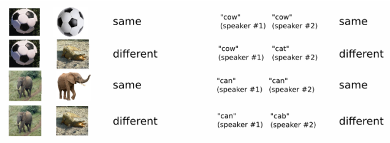
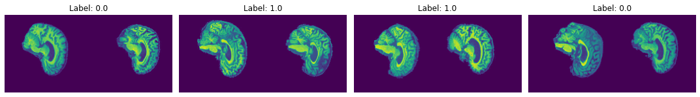
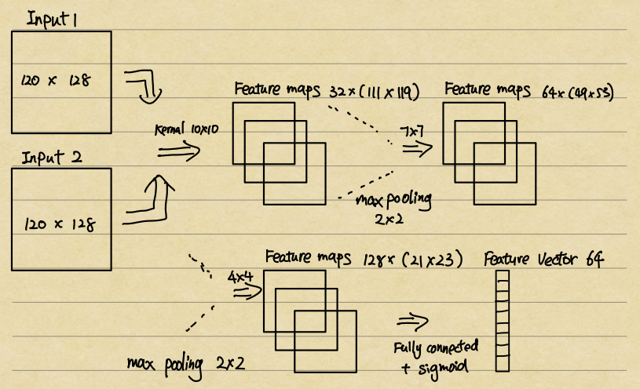
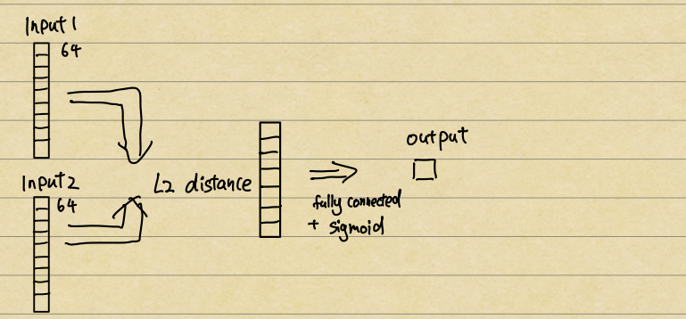
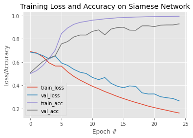
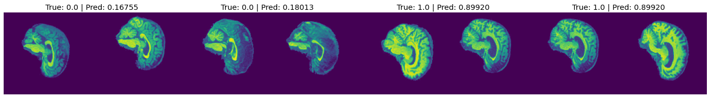
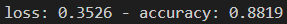
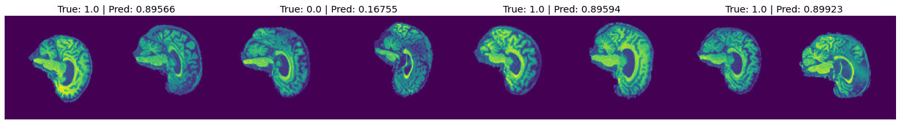

# Classify Alzheimer’s disease of ADNI brain dataset using a classifier based on Siamese network

This project uses a Siamese network to determine the similarity between two images to classify Alzheimer’s disease.

## Siamese network

The Siamese network is a "conjoined neural network", where the "conjoining" of neural networks is achieved by sharing weights.

Since the Siamese network is used to determine the similarity between images, unlike other neural networks, the Siamese network uses two images and a label representing their similarity as input.

The figure below shows the basic architectural of the Siamese network. 

It is clear that the Siamese network can be divided into two parts. The first part is the CNN. Although two CNNs are drawn in the figure, they are the same CNN, which have the same structure and share the weight. The output of the CNN should be two one-dimensional vector s that contains the information of the inputs. 

In addition, the second part of the Siamese network is the Differencing Layer. Through calculating the euclidean distance between two vectors, we can obtain a similarity score. If we use the sigmoid as the activation function, a similarity score closer to 0 means that the two images are more similar, and conversely, if it is closer to 1, it means that the two images are most likely from different labels.

## Application to ADNI brain dataset

### 1. Data Preprocessing

The ADNI brain dataset contains two classes, AD and NC, and the initial shape of each image is (240, 256, 1). After loading the dataset from the directory, all images will be normalized. Moreover, in order to increase the training speed, all images are resized to (120, 128, 1).

The most important part of the data proprocessing is to compose the data into pairs and lebel them. In order to keep thenumber of pairs with the same class is the same as the number of pairs with different classes, I split the data into 4 different sets of pairs, which are 

((AD, AD), 0), ((NC, NC),0), ((AD, NC),1), ((NC, AD),1)

After pair the images, I combine all the pairs and shuffle them. Here is some figures shows the image pairs with their labels.

In addition, the combined pairs will be batched with batch size 16, then it will be split into the training data and validation data with a ratio of around 8:2.

### 2. Siamese Model

The Siamese model I constructed is consisted by two parts, the first is an embedding model and the second is a siminese network model, which contains a merge layer and output layer.

As the figure shows, the embedding model is a CNN that embeds an image into a feature vector, which contains 3 convolutional layers, 2 max-pooling layers and 1 dense layer with a sigmoid activation function. The reason for using the sigmoid as the activation function is we want the feature vector to be normalized. 

After calculating the feature vectors of two inputs, I use a merge layer to calculate the L2 distance between two vectors. And then, I addd a dense layer with a sigmoid activation function to predict the similarity of the inputs from 0 to 1. 

### 3. Training and Validating

After constructed the Siamese model, the next step is to identify the loss function and the optimizer. 

Since the dataset only has two classes, the loss function I have chosen is the tf.keras.losses.binary_crossentropy(), which will show the difference between the truth label and the predicted label. Moreover, the accuracy function I have chosen is the keras.metrics.binary_accuracy().

The optimizer I have chosen is the Adam with a learning rate of 0.00006. 

 

After 25 epochs training, the training accuracy, training loss, validation accuracy, validation loss are shows below:

According to the graph above, it can be seen that the training accuracy increases sharply in the first 8 epoches, and then stay at **99%** until the end of training. Despite some fluctuations, validation's accuracy has also been on the rise, the final accuacy of the validation is **93%.**. Moreover, the training loss and validation loss continuous decline during training, which means the model has great performance on distinguish the differences between images. 

The figures below shows the predicted label and truth label of some sample of pairs

### 4. Testing

The dataset provides some images for testing. However, the Siamese network only gives the similarity between two images, it does not classify the images. As a result, I combine the training images and test images together and use the same data preprocessing method to put them into the Siamese model. Since I know the class of one of the images, I can get the class of the test image by the similarity of the two images.

Through putting the test image pairs into the trained Siamese model, the test accuracy can be recieved, which is 

## 5. Prediction

Due to the Siamese model only predict the similary between two images, I construct a new model to classify the images.

The classifier only contains a output layer, the acivation function is softmax, which can classify the image with the highest probability.

## Code discription

1. “modules.py" containing the source code of the components of the model
2. “dataset.py" containing the data loader for loading and preprocessing the dataset
3. “train.py" containing the source code for training, validating, testing and saving the model. 
    1. If you want to train your own model with your dataset, you can change the PATH vairable and set TRAINING to True.
    2. if you want to use the model that I trained, you can set TRAINING to False
4. “predict.py" showing example usage of the trained model. Visulaizing some results.  
    1. Through change the PATH, you can visulaize the images with their truth label and predicted label. 

Both the “train.py” and “predict.py” are runnable

## **Dependencies**

1. The project requires the python version == 3.9.12
2. The project requires the following external libriaries
    - numpy 1.23.1
    - matplotlib 3.5.2
    - Tensorflow-gpu 2.6.0

## References

[1] G. Koch, R. Zemel, R. Salakhutdinov et al., “Siamese neural networks for one-shot image recognition,” in ICML deep learning workshop, vol. 2. Lille, 2015, p. 0
[2] Image similarity estimation using a Siamese Network with a triplet loss https://keras.io/examples/vision/siamese_network/
[3] Image similarity estimation using a Siamese Network with a contrastive loss https://keras.io/examples/vision/siamese_contrastive/