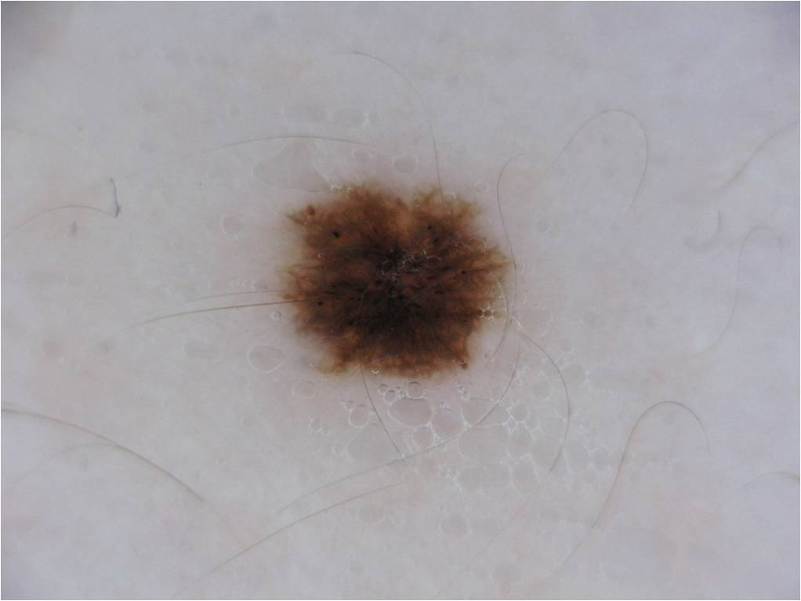
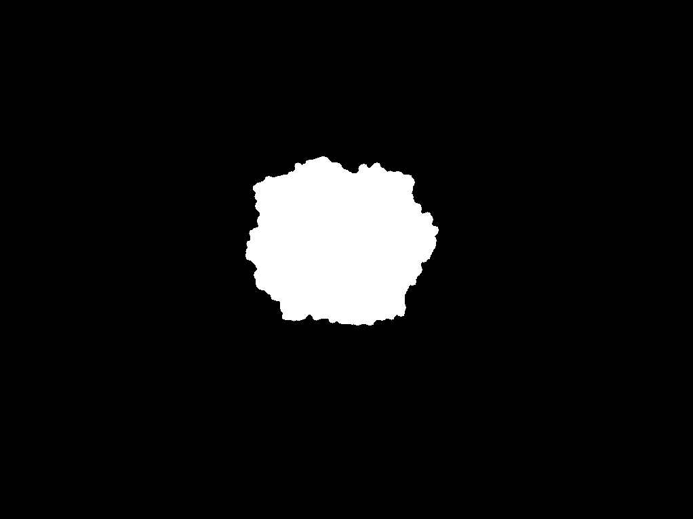

# Improved UNet
## Author
Name: Zichuan Huang

Student number: 46281740

This is the final project for COMP3710
-------
## 1. Algorithm Description
The reason that this algorithm is called 'Improved UNet' is because it is inspired by the traditional UNet's architechture, which is also include a path that encodes the input and then decode it by a localization pathway.
## 2. Problem
The ISIC dataset includes a series of skin cancer pictures, and each picture has a corresponding segmentation image as the grountruth results. The final object that we need to achieve is to use these training data to train our unet model. The model are supposed to do the segementation by itself on the new skin cancer picture without the groundtruth, and the DSC(Dice Similarity Coefficient) should be above 0.8. The example inputs and outputs are shown below.

## 3. Mechanism

## 4. Data Splitting

## 5. Dependencies list