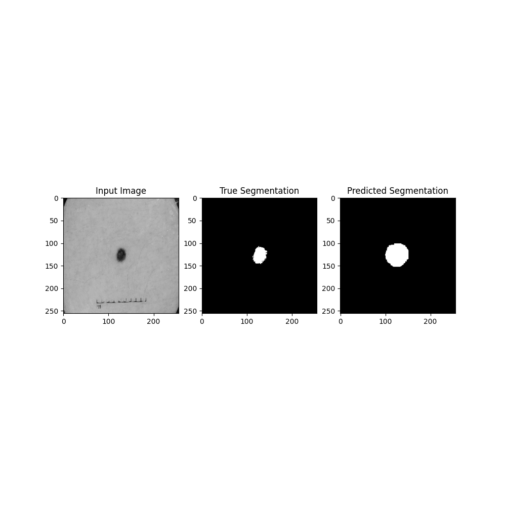
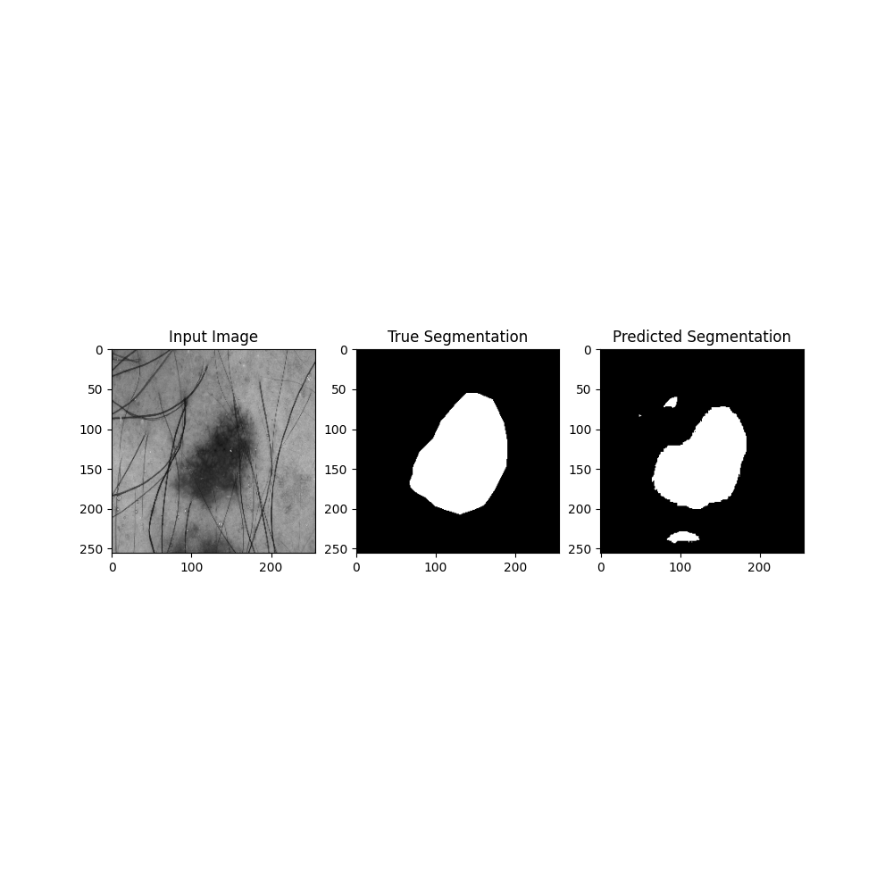
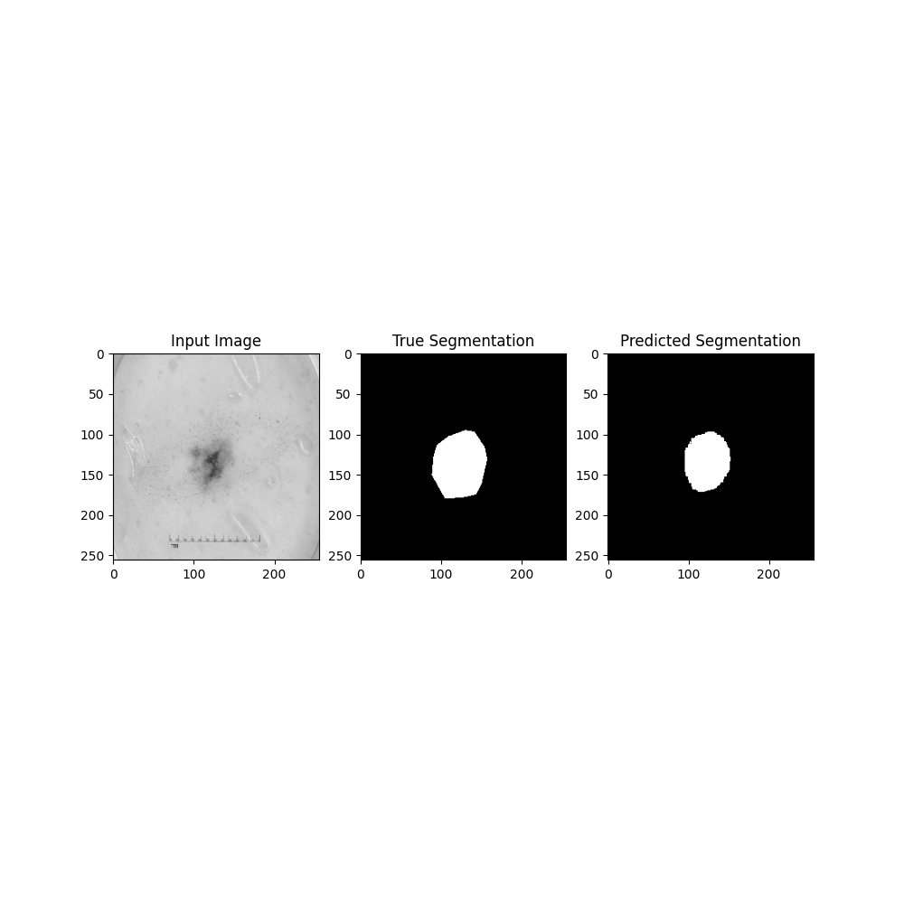
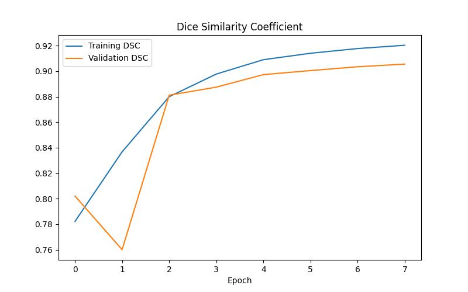

# Improved UNet
## Author
Name: Zichuan Huang

Student number: 46281740

This is the final project for COMP3710
-------
## 1. Algorithm Description
The reason that this algorithm is called 'Improved UNet' is because it is inspired by the traditional UNet's architechture, which is also include a path that encodes the input and then decode it by a localization pathway.

## 2. Problem
The ISIC dataset includes a series of skin cancer pictures, and each picture has a corresponding segmentation image as the grountruth results. The final object that we need to achieve is to use these training data to train our unet model. The model are supposed to do the segementation by itself on the new skin cancer picture without the groundtruth, and the DSC(Dice Similarity Coefficient) should be above 0.8. The example inputs and outputs are shown below.

## 3. Mechanism
The architecture of improved UNet are shown below, which is given by the paper *"Brain Tumor Segmentation and Radiomics Survival Prediction"*. As it shows on the figure, it looks similar to the original UNet. Compared to the original UNet, improved UNet adds extra concatenation and element-wise sum layers. Each context module consists of two 3x3x3 convolutional layers and a dropout layer in between.

Each layer of the improved UNet takes a 3x3x3 convolution with input stride 2 to reduce the resolution of the feature maps and do a element-wise sum with the context module, from size of 16 to 256. Then the upsampling begin, it takes features from lower levels of the network and encode the information to a higher spatial resolution. This is implemented by recombine the upsampled feature with the feature from the corresponding level and the localization module. In the output, it apply deep supervision in the localization pathway by intergrating segmentation layers at different levels and combining them by element-wise sum.

## 4. Data Splitting
Here I simply follow the original splitting strategy given in the original dataset.
## 5. Output and Dice Coefficient

## 6. Dependencies list
Python 3.9.12
Tensorflow 2.6.0
matplotlib 3.5.1

## 7. References
[Brain Tumor Segmentation and Radiomics Survival Prediction](https://arxiv.org/abs/1802.10508v1)

[ISIC 2017 Challenge Dataset](https://challenge.isic-archive.com/data/#2017)