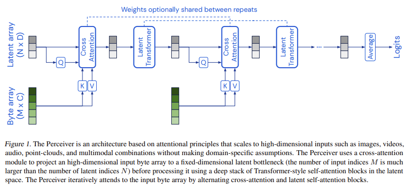
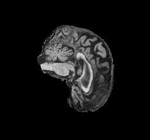
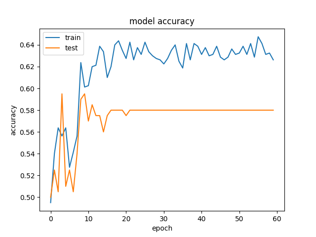
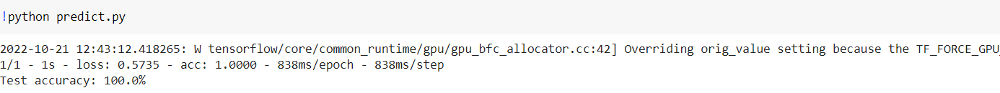

### NOTE ON LATE PULL REQUEST AND MISSING COMMITS
Due to me not knowing of the git file size limit, most of my commits included the zip files which are too large. Attempts were made over the enitirety of Saturday at editing the commits to remove the file using various online tools, however none proved successful.

Due to this I have committed (the one before this commit) the files as they were on 11:56 on Friday Night, and I can show in person this is the case.

I have also included my log history in the text file named original_git_log.txt, this may not be suffiecient evidence but I hope it will be.

If any further evidence is required please email me.

# Perceiver Model implementation for Classification of ADNI Alzheimer's Data
### Author: William Parker
### Student Number: s4637606

## Description of Model

This model is fundametally based off [Perceiver: General Perception with Iterative Attention](https://arxiv.org/abs/2103.03206) with the particular code and model used being based off [Image classification with Perceiver](https://keras.io/examples/vision/perceiver_image_classification/) with some variation and changing of the data to use ADNI data set instead of CIFAR-100.

This Perciever model aims to accurately classify whether or not an image of a brain is indicative of Alzheimers or not. An issue with Transformer models is the quadratic computing bottleneck. Perciever models aim to address this issue by combining and alternating the transformer attention mechanism with a cross attention module. This creates an array in the model which is of a signifigantly lower size than the array in alternative models. Another advantage of Perciever models is that they can be used on varying types of data (audio, video, spatial positioning, text and images), although this particular model deals only with images.

Helpful Diagram from Deepmind Paper

### Positional Encoding
Positional encoding lets the data array preserve the positional structure. The original deepmind paper uses fourier features which appears to be a more ideal solution that produces better results. However due to complexity of implementation and a lack of math knowledge, patches were used instead. Patches are regions of each image where positioning is retained.

## Data
The data was already pre-processed kindly by the Course Staff. Images were input with a label of 1 (Alzheimers) or 0 (no Alzheimers).
A limited amount of the data (800 training and 200 test) was used with a 80:20 split of train:test data. It may be the case that images adjacent to the other may be the same patients. However random selection was not used which may be a cause for the low accuracy of my model, but the high accuracy on the predict.py.

### Example Input
An Alzheimers positve brain scan

## Usage
There are 4 files
dataset.py - processes data
modules.py - stores model
train.py - run to run the model (ensure tensorflow_addons installed)
predict.py - run to test accuracy on test data

## Dependencies
tensorflow
tensorflow_addons
numpy
matplotlib

## Results

It had a final accuracy of 58.0% which is well below the required 80% though it sometimes reach 65% accuracy. 

However when used to predict on 10 positve test data it was 100% accurate.
