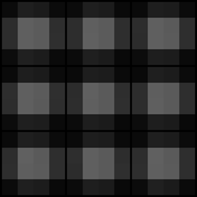

# StyleGAN implementation on OASIS dataset

COMP3710 Project  
Chun-Chiao Huang  
46395281  

## Aim
This project implements styleGAN, which aims to train a discriminator and a generator simultaneously.      
By letting the discriminator learn to classify the real image from OASIS dataset and the fake image generated by the generator.       
And letting the generator learn to cheat the discriminator.   
Eventually, the generator can produce synthetic images similar to the OASIS images.   
    
Different from the traditional Generative Adversarial Network, styleGAN has many new features.    
These features include progressively growing, Adaptive Instance Normalization, mapping network, Eualised Learning Rate, Noise Injection and Fade-in.    
  
## Model structue
### ProGAN strusture
   
    Tero et al., 2018 
  
  The structure of styleGAN is similar to ProGAN, while the Generator is changed to the structure shown in the below figure.  
  The generator and the discriminator both start at 4 * 4 images and progressively grow to 256 * 256 images.
### Structure of Generator
    
   Tero et al., 2020    
   #### AdaIN and Mapping network
   Instead of random noise input to the generator, the input is now changed to constants.   
   A 8-layers mapping net is added to project random noise *z* to latent *w*.   
   Then, *w* go through a dense layer and become factors and biases for Adaptive Instance Normorlization. (AdaIN)
   #### Equlised Learning Rate (Weight Scaled)    
   All the weights of Conv layers and dense layers are devided by a factor (He's std) to ensure the dynamic range and the learning speed for them are the same. (Tero et al., 2018 )    
   #### Noise Injection   
   Noises are scaled by learnable parameters and then injected before every AdaIN.
   #### Fade-in
   During training, whenever the growing happens, the output of the previous layer will be upscaled and mixed with the current layer.
   The proportion of the current layer and the previous layer is controlled by *alpha*, which decays as the current layer being trained.
   #### Loss
   The loss used is Non-Saturating loss, suggested by tutor Siyu.   
   No other loss is added as it works very well.
## Results    
### Images    
   
   
 
 

### Loss
  
   

## Requirements 
Python 3.7.12       
matplotlib 3.2.2    
numpy 1.19.5 (numpy is only used for plotting and saving images)    
torch 1.9.0+cu111   
torchvision 0.10.0+cu111    
tqdm 4.62.3   
Pillow 7.1.2
## Usage  
### To train the model, run:
    python train.py [data_path] [results_path]  
where [data_path] is the path of dataset and the results_path is the path the results will be saved at.  
The results include trained denerator model, discriminator model, loss plot, images during training and a .gif image show the training process.
### To use the trained model to generate images, run:
    python generate.py [model_path] [results_path]   
where the [model_path] is the path of the trained generator and the [results_path] is the path the results will be saved at.  

## Reference
### Papers
  Karras, T., Laine, S., & Aila, T. (2020). A Style-Based Generator Architecture for Generative Adversarial Networks. IEEE Transactions on Pattern Analysis and Machine Intelligence, PP, 1–1. https://arxiv.org/pdf/1812.04948.pdf

  Karras, T., Aila, T., Laine, S., & Lehtinen, J. (2017). Progressive Growing of GANs for Improved Quality, Stability, and Variation. https://arxiv.org/pdf/1710.10196.pdf

### Codes   

https://github.com/lernapparat/lernapparat/blob/master/style_gan/pytorch_style_gan_test_discriminator.ipynb
https://github.com/aladdinpersson/Machine-Learning-Collection/tree/master/ML/Pytorch/GANs/StyleGAN
https://github.com/rosinality/style-based-gan-pytorch   
https://github.com/caffeinism/StyleGAN-pytorch
https://github.com/facebookresearch/pytorch_GAN_zoo
