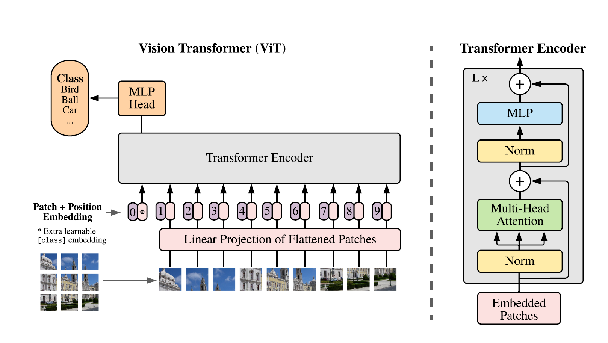
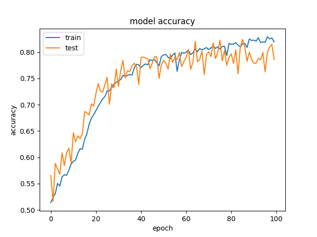

# ADNI Alzheimer's VIT Classifier
This project utilises a vanilla VIT (Vision Transformer) model as outlined in 
[An Image is Worth 16x16 Words](https://arxiv.org/abs/2010.11929) 
to classify 2D MRI Data as either healthy or Alzheimer's afflicted. The 
model achieves above 80% validation accuracy on the training data within 
100 epochs.

## VIT
### Transformer
Created in 2017 in the landmark paper [Attention Is All You Need](https://arxiv.org/abs/1706.03762),
Transformers have become widespread across the field of machine learning. Their success is due to their
unique architecture, relying solely on attention rather than convolutions or recurrences. The key advantage
of attention over these methods is that inputs can be related as a linear function of distance.
### Self-Attention
The critical component of vision transformers, self-attention enables the model to generate a complex understanding of the training data.
As Transformers gained their popularity through their ability to perform language processing this is best explained using this lens. 
Consider this sentence: *'The cat sat on the mat, it was hot.'*. An english speaker can make the connection that both 'cat' and 'it' 
refer to the same object and are thus highly related. In the same way self attention aims to find these relationships within the input data presented. Vision Transformers 
perform this self-attention not on words but rather on patches of the image. 
### Model Architecture


*Standard VIT Model [An Image is Worth 16x16 Words](https://arxiv.org/abs/2010.11929)*

 As seen in the diagram above the VIT contains three main interacting components. Normalisation, Multi-Head Attention and MLP.
#### Normalisation
```python
x1 = layers.LayerNormalization(epsilon=epsilon)(encoded_patches)
```
The normalisation used is Layer Normalisation which shifts
inputs to have a mean value of 0 and a standard deviation of 1. This is 
done to both increase the speed of training and to avoid the *exploding gradients* problem. 
To learn more about this layer refer to [Layer Normalization](https://arxiv.org/abs/1607.06450).
#### Multi-Head Attention
```python
attention_output = layers.MultiHeadAttention(
            num_heads=num_heads, key_dim=projection_dim, dropout=transformer_dropout
        )(x1, x1)
```
Multi-Head attention is where the aforementioned self-attention calculated. The Multi-Head refers to the fact that the
attention is computed in parallel to increase performance. For further information refer to 
[Attention Is All You Need](https://arxiv.org/abs/1706.03762).
#### MLP
```python
def mlp(x, hidden_units, dropout_rate):
    for units in hidden_units:
        x = layers.Dense(units, activation=tf.nn.gelu)(x)
        x = layers.Dropout(dropout_rate)(x)
    return x
```
The MLP is multiple dense layers utilising the Gaussian Error Linear Units (GELU) activation function.  

## Dependencies 
The project has the following dependencies:
* Python 3.9
* Tensorflow 2.9.1
* numpy 1.23.1
* matplotlib 3.6.1
* CUDA 11.8
* cuDNN 8.5.0.96

## Data Processing
First the [ADNI](https://cloudstor.aarnet.edu.au/plus/s/L6bbssKhUoUdTSI) data was downloaded and extracted.
Then the train data was split again with an 80-20 split of train to validation (This ratio was chosen due to industry standards
and the Pareto principle). It is important to note that the data
includes multiple images from the same patient. In order to prevent patient's being split across train and validation
their IDs were used. The three datasets of train, validation and test were then loaded and are processed in the 
data augmentation class. 
```python
data_augmentation = keras.Sequential(
    [
        layers.Normalization(),
        layers.Resizing(image_size, image_size),
        layers.RandomFlip("horizontal"),
        layers.RandomRotation(factor=0.02),
        layers.RandomZoom(
            height_factor=0.2, width_factor=0.2
        ),
    ],
    name="data_augmentation",
)
```
## Usage
To use the project simply download the [ADNI](https://cloudstor.aarnet.edu.au/plus/s/L6bbssKhUoUdTSI) data. Then extract 
it into the directory of project. Then run train.py and the model will train. Once the model finishes training copy 
the weights in ./tmp into a separate folder if you wish to save them. To use predict.py alter the directory below 
to be the directory of your saved model.
```python
# Replace this filepath with location of best model
final_filepath = "./best_model/checkpoint"
```
## Hyper-parameter tuning
The model used contains many hyper-parameters. Those that were tuned are listed below:
* Image Size: Size each image is resized to
* Batch Size: Size of batches used in training
* Patch Size: Size of each patch the image was divided into
* Transformer Layers: Number of transformer layers in the model
* Learning Rate: Optimizer learning speed

Due to difficulties with test accuracy results many hyper-parameter values were tested. These results are 
displayed below.
* Image Size: 72
* Batch Size: 32
* Patch Size: 4
* Transformer Layers: 16
* Learning Rate: 0.001


* Image Size: 72
* Batch Size: 64
* Patch Size: 4
* Transformer Layers: 8
* Learning Rate: 0.001



* Image Size: 256
* Batch Size: 64
* Patch Size: 32
* Transformer Layers: 8
* Learning Rate: 0.001


* Image Size: 72
* Batch Size: 64
* Patch Size: 4
* Transformer Layers: 16
* Learning Rate: 0.0003


## Results
The best results achieved were with the following hyper-parameters:
* Image Size: 72
* Batch Size: 32
* Patch Size: 4
* Transformer Layers: 16
* Learning Rate: 0.001

These parameters resulted in a train and validation accuracy of >80% however, none of the parameters tested gave
a test accuracy of more than 70%. The difficulties in achieving high test accuracy is thought to be caused by
relatively small sized dataset. Transformers perform optimally when they are trained on millions of images. 