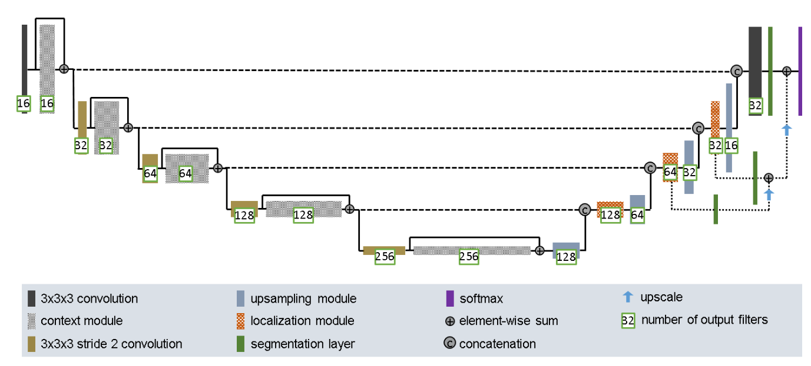
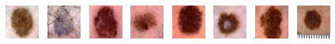
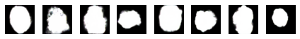
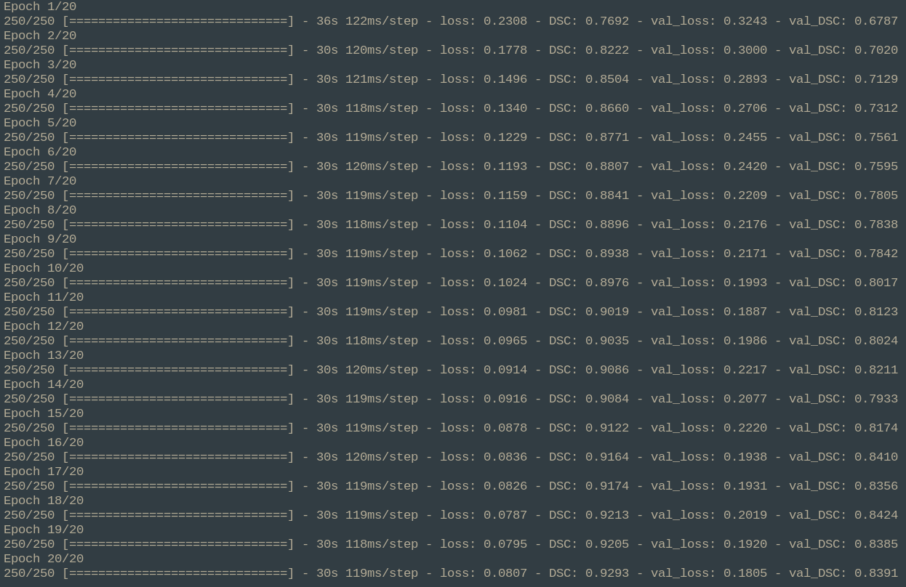

# Lesion Segmentation with Improved-UNet

## Overview 

The goal of this project is to segment the ISIC dataset by identifying potential regions of melanomas in images. 

The source dataset used was the [2017 ISIC Challenge dataset](https://challenge.isic-archive.com/data/#2017), which consists of a training, validation and test datasets that contain images of skin lesions along with the ground truth segmentation results.

This data was processed by an improved version of the [UNet](https://en.wikipedia.org/wiki/U-Net) neural network architecture, using the [Dice similarity coefficient](https://en.wikipedia.org/wiki/S%C3%B8rensen%E2%80%93Dice_coefficient) to determine the accuracy and validity of the model's results. The results showed a testing accuracy of >0.8 using this metric.

## Data preprocessing

Conveniently, the ISIC Challenge dataset is already split into training, validation and test datasets which can be passed to the model after little processing - native `tf.data.Dataset` methods were used to ingest these datasets by decoding each image into its three RGB channels, resizing each image to 256x256 resolution, and normalising the RGB colour spectrum by diving each decoded image element-wise by 255. 

## Model architecture

The design of this model is based on the model used by [F. Isensee, et al.](https://arxiv.org/pdf/1802.10508v1.pdf) seen below. 

The actual architecture used for this project can be found in the [appendix](#Appendix)

---

At a high level, the improved UNet design is an **encoder-decoder** network, where the encoder classifies and encodes features in the input dataset and then the decoder upsamples these features to produce high resolution predictions.

### Encoder

Each encoder block consists of multiple convolution layers which extract feature representations from the given image, and joining these blocks with downsampling layers therefore allows features to be extracted at many different levels.

### Decoder

Each decoder block then upscales these lower resolution features, then uses another convolution layer to extract features before concatenating on the features derived from the encoder at the same level as this decoder.

Additionally, following the example architecture above, segmentation layers are introduced in the decoding process to make the resulting inference more fine-grained.

## Results

### Training

When training the model, a relatively small batch size of 8 was used, and the dataset was shuffled before training. Over the 20 epochs that the model was trained, the DSC history is shown below:

  

The full history of this model while training is shown [here](#TrainingResults)

### Prediction

In the graph below, the model was used to predict segmentations of the test dataset, where the first row shows the predictions and the corresponding ground truths are shown below. 

---

**Actual**

  

**Prediction**

  

**Ground Truth**

  

---

The model predicted the ground truth segmentation relatively well, with an average DSC for this batch of 0.84, and an overall average DSC of 0.82.

## Setup and Replication

With a `python3.10` virutal environment, run:

`pip3 install -r requirements.txt`

Then, download the [ISIC Dataset](https://challenge.isic-archive.com/data/#2017), and extract the results into `isic_dataset/`

To train the model and visualise its segmentation performance, run:

`python3.10 predict.py`

from the root folder.

**Warning: this model was trained on Google Colab+, so performance may differ on less powerful machines**

## Appendix

### Model summary

[Model Summary](./model_summary.txt)

### Training results

