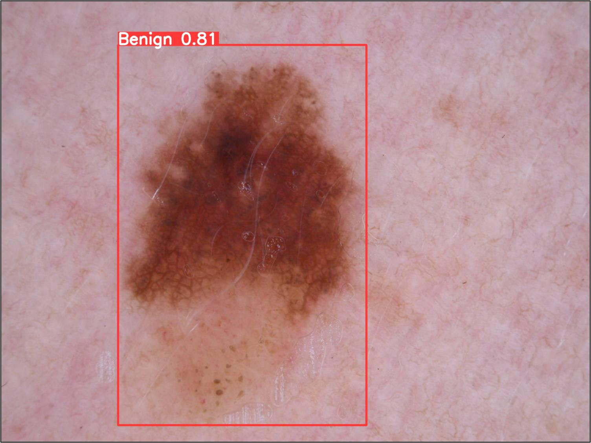
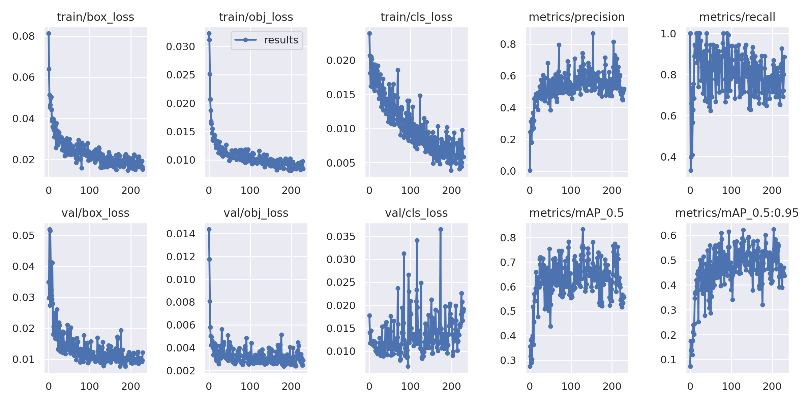
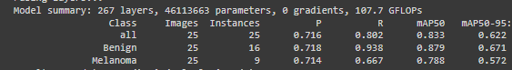

# Lesion Detection with YOLOv5
This package utilizes [YOLOv5](https://github.com/ultralytics/yolov5) to train a model to detect lesions within various different images. 

## Overview

### Background

### YOLOv5 Model Architecture

### Dependencies 
- PyTorch
- Pillow
- Git
- [YOLOv5](https://github.com/ultralytics/yolov5)
- 
### Data

### Results
The following two images show examples of inference using the model. It can be seen that it does it with 80% accuracy. The model is able to distinguish between benign and melanoma.  

The following image shows the results from the training:

## Installation

## Usage
