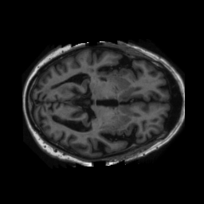

# Generative Model for OASIS Brain Dataset using StyleGAN

Author: Danny Wang

## OASIS Brian Dataset Overview

The OASIS Brain Dataset consists of a total 11328 brain MRI images (combining train, test and validation samples), with a size of 256 by 256 pixels each.

Selected example:

<p align="center">
  
</p>

## Problem Decription

## StyleGAN Architecture & Description

## Model Dependencies & Preprocessing

Library dependencies are as follow:

```
| Library     | Version |
| ------------|:-------:|
| Python      | 3.8.5   |
| Tensorflow  | 2.7.0   |
| Tqdm        | 4.64.0  |
| Matplotlib  | 3.3.2   |
| Numpy       | 1.19.2  |
```

In this generative project, the OASIS dataset was utilised as the training set, and randomly generated gaussian normal noise was utilised as test input for the StyleGAN model. The training images was loaded in as grayscale values, and was normalised to 0 and 1 for training.

## Model Performance

---

## References:

1. [StyleGAN Paper](https://arxiv.org/pdf/1812.04948.pdf)
2. [OASIS Brain](https://www.oasis-brains.org/)
