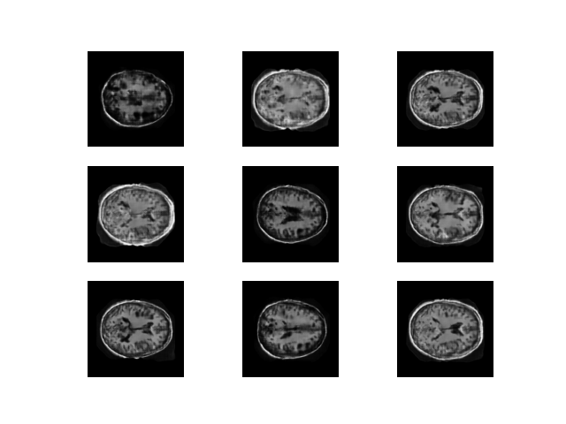
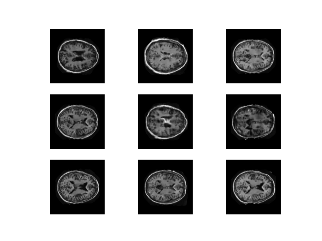
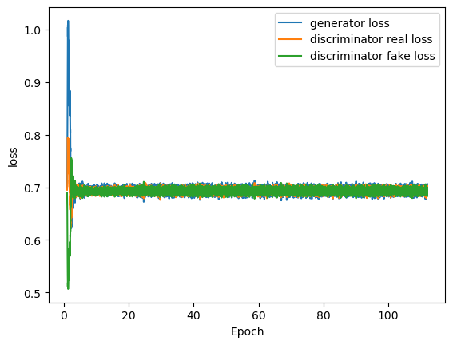
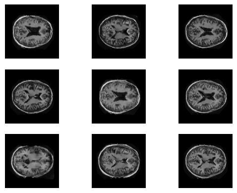

# Generative Model for OASIS Brain Dataset using StyleGAN

Author: Danny Wang

## Problem Statement & OASIS Brian Dataset Overview

For this project, a generative adversarial network (GAN) following the StyleGAN architecture proposed in the paper by T Karras et al.[1],  has been implemented using the OASIS Brain dataset. With an attempt to generate "reasonably clear images" of the brain MRI.

The OASIS Brain dataset consists of a total of 11328 brain MRI images (combining train, test and validation samples), with a size of 256 by 256 pixels each.

Selected example:

  
  
 <em>Figure 1: Example sample of OASIS Brian Data</em>

## StyleGAN Architecture & Description

## Model Dependencies & Preprocessing

Library dependencies are as follow:

| Library    | Version |
| ---------- | :-----: |
| Python     |  3.8.5  |
| Tensorflow |  2.7.0  |
| Tqdm       | 4.64.0 |
| Matplotlib |  3.3.2  |
| Numpy      | 1.19.2 |

In this generative project, the OASIS dataset was utilised as the training set, and randomly generated gaussian normal noise was utilised as test input for the StyleGAN model. The training images was loaded in as grayscale values [0, 255], and was normalised to [0, 1] for training.

## Usage

## Model Performance

The following figures illustrates the results during training:

<table class="image-grid">
    <tr>
        <td>
            
        </td>
        <td>
            
        </td>
    </tr>
   <tr>
        <td align="center">
            Epoch 40
        </td>
        <td align="center">
            Epoch 80
        </td>
    </tr>
</table>

     
    
Epoch 120

    <em>Fig 3: Trianing progress <em/>

After training for 120 epochs with batch size of 12 and 13000 iterations in each epoch, the training loss for the generator and discriminator are given below.

     
 
    <em align="center"> Figure 4: Training Loss</em>

Using the trained model ,we can generate some samples of the brain MRI images given some randomly generated inputs. In which, it is clear that whilst the result doesn't provide the same level of details as the orginal OASIS dataset image. The general shape and clarity of the image could be seen, and potentially interpreted as a brian MRI. Thus, it is believed that with more training and parameter tuning, the generated output could be greatly improved. 

     
 
    <em align="center"> Figure 5: Generated Samples</em>

---

## References:

1. [StyleGAN Paper](https://arxiv.org/pdf/1812.04948.pdf)
2. [OASIS Brain](https://www.oasis-brains.org/)
