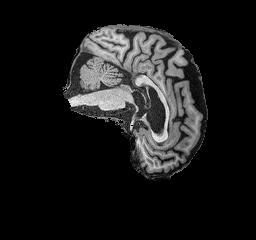
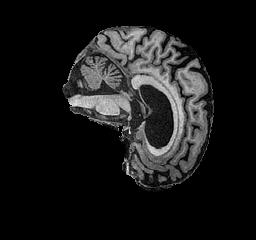
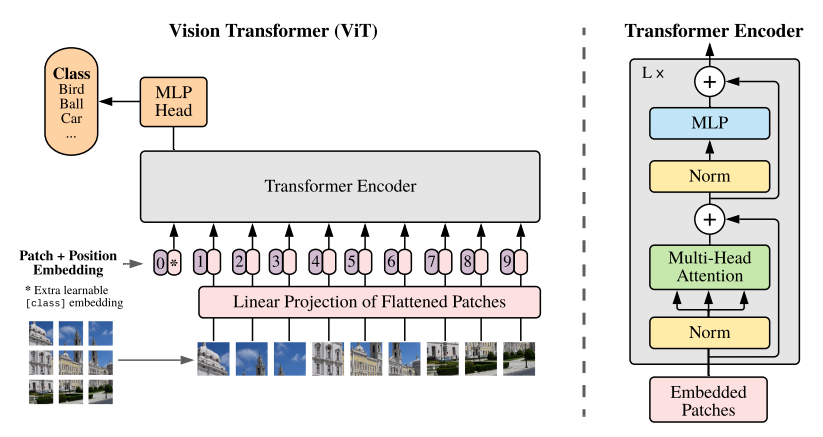
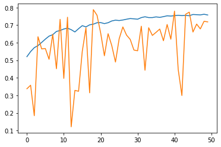
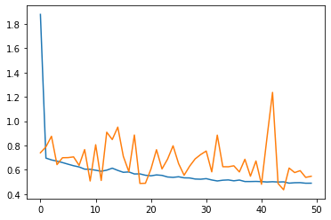
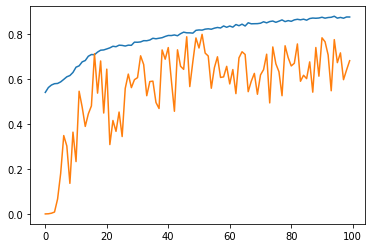
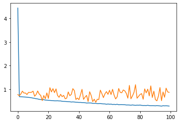

# Visual Transformer (ViT) for classifying Alzheimer's Disease

COMP3710 Report
Eric Shen
46466369


| Alzheimer's | Normal |
| --- | --- |
|  |  |

Images of the human brain from the [ADNI](https://adni.loni.usc.edu/) dataset, as classified by a Visual Transformer.

## Project Aims
This project aims to classify images of the brain from the ADNI dataset as either exhibiting Alzheimer's disease or not. This was implemented using a Visual Transformer (ViT) model, based on the architecture defined in [this paper](https://arxiv.org/pdf/2010.11929.pdf "An Image is Worth 16x16 Words: Transformers for Image Recognition at Scale"), and the inspired by the implementation in [this article](https://keras.io/examples/vision/image_classification_with_vision_transformer/).

## Model Architecture


The model takes images as input, breaking it up into flattened patches which are then fed into a transformer encoder. Each of these patches are given a position embedding to retain information about order. The transformer encoder uses an attention mechanism to retain information about previously viewed data, and is in theory capable of keeping this memory of extremely large sets of data. This allows the model to learn to associate certain patches of an image with others, based on factors such as their positioning. After being run through the transformer encoder, the output is fed to a MLP which classifies the image.

## Results
The current best model trained reached 63% accuracy on the test set, with 75% training accuracy and 71% validation accuracy. This was achieved using the following parameters:
- `learning_rate` = 0.001
- `weight_decay` = 0.0015
- `batch_size` = 256
- `patch_size` = 8
- `num_epochs` = 50
- `image_size` = 128
- `transformer_layers` = 8

The accuracy is as follows, where the orange line represents the validation stat and the blue line is the the results on the training data:

Accuracy:



Loss:



Another configuration attempted to solve the fluctuating validation accuracy:
- `learning_rate` = 0.0015
- `weight_decay` = 0.0005
- `batch_size` = 256
- `patch_size` = 16
- `num_epochs` = 100
- `image_size` = 128
- `transformer_layers` = 8

Accuracy:



Loss:



## Discussion, conclusions and future improvements
Several other omitted attempts to improve the model performance were made, ranging from varying learning rate and weight decay combinations, to image, batch and patch sizes. None of these yielded meaningful results, and neither validation accuracy nor testing accuracy was above 0.8 for a substatial duration of the training process.

While the task was to achieve greater than 80% accuracy on the test set, this proved quite difficult and would require fine tuning of each of the hyperparameters to see improvement. 

A potential cause for this difficulty may be the nature of the train and test images being too different, preventing the model from drawing reasonable connections between features, instead overfitting to the test set. A method of cropping the images to better fit the brains themselves may also benefit the model, and reduce computation time for smaller images.

## Requirements
- tensorflow 2.10.0
- keras 2.10.0
- Pillow 9.0.1
- tensorflow-addons 0.18.0
- zipp 3.8.1
- matplotlib 3.5.1

## Installation & Usage
### First time use
The ADNI dataset has been stored in the form:
```
|-- ADNI
    |-- test_AD.zip
    |-- test_NC.zip
    |-- train_AD.zip
    |-- train_NC.zip
```
Where each of the zip files contains images for the corresponding data set. 

It is sufficient to run `train.py` to train the dataset and set up the weights, which are stored in `./checkpoint`.

### Prediction and subsequent use
For prediction of individual images, run `predict.py` in the format `predict_single_image(image_filepath)`.


## Papers and references
### Papers
[Vaswani A. et al, Attention is All You Need](https://arxiv.org/pdf/1706.03762.pdf)

[Dosovitskiy A. et al, An Image is Worth 16x16 Words: Transformers for Image Recognition at Scale](https://arxiv.org/pdf/2010.11929.pdf)

### Code references
[Display Deep Learning Model Training History in Keras](https://machinelearningmastery.com/display-deep-learning-model-training-history-in-keras/)

[Vision Transformer in TensorFlow](https://dzlab.github.io/notebooks/tensorflow/vision/classification/2021/10/01/vision_transformer.html)

[Image classification with Vision Transformer](https://keras.io/examples/vision/image_classification_with_vision_transformer/)