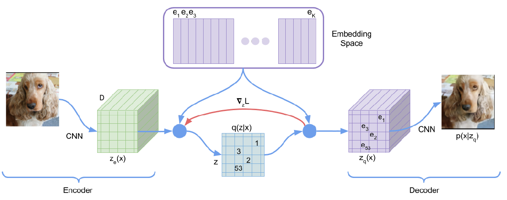
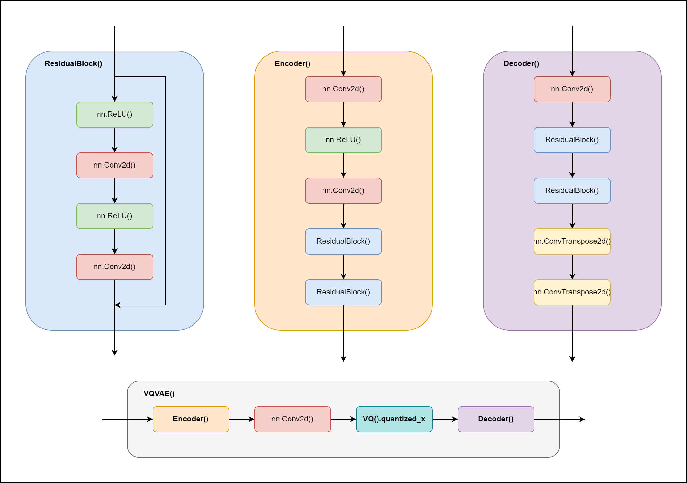
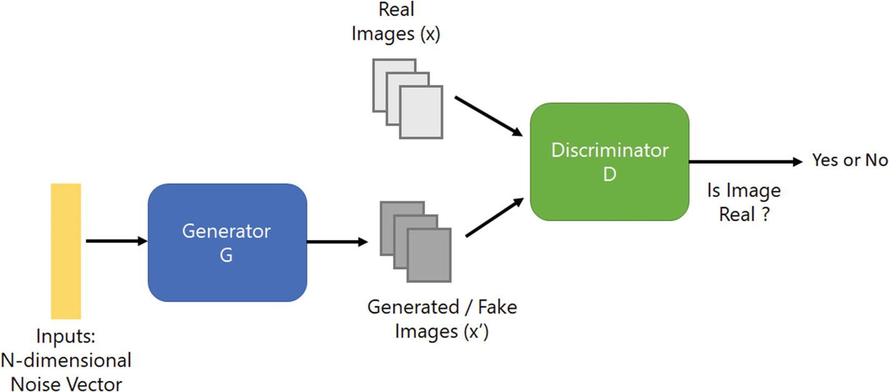
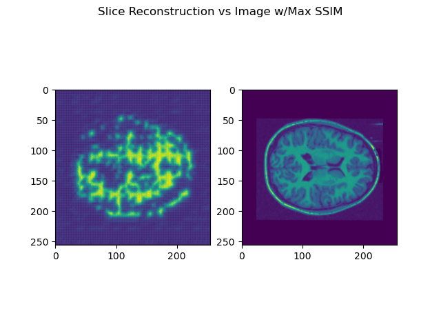
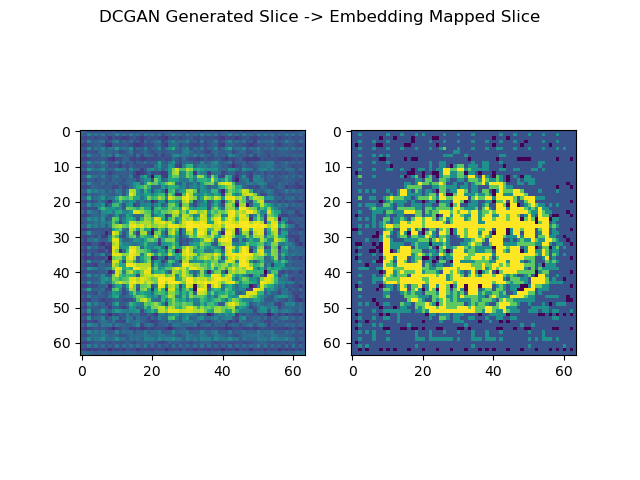

# Generative Model using VQ-VAE + DCGAN

## Usage
### Dependencies
- cudatoolkit (11.3.1)
- matplotlib (3.5.2)
- numpy (1.22.3)
- pillow (9.2.0)
- pytorch (1.12.1)
- scikit-image (0.19.2)
- torchvision (0.13.1)
- tqdm (4.64.1)

### Preparation
In order to correctly load the image(s) associated with the model(s), a strict data folder structure must be followed, with the pre-split OASIS dataset obtained as a zip file. The following is a directory tree representation of how files should be organized:
```
recognition
| 46481326
| | oasis
| | | test
| | | | keras_png_slices_test
| | | | | case_441_slice_0.nii.png
| | | | | case_441_slice_1.nii.png
| | | | | ...
| | | train
| | | | keras_png_slices_train
| | | | | case_001_slice_0.nii.png
| | | | | case_001_slice_2.nii.png
| | | | | ...
| | output (empty folder)
| | state (empty folder)
```
Note: The "output" and "state" folders must be created in order for model load/save and image outputs to work. The source code may be modified if the structure is deemed to be inappropriate.

Please note that due to technical limitations, the implementation of the VQVAE is not particularly stable, that is, the loss_threshold at which training may terminate may vary, leading to varying results when you attempt to train the model. 
If more consistent results are desired, the ImageFolder dataset(s) may be set to not shuffle and the number of training epochs may be changed (preferably < 2).

### Training and Testing
The training and testing process are managed by the driver.py file and can be initiated with the following steps:
1. `cd recognition/46481326` Change directory into the root folder 
2. `python driver.py` Run script to begin training and testing
The driver file trains the model and generates required outputs.

Note: If you would like to retrain the model and discard the existing training, run `rm state/*` to delete the saved model state(s).

# Model
## Modules
All models are defined in PyTorch in the models module:
- `from modules import Hyperparameters` Hyperparameters for training/testing
- `from modules import VQ` Vector Quantizer Subclass
- `from modules import ResidualBlock` A Single Residual Block
- `from modules import Encoder` VQVAE Encoder
- `from modules import Decoder` VQVAE Decoder
- `from modules import VQVAE` VQVAE Superclass
- `from modules import Discriminator`DCGAN Discriminator
- `from modules import Generator` DCGAN Generator

## VQVAE
A Vector Quantized Variational AutoEncoder is a subclass of Variational AutoEncoders which allows discrete slices to be learned in a process known as vector quantization. 
The process of vector quantization is used to learn slices of a discrete embedding space, otherwise known as a "codebook."

The advantage of Vector Quantization over convention Variational AutoEncoders is that vector quantization allows multiple classes of objects to be learned and generated independently [1].
Conventional Variational Autoencoders store the latent differences between image(s) as a continuous distribution and may not be appropriate for generating a large set of varying classes.
This may not be completely be beneficicial to a dataset consisting solely of brains, it nonetheless provides a relatively simple and generalizable method of image generation.


As evidenced by the above diagram, each slice in the encoded tensor maps to its corresponding slice in the embedding space.
The vector quantizer learns this mapping by evaluating the l2 error and minimizing the difference between the embedded slice (e_1, e_2, ..., e_n) in the z_q(x) tensor and its associated entry in the z_e(x) tensor.
This embedding mapping (z_e -> z_q) is stored in a symbolic table q(z|x). The mapped z_q can then be decoded to produce a reconstructed image.

Below is a high level architecture diagram of the VQVAE:


## DCGAN
DCGANs - also known as Deep Convolutional Generative Adversarial Networks - allows for brand new images to be generated given some arbitrary dataset.
DCGANs work by generating fake images from random noise, and then feeding this through a discriminator trained on both real and fake images [2].
This is then backpropagated through the network to improve the generator and make results more "convincing."

A DCGAN was implemented to generate new embedded codebook slices, which are in turn, decoded on the trained VQVAE model to generate unique images.

Below is a high level architecture diagram of the DCGAN:


# Results
## OASIS Brains
The VQVAE training terminated after 2 epochs, once the loss decreased below the threshold of 0.3.

The highest SSIM achieved was 0.2666, and there were no samples which exceeded an SSIM of > 0.6 :(

The below image shows the best performing output (left) vs the ground truth (right):


# Discussion
There are many things wrong with the current implementation and could potentially be adressed given a more lenient timeframe:
1. The mapping from the GAN generated slice (left) to the embedding mapped slice (right) only contains 5 unique values, too few for any significant definition to be retained.
  * This may be resolved by increasing the number of unique values in the mapping.

2. The threshold_loss value 0.3 (0.25 in the paper) can and should be adjusted and tested to determine the optimal value.
3. The current VQVAE only trains for about 2 epochs, which may reduce its generalizability.
4. The GAN only trains on a limited number of codebook slices.
5. The GAN may not tolerate discrete embedded slices very well.

# Bibliography
[1] van den Oord, A., Vinyals, O., & Kavukcuoglu, K. (2017). Neural Discrete Representation Learning. CoRR, abs/1711.00937. Opgehaal van http://arxiv.org/abs/1711.00937

[2] Alec Radford, Luke Metz, & Soumith Chintala. (2016). Unsupervised Representation Learning with Deep Convolutional Generative Adversarial Networks.
