# Visual Transformer for the Classification of Alzheimer's Disease

## Author
Chiao-Hsi Joshua Wang (Student No. 46965611)

## Project Overview
The use of deep learning and neural networks in medical imaging is a rapidly expanding field, with great potential to improve accuracy of diagnoses and reduce human error in healthcare and medicine. In 2020, the paper ["An Image is Worth 16x16 Words: Transformers for Image Recognition at Scale"](https://arxiv.org/abs/2010.11929) showed that reliance on traditional Convolutional Neural Networks was unnecessary and that Vision Transformers are also able to attain excellent results when compared to state-of-the-art convolutional networks, while requiring fewer resources to train. This project aims to develop a Vision Transformer similar to the one described in the original paper. The goal is for the Vision Transformer to be able to classify whether MRI scans of a brain as either having Alzheimer's Disease or Normal Cognitive function. A testing accuracy of at least 80% is the target for this model.

## Vision Transformers
Traditional Transformers make use of the self-attention mechanism to identify how multiple inputs interact with each other. Often abbreviated as ViT, Vision Transformers utilize the original Transformer architecture, but instead apply the attention mechanism to 2D images, which can then be used on classification problems.

<p align="center">
    
</p>

2D image inputs can be passed into the ViT, and these will be split into smaller patches. These patches are then flattened to become 1D vectors (linear projections), before learnable class embeddings are added on. To preserve the ordering of the image patches, positional encodings can also be added on. These flattened patches embedded with class or positional embeddings are then passed into regular Transformer encoders, where relationships in the patches of image data are detected. A Multi-Layer Perceptron (MLP), which is a neural network that learns relationships, is finally used to classify inputs.

The components in a Transformer Encoder are as follows:

<p align="center">
    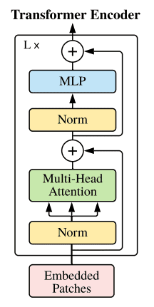
</p>

Embedded patches are passed into a Normalization layer before the Multi-Head Attention Layer (which performs the self-attention mechanism mentioned). Outputs are then passed into a skip connection layer, followed by another Normalization layer and a MLP layer. Each ViT can have multiple of these Transformer Encoder blocks one after another to increase the complexity of the model.

## Project Dependencies
The dependencies listed below are recommended for replicating the results from this project as they are what have been tested in the project and will likely be the most stable.

- Python 3.10.4
- Tensorflow 2.10.0
- Tensorflow Addons 0.18.0
- Matplotlib 3.5.2

`Tensorflow` is used for loading data, as well as building, training and predicting on the model.

`Tensorflow Addons` is used to provide the chosen `AdamW` optimizer for the model.

`Matplotlib` is used for plotting the loss and accuracy curves of the model, and plotting confusion matrices of testing results.

## Repository Overview

`resources/` contains the images used in this README.

`parameters.py` contains the hyperparameters used for specifying data loading and model settings.

`modules.py` contains the components of the Vision Transformer.

`dataset.py` contains the function used for loading the data.

`train.py` contains the functions for compiling and training the model.

`predict.py` contains the functions for predicting on the trained model.

`utils.py` contains functions for visualizing data.

## Usage
### Parameters
Before training the model, set the global variables in `parameters.py`. The variables that should be set are as follows:

`IMAGE_SIZE`: Height and width of image.

`PATCH_SIZE`: Height and width of the patches.

`BATCH_SIZE`: Batch size of training and testing data.

`PROJECTION_DIM`: Units in attention layer.

`LEARNING_RATE`: Learning rate of the optimizer.

`ATTENTION_HEADS`: Heads in attention layer.

`DROPOUT_RATE`: Percentage of units to drop out in each Dense Layer (as a decimal).

`TRANSFORMER_LAYERS`: Number of transformer encoders to include.

`WEIGHT_DECAY`: Weight decay of the optimizer.

`EPOCHS`: Number of epochs to train model for.

`MLP_HEAD_UNITS`: Number of units in the MLP head classifier for learning features (as an array, where each element is the number of units in an additional Dense Layer).

`DATA_PATH`: Path from which the dataset will be loaded.

`MODEL_SAVE_PATH`: Path at which the model will be saved.

The `INPUT_SHAPE`, `HIDDEN_UNITS` and `NUM_PATCHES` variables are automatically calculated.

### Building and Training the Model
- `train.py` can be run once parameters have been set. This will automatically build and compile the model and begin training. Upon finishing training, the model will be saved in `hdf5` format in the directory specified by `MODEL_SAVE_PATH`. Loss and accuracy curves will automatically be plotted and saved to the working directory.

- `predict.py` can be run to predict results using the trained model. This will load the model from `MODEL_SAVE_PATH` and evaluate the test set on this model. A confusion matrix will automatically be plotted and saved to the working directory.

## Dataset
This project uses the provided dataset which can be downloaded from [this link](https://cloudstor.aarnet.edu.au/plus/s/L6bbssKhUoUdTSI). Alternatively, the original dataset can be downloaded from the [ADNI website](https://adni.loni.usc.edu/). To specify the path from which the code will load the data, change the `DATA_LOAD_PATH` constant in `parameters.py`. Data is expected to be in the following file structure:
```
train/
    AD/
        images
        ...
    NC/
        images
        ...
test/
    AD/
        images
        ...
    NC/
        images
        ...
```
Since this data consists of only two classes, binary encoding is used when loading the data. 0 is used to denote the `AD` class for brains which have Alzheimer's Disease, while a 1 is used to denote the `NC`, which are for brains which have Normal Cognitive function.

### Training, Validation and Test Splits
The provided dataset consisted of 21,520 images in the training folder, and 9000 images in the testing folder. Since Vision Transformers are very data-hungry models which require a lot of data for training, it was decided that the validation set would be split from half of the image data in the testing folder. This gives a dataset split of:
- 21,520 images in training set
- 4500 images in validation set
- 4500 images in testing set

### Data Augmentation
The data loaded was also augmented before passing to the model for training and prediction. `Normalization`, `RandomFlip`, `RandomZoom` and `RandomRotate` layers were applied to each image in the three datasets. By augmenting the data, the model would be less likely to overfit on the already small set of training data. The randomized actions have all been passed a seed parameter to allow for the reproducibility of results.

An example of a loaded image is displayed below:

<p align="center">
    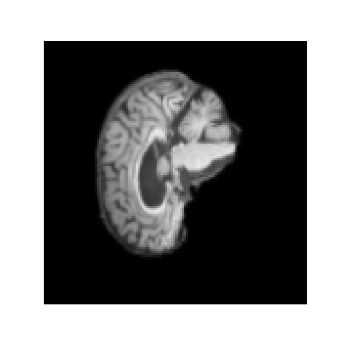
</p>

## Vision Transformer Implementation
### Changes to Original Vision Transformer
The architecture of the Vision Transformer model implemented differs slightly from the original model proposed in the Vision Transformer paper (see References [1]).

The major differences are that Shifted Patch Tokenization and Local Self-Attention is applied. In [this paper](https://arxiv.org/abs/2112.13492), it is shown that applying both Shifted Patch Tokenization and Local Self Attention in a Vision Transformer helps to solve the lack of locality bias in Transformers and can help Vision Transformers to learn better on smaller datasets. Since our dataset is relatively small with only 30,520 total images, it was decided the aforementioned techniques would be included into the model.

Shifted Patch Tokenization works by shifting input images slightly either right or left, and also up or down. This helps to widen the receptive field of the Transformer and thus improve its ability in identifying the relationship between patches in the image.

<p align="center">
    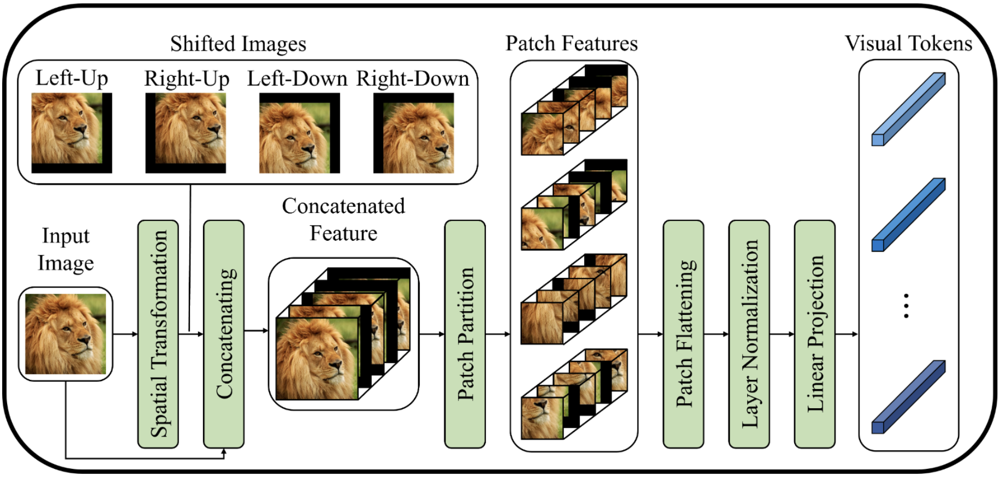
</p>

Local Self-Attention is similar to the traditional Multi-Head Attention (MHA) layer, however an additional diagonal mask is applied to shift the ViT's attention towards inter-token relationships rather than its own tokens. A Learnable Temperature Scaling is also included for the model to learn the temperature of the Softmax layer in the MHA layer automatically, helping to either sharpen score distribution or attention distribution.

<p align="center">
    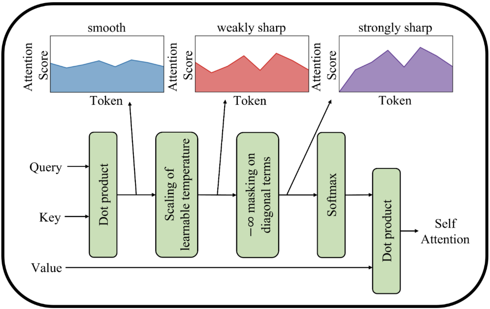
</p>

Additionally, the class token included in the Transformer Encoder from the original paper was also removed. An author from the original paper stated [here](https://github.com/google-research/vision_transformer/issues/61#issuecomment-802233921) that the class token is not important and unnecessary and thus, in our model, classification is done through the use of an MLP (Dense layers) which learn features.

### Vision Transformer Architecture
After the initial input layer of the Vision Transformer, data is passed into a the `PatchLayer` layer, which splits the images into patches with height and width of the `PATCH_SIZE` constant. In this layer, Shifted Patch Tokenization is also applied to the inputted images before patching. The original image split into patches becomes:

<p align="center">
    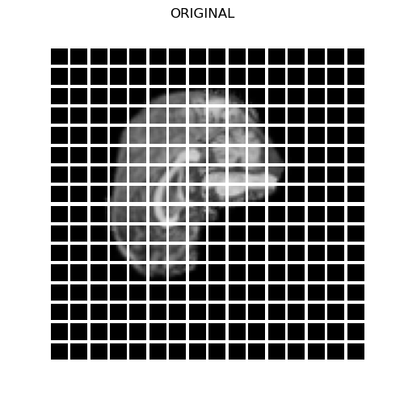
</p>

The images which have Shifted Patch Tokenization applied and are patched become:

<p align="middle" float="left">
    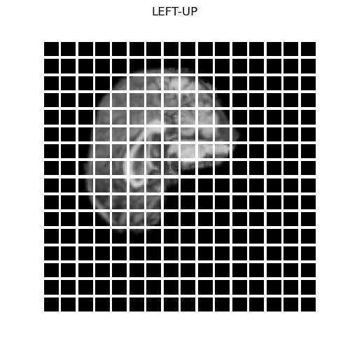
    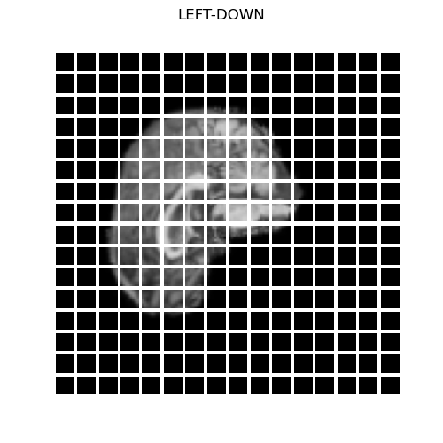
</p>
<p align="middle" float="left">
    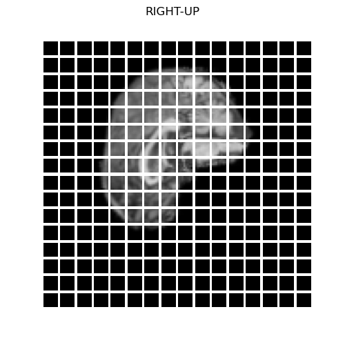
    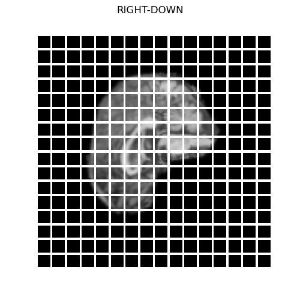
</p>

From here, these images are flattened into vectors before being passed to the `EmbedPatch` layer, which is used for embedding patch positions to the flattened vectors. After patches have been encoded with their positions, the vectors are passed into the Transformer blocks. Within the Transformer blocks, an architecture similar to the original is followed, except Locality Self-Attention is applied together with the Multi-Head Attention layer, rather than just the Multi-Head Attention layer itself. Following the Transformer encoder blocks, MLP layers are used to learn features and to make the final classification (since the class token is no longer being used).

In testing, it was found that if the model returned logits and BinaryCrossEntropy was evaluated from logits, results were more stable. Thus, the final MLP classification layer does not have any activation applied.

## Training and Testing Process
Multiple combinations of hyperparameters were tested and tuned, based on the results of training, validation and testing accuracies returned. Three models of varying complexity and their results are documented below.

### **Model 1**
This model was initially trained with the following hyperparameters:
```
IMAGE_SIZE = 128
PATCH_SIZE = 8
BATCH_SIZE = 32
PROJECTION_DIM = 512 
LEARNING_RATE = 0.0005
ATTENTION_HEADS = 5
DROPOUT_RATE = 0.2
TRANSFORMER_LAYERS = 5
WEIGHT_DECAY = 0.0001
EPOCHS = 10
MLP_HEAD_UNITS = [256, 128]
```
These parameters give the model a total of 53,123,460 trainable parameters. The loss and accuracy plots of training and validation for this model were as follows:

<p align="center">
    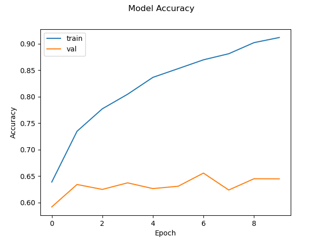
</p>

<p align="center">
    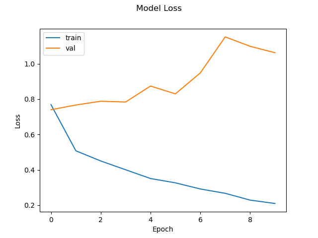
</p>

The confusion matrix of the test set is shown below. 0 represents brains which have Alzheimer's Disease, while 1 represents brains with Normal Cognitive function.

<p align="center">
    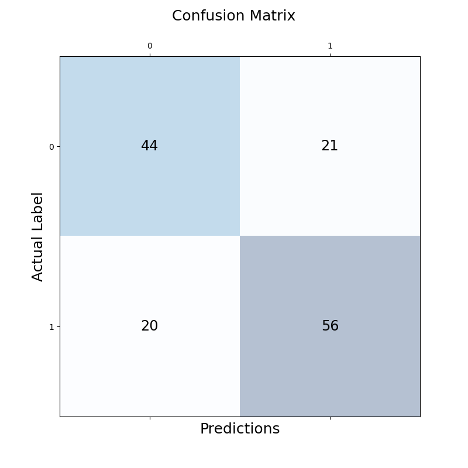
</p>

From the plots above, it is evident that the model is greatly overfitting in only 10 epochs. When training the model for more epochs, overfitting would worsen. Evaluating the test set on this model resulted in a 64.73% accuracy, not meeting the 80% accuracy goal.

### **Model 2**
In a second attempt to train the model and decrease the overfitting seen in the previous result, the hyperparameters were adjusted to the following:
```
IMAGE_SIZE = 128
PATCH_SIZE = 8
BATCH_SIZE = 32
PROJECTION_DIM = 128
LEARNING_RATE = 0.001
ATTENTION_HEADS = 5
DROPOUT_RATE = 0.4
TRANSFORMER_LAYERS = 3
WEIGHT_DECAY = 0.0001
EPOCHS = 10
MLP_HEAD_UNITS = [64, 32]
```
This combination of settings gives 3,445,764 trainable parameters. The model's complexity was decreased significantly to make it more difficult for the model to overfit on the training set. This model yielded a testing accuracy of 64.53%. The loss and accuracy curves, and confusion matrix are displayed below.

<p align="center">
    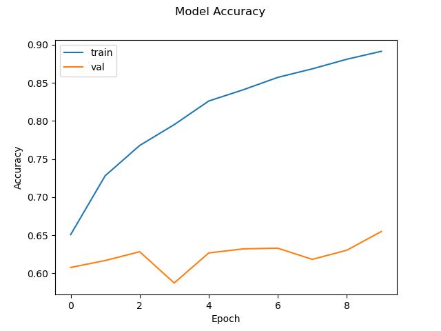
</p>

<p align="center">
    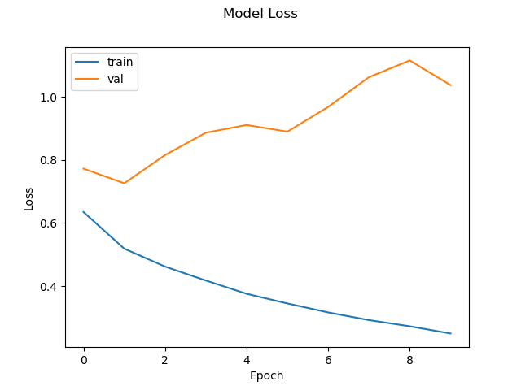
</p>

<p align="center">
    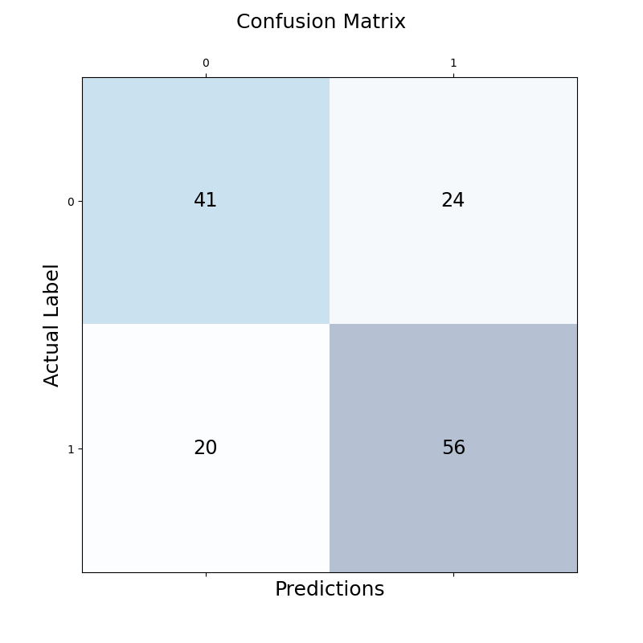
</p>

From the plots, it is evident that overfitting is still not being handled, with results being very similar to those from before. The confusion matrix also clearly shows that the accuracy on the testing dataset has not improved (and has decreased by 0.2%).

### **Model 3**
A final significantly less complex model was trained again with the following parameters:

```
IMAGE_SIZE = 128
PATCH_SIZE = 8
BATCH_SIZE = 32
PROJECTION_DIM = 16
LEARNING_RATE = 0.0001
ATTENTION_HEADS = 2
DROPOUT_RATE = 0.3
TRANSFORMER_LAYERS = 1
WEIGHT_DECAY = 0.0001
EPOCHS = 10
MLP_HEAD_UNITS = [16, 8]
```
This model has only 90,418 trainable parameters and resulted in a testing accuracy of 60.63%. The plots of accuracy and loss, and confusion matrix are displayed below.

<p align="center">
    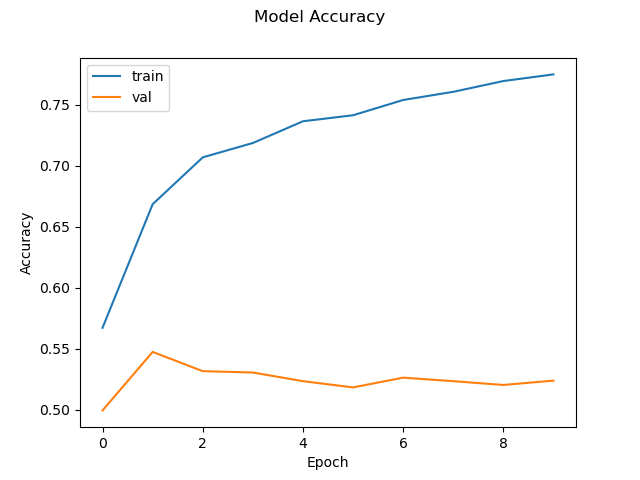
</p>

<p align="center">
    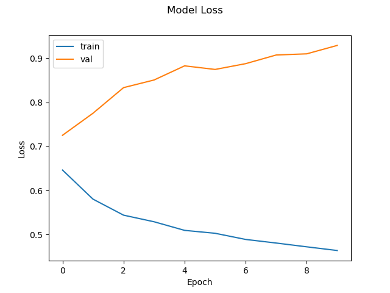
</p>

<p align="center">
    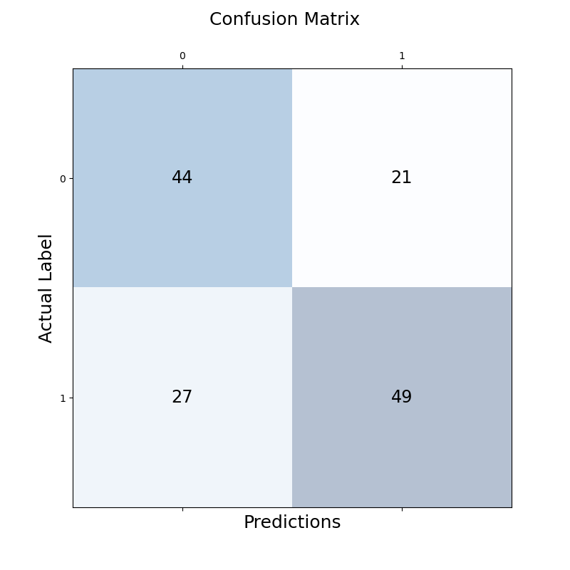
</p>

Again, the model exhibits clear signs of overfitting. This smaller model also yielded a 4.1% decrease in accuracy from the initial Model 1. Therefore, it was concluded that training on models which were less complex would not fix the overfitting issue and would result in greater decreases in testing accuracy.

Further attempts to tune the model with different hyperparameters were made (both larger and smaller models were tested). Different optimizers and learning rates were also tested, but all models would overfit and the greatest testing accuracy was the 64.73% achieved from Model 1.

## Conclusions and Future Improvements
From the three models that were trained and tested above, it is clear that there is a significant issue with the model overfitting as it was not possible to achieve a validation or testing accuracy of above 64.73%.

To improve on this project and potentially increase the accuracy of this model to be closer to the 80% target, it is suggested that a larger dataset should be used.

Using pre-trained Vision Transformers and then fine-tuning the model on the relevant dataset, similar to the methodology employed in the original Vision Transformer paper (see References [1]) could also help to improve the accuracy of this model.

## References
[1] Vision Transformer Paper, from: https://arxiv.org/abs/2010.11929

[2] Vision Transformer for Small-Size Datasets Paper, from: https://arxiv.org/abs/2112.13492

[3] Vision Transformer Implementation, from: https://keras.io/examples/vision/image_classification_with_vision_transformer/

[4] Shifted Patch Tokenization and Locality Self Attention, from: https://keras.io/examples/vision/vit_small_ds/