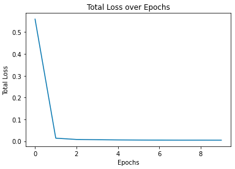
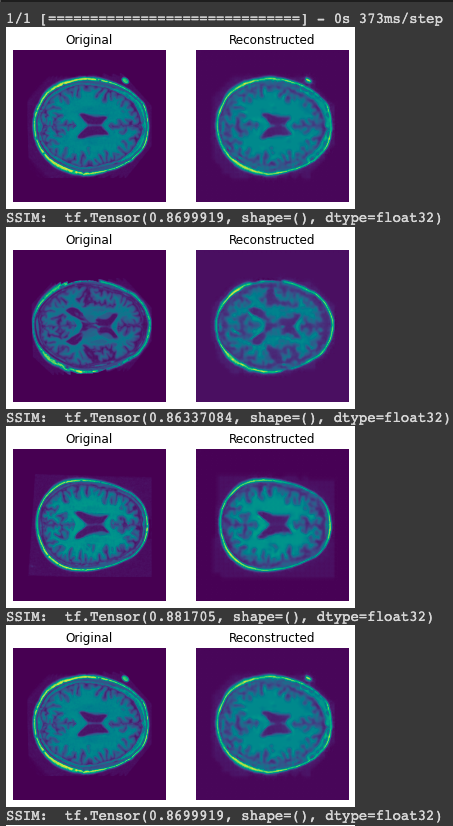
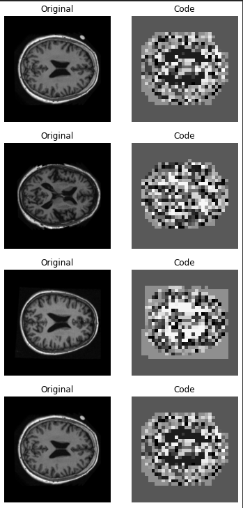
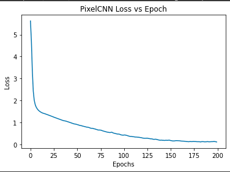
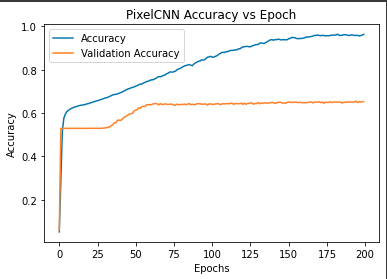
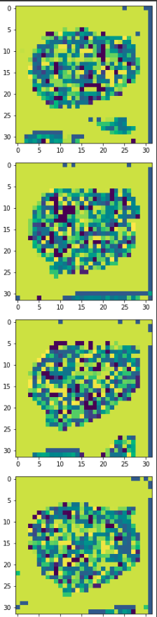

# **OASIS Dataset Brain Slice Generation via VQVAE**

## **Description of the Algorithm**

The chosen algorithm is VQVAE which stands for _Vector Quantized Variational Auto Encoder_. It differs from other VAE's by maintaining a discrete latent space. There are four main components to the VQVAE model implemented in this PR,

1. Encoder
2. VQ Layer
3. Decoder
4. PixelCNN

### 1. Encoder

The encoder takes an input and compresses it to a smaller dimension. It does this through Convolutional Layers.

### 2. VQ Layer

The Vector Quantization layer sits between the encoder and decoder and maintains and learns a "codebook" and takes input from the Encoder and optimises codes which minimise the distance between encoder ouputs and codewords inside our codebook. These codewords live within a discrete latent space.

### 3. Decoder

Takes output from the Vector Quantization layer in the discrete latent space and decompresses the input with the goal of recreating the original input to the Encoder.

### 4. PixelCNN

This is a specfic type of CNN proposed by _van der Oord et al._ in [Conditional Image Generation with PixelCNN Decoders](https://arxiv.org/abs/1606.05328). The reason for this is it generates images based on the prior outcomes. Thus we can use it to generate new likely codebooks to feed to our Decoder.

### VAQVAE Figure

"Figure 1: Left: A figure describing the VQ-VAE. Right: Visualisation of the embedding space." (_van der Oord et al._, 2018)

### The Problem

The problem we are trying to solve is to create a generative model using a VQVAE to create a "reasonably clear image" and attain a SSIM of over 0.6. As you will see we have been able to attain a "reasonably clear image" however, we were not able to attain an SSIM of over 0.6. Challenges which impacted the results were;

- Long run-times using Google Colab
- Expenses of purchasing extra compute time
- Hyper parameter tuning combined with the above

## **Dependencies List**

- TensorFlow (v2.10.0)
- NumPy (v1.21.6)
- MatPlotLib (v3.5.3)
- pillow (v9.2.0)

## **Reproducability**

The modules provided within the PR should allow for users to reproduce the results provided below. Please make note of the following:

1. The `DIRECTORY_PATH` inside _dataset.py_ is set to the correct directory under which the OASIS Dataset is located. If loading through Google Colab connected to Google Drive this will likely be at `"/content/{dirname}/"` where _dirname_ is the name of the directory within the runtime the data has been unloaded.
2. You will likely need to purchase Google Colab Pro if you wish to run this on Google Colab without modification.

## **I/O and Results / Plots**

### Input

The required inputs for this software is the non-segmented portion of the prepocessed OASIS dataset, available through the course website. Alternatively an unprocessed version is available [here](https://www.oasis-brains.org/).

### Output

The output of this software is images of generated brains via a VQVAE trained on the OASIS data set.

### Results / Plots

### VQVAE Total Loss over Training

### VQVAE Reconstruction from Test Set

### VQVAE Codebooks

### PixelCNN Training Loss

### PixelCNN Training & Validation Accuracy

### PixelCNN Generated Priors

### PixelCNN Generated Brains

## **References**

### Neural Discrete Representation Learning

_Oord, Aaron van den and Vinyals, Oriol and Kavukcuoglu, Koray_, 2018 - arXiv, Neural Discrete Representation Learning - available at: https://arxiv.org/pdf/1711.00937v2.pdf

_Sayak Paul_, 2021 - Keras, Vector-Quantized Variational Autoencoders - available at: https://keras.io/examples/generative/vq_vae/
