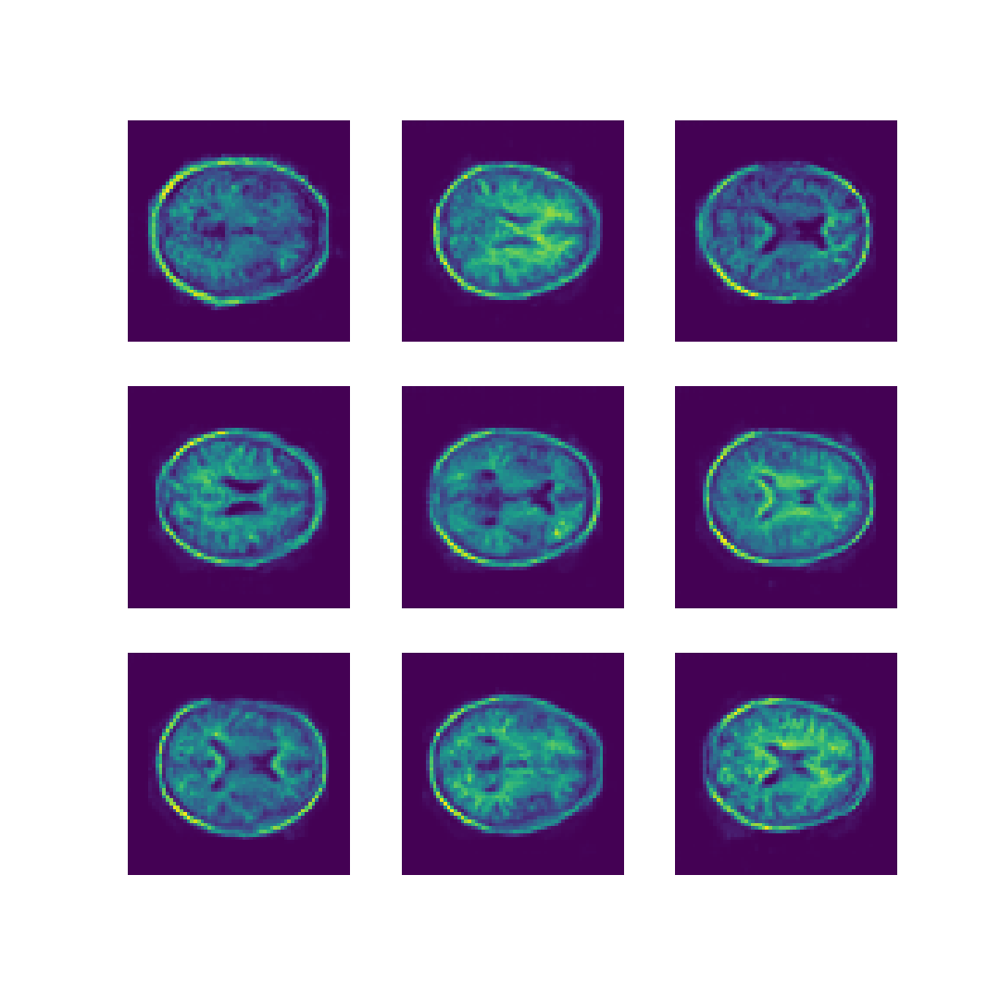

# A Generative Model of the OASIS Dataset Using a Generative Adversarial Network

## The problem being solved
The Oasis Brain dataset includes approximately 11,000 images produced by MRI scans of human brains. These include the unlabelled data as a greyscale image, as well as corresponding segmentation labels that segment the image into one of four classes. The task at hand here is to use the unlabelled data to train a deep convolution generative adversarial network (DCGAN), to generate images of a similar style to the OASIS dataset.

## The algorithm
At a high level, a generative adversarial network (GAN) involves creating two models, one that generates images (the generator) and one the discriminates images (the discriminator). These two models then act as players in a [non-cooperative game](https://en.wikipedia.org/wiki/Non-cooperative_game_theory). The discriminator is trying to maximise the number of correct classifications it makes of images it is given between real images (sourced from the OASIS dataset) and fake images generated by the generator. The generator on the other hand, is trying to minimise the number of correct classifications the discriminator makes. In the training process, it is important the both models approach their respective solutions at an appropriate pace to the other, as if one model becomes "too good too quickly", the game overall will not reach an [equilibrium](https://en.wikipedia.org/wiki/Nash_equilibrium) and diverge.

### The discriminator
The discriminator's architecture uses four convolutional layers, each with batch normalisation and dropout layers, with a leaky rectified linear unit (ReLU) activation function. The batch normalisation layers are to reduce the impact of poor intialisation of the training variables and generator's images, where the dropout layers are useful in slowing the rate of learning down and balancing the two models to reach an equilibrium. The output involves dense layers to finally return a single number representing the classification of the input image as real or fake.

The loss function used is the binary cross entropy function from the Keras api in Tensorflow, implemented to account for both real and fake images. The optimiser used is stochastic gradient descent, again from the Keras api in Tensorflow.

### The generator
The generator takes 100 numbers as input. These are randomly generated (using a Gaussian distribution) in training, and uses four up convolutional layers, with batch normalisation and dropout (for similar reasons as the discriminator) to then produce a full sized image. The activation function for each step except the last is leaky ReLU, and the last layer uses a Sigmoid activation function to set the output to the desired greyscale values.

The loss function used is again the binary cross entropy function, however the optimiser used is the Adam optimiser from the Keras api using Tensorflow.

## Results
After having run this model for 353 epochs, using the entire OASIS dataset, the models both appeared to be converging and some samples from the generator are displayed below, using an additional nine randomly generated sequences of numbers. Note that it was difficult to tell if further training would have significantly affected the results due to computing resources being unreliable, however given the loss for both models were slowly decreasing for around 150 epochs this is unlikely, and further training would either produce similar results to these or slightly better ones. However, already with this amount of training, it seems that the results are already rather accurate when compared to the real data.

    

## System requirements
The results above were trained using the GPU distribution of Tensorflow, using a [GeForce RTX 2080](https://www.nvidia.com/en-us/geforce/graphics-cards/rtx-2080/). Due to memory limitations, this model was trained resizing images to (64,64), however if you have more memory training at a larger size, or full size which is (256, 256) could be feasible.

This program was trained using Python 3.7 and Tensorflow 2.1.0 (the GPU distribution). This program should be able to be used with Python 3.8 (untested), however note that Python 3.8 only supports Tensorflow 2.3.0, which does not utilise a GPU. The training file uses additional Python packages, namely:

* Numpy 1.19.1
* Matplotlib 3.3.1
* PIL 7.2.0

## How to use this program
This program is split into three different files. The files `generator.py` and `discriminator.py` hold their respective models as subclasses of `tensorflow.keras.Model`. The driver script is `train.py`, handling the processing of the data, training and results. This file will save checkpoints at every epoch, and run for 500 epochs. Note that this can be changed by adjusting the appropriate variables. If you would like to use this model to train off of a different dataset, the file path will need to be specified under the `glob.glob()` call. Note that some of the hyper-parameters and even architecture may need to be adjusted considering approaching an equilibrium is very sensitive to the distribution of the data. The data will need to be placed in the same directory as the `.py` files, and two directories, `generated_images` and `saved_weights` must also be created in this same directory to save the results of training.
