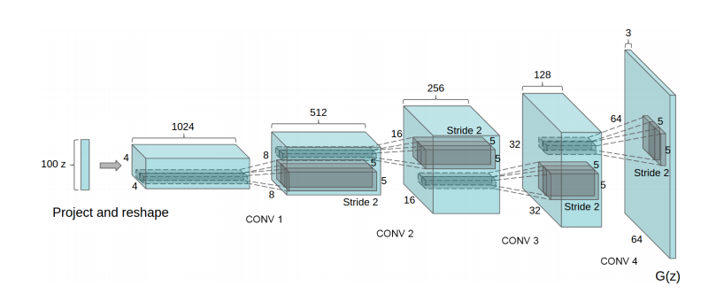
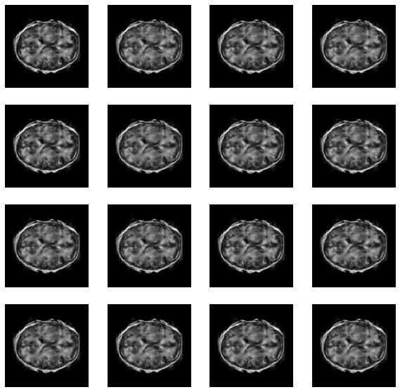
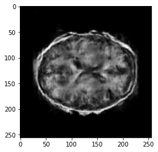

#  **Tensorflow Implementation of DCGAN Model on the OASIS Brain Data Set**

## Description
### Model
There are two models trained simultaneously by an adversarial process. A generator learns to create images that look real, while a discriminator learns to tell real images apart from fakes.
### Problem Solved
Create a generative model of the OASIS brain or the OAI AKOA knee data set using a DCGAN [1] that
has a “reasonably clear image” and a Structured Similarity (SSIM) of over 0.6. And the implementation of this project is evaluated to have a max Structured Similarity (SSIM) of 0.63 on the original data set.
___
## How DCGAN Works
I train two models simultaneously.
- CNN(discriminator): Classifying authentic and fake images.
("Authentic" images are provided as training data to CNN.)
- DCGAN(generator): Trained to generate images classified as authentic by CNN. 
(By trying to fool CNN, DCGAN learns to generate images similar to the training data.)<br/>The generator uses tf.keras.layers.Conv2DTranspose (upsampling) layers to produce an image from a seed (random noise). Start with a Dense layer that takes this seed as input, then upsample several times until it reaches the desired image size of 256x256x1. Notice the tf.keras.layers.LeakyReLU activation for each layer, except the output layer which uses tanh.

---
## Visualization
#### Result after 400 Epochs

#### Example Outputs
Generate a 256x256 image with a 100x1 random normal noise with the trained generator model. <br/>
<br/>
Compare the generated image with images in the original data set and calculate the max value of Structured Similarity (SSIM).<br/>
**Note: Structured Similarity (SSIM): 0.6319508**
___
## Algorithm Code
```
# Generator
def make_generator_model():
    model = tf.keras.Sequential()
    model.add(layers.Dense(4*4*512, use_bias=False, input_shape=(100,)))
    model.add(layers.BatchNormalization())
    model.add(layers.LeakyReLU())

    model.add(layers.Reshape((4, 4, 512)))
    assert model.output_shape == (None, 4, 4, 512)

    model.add(layers.Conv2DTranspose(256, (4, 4), strides=(2, 2), padding='same', use_bias=False))
    assert model.output_shape == (None, 8, 8, 256)
    model.add(layers.BatchNormalization())
    model.add(layers.LeakyReLU())
    
    model.add(layers.Conv2DTranspose(128, (4, 4), strides=(2, 2), padding='same', use_bias=False))
    assert model.output_shape == (None, 16, 16, 128)
    model.add(layers.BatchNormalization())
    model.add(layers.LeakyReLU())

    model.add(layers.Conv2DTranspose(64, (4, 4), strides=(2, 2), padding='same', use_bias=False))
    assert model.output_shape == (None, 32, 32, 64)
    model.add(layers.BatchNormalization())
    model.add(layers.LeakyReLU())
    
    model.add(layers.Conv2DTranspose(32, (4, 4), strides=(2, 2), padding='same', use_bias=False))
    assert model.output_shape == (None, 64, 64, 32)
    model.add(layers.BatchNormalization())
    model.add(layers.LeakyReLU())
    
    model.add(layers.Conv2DTranspose(16, (4, 4), strides=(2, 2), padding='same', use_bias=False))
    assert model.output_shape == (None, 128, 128, 16)
    model.add(layers.BatchNormalization())
    model.add(layers.LeakyReLU())
    
    model.add(layers.Conv2DTranspose(1, (4, 4), strides=(2, 2), padding='same', use_bias=False, activation='tanh'))
    assert model.output_shape == (None, 256, 256, 1)

    return model

# Discriminator
def make_discriminator_model():
    model = tf.keras.Sequential()
    model.add(layers.Conv2D(16, (4, 4), strides=(2, 2), padding='same',
                                     input_shape=[256, 256, 1]))
    model.add(layers.LeakyReLU())
    model.add(layers.Dropout(0.3))

    model.add(layers.Conv2D(32, (4, 4), strides=(2, 2), padding='same'))
    model.add(layers.LeakyReLU())
    model.add(layers.Dropout(0.3))

    model.add(layers.Conv2D(64, (4, 4), strides=(2, 2), padding='same'))
    model.add(layers.LeakyReLU())
    model.add(layers.Dropout(0.3))
    
    model.add(layers.Conv2D(128, (4, 4), strides=(2, 2), padding='same'))
    model.add(layers.LeakyReLU())
    model.add(layers.Dropout(0.3))
    
    model.add(layers.Conv2D(256, (4, 4), strides=(2, 2), padding='same'))
    model.add(layers.LeakyReLU())
    model.add(layers.Dropout(0.3))
    
    model.add(layers.Flatten())
    model.add(layers.Dense(1))

    return model

def discriminator_loss(real_output, fake_output):
    cross_entropy = tf.keras.losses.BinaryCrossentropy(from_logits=True)
    real_loss = cross_entropy(tf.ones_like(real_output), real_output)
    fake_loss = cross_entropy(tf.zeros_like(fake_output), fake_output)
    return real_loss + fake_loss

def generator_loss(fake_output):
    cross_entropy = tf.keras.losses.BinaryCrossentropy(from_logits=True)
    return cross_entropy(tf.ones_like(fake_output), fake_output)
```
___
## Dependencies Required
- Python = 3.7
- Tensorflow = 2.1.0
- Keras
___
## OASIS Brain Data Set
OASIS Brain data set - This is part of the OASIS brain study with segmentation labels.<br/>In the training set, there are 9664 brain images of 256x256 pixel in grayscale. For the model training, the original size of images(256x256) will be used.
___
## Author
**Ruixiang Ma<br/>45511365**
___
## Reference
[1] A. Radford, L. Metz, and S. Chintala, “Unsupervised Representation Learning with Deep Convolutional Generative Adversarial Networks,” arXiv:1511.06434 [cs], Jan. 2016, arXiv: 1511.06434. [Online]. Available: http://arxiv.org/abs/1511.06434
