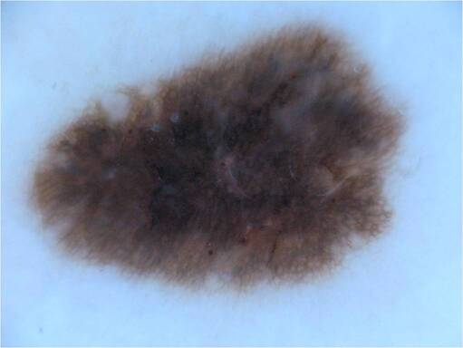
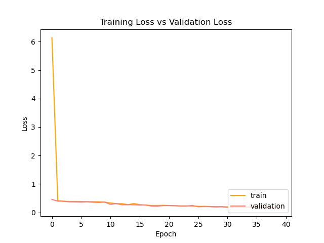
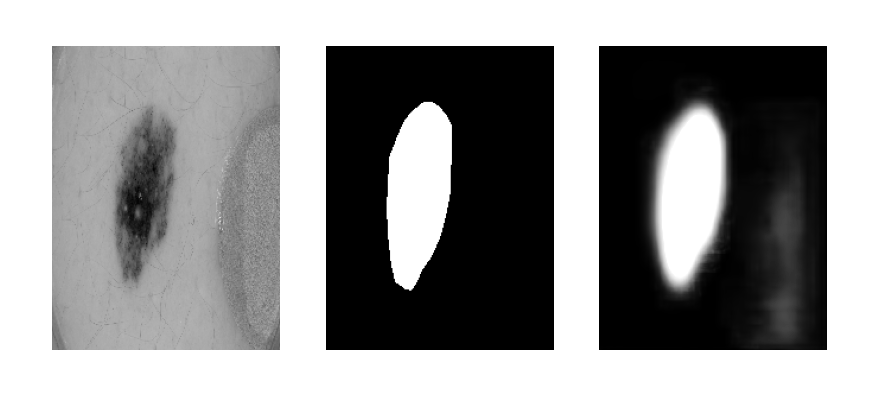

# U-Net for ISICs Dataset Segmentation

The International Skin Imaging Collaboration (ISIC) is an effort to improve the diagnosis of melanoma, the deadliest form of skin cancer. Utilising the U-Net convolutional neural network, developed originally for biomedical image segmentation, a model can be trained to generate a segmentation mask for an image of a skin lesion, and ultimately assist in identifying the presence of melanoma. Additionally, the model itself should achieve a Dice similarity coefficient of 0.7.

## ISICs 2018 Challenge Dataset

For the present task, the pre-processed dataset from the ISICs 2018 challenge has been obtained, containing 2,597 images of dermascopic lesions and their respective segmentation labels, identifying the presence of lesions in the image. The segmentation labels are binary mask images that contain either a pixel value of 0 for areas of the skin existing outside a lesion, or 255 for areas inside a lesion. 

An example of an image/label pair is displayed below. As is clear, the model will need to effectively distinguish between lesions in the image, and other features that may also be present (such as hair or other skin blemishes).

*Figure 1: Provided training image (ISIC_0000000).*

*Figure 2: Provided segmentation mask for image (ISIC_0000000).*

### Data pre-processing

As part of the data pre-processing stage, the grayscale versions of the training images are decoded to aid efficiency in training the model. Additionally, as the training images have varying dimensions, the decoded image is resized to ensure consistent dimensions of 256 x 192 across the dataset, ensuring that any important features contained in the images are not lost. Finally, the pixel values are normalised to ensure accuracy of the trained model. 

For the segmentation masks, in addition to the steps above, the pixel values are rounded to ensure they are strictly 0 or 1 for the purpose of training the model. This is due to the fact that in the original segmentation masks, there exists a small variance in pixel values around the edges of the identifying area.

Finally, 60% of the total dataset is used for training, whilst 20% is used for validation and the remaining 20% for testing.

## U-Net Architecture

The U-Net convolutional neural network was originally developed for biomedical image segmentation, consisting of an encoding path used to capture the context in the image. It includes a series of convolution and max pooling layers to accomplish this, before precise localisation is achieved by the decoder that follows. 

*Figure 3: U-Net architecture. Each blue box corresponds to a multi-channel feature map. The number of channels is denoted on top of the box. The x-y size is provided at the lower left edge of the box. White boxes represent copied feature maps. The arrows denote the different operations (Ronneberger, O., Fischer, P., Brox, T., 2015).*

## Results

Having trained the present model to 30 epochs, a Dice coefficient above 0.7 was achieved (indicated by Figure 4 below) from approximately the 28th epoch.

*Figure 4: Training Dice Coefficient vs. validation Dice coefficient curve.*

*Figure 5: Training accuracy vs. validation accuracy curve.*

*Figure 5: Training loss vs. validation loss curve.*

As indicated by Figure 7 below, the model successfully predicted the segmentation mask pointing to the skin blemish area in the original image (indicated by the actual segmentation mask). However, the it can be observed that the model is still identifying additional noise in the image (evident in the bottom right hand corner).

*Figure 7: Segmentation mask prediction by the model on the test dataset (left: original image, middle: actual mask, right: predicted mask).*

## Dependencies
- Python 3.7
- TensorFlow 2.1.0
- scikit-learn 0.23.2
- matplotlib 3.3.1
- ISICs 2018 Challenge dataset (accessible at the following [link](https://cloudstor.aarnet.edu.au/sender/?s=download&token=f0d763f9-d847-4150-847c-e0ec92d38cc5)).

## References

Ronneberger, O., Fischer, P., Brox, T. (2015). *U-Net: Convolutional Networks for Biomedical Image Segmentation.* Retrieved from: https://arxiv.org/pdf/1505.04597.pdf.