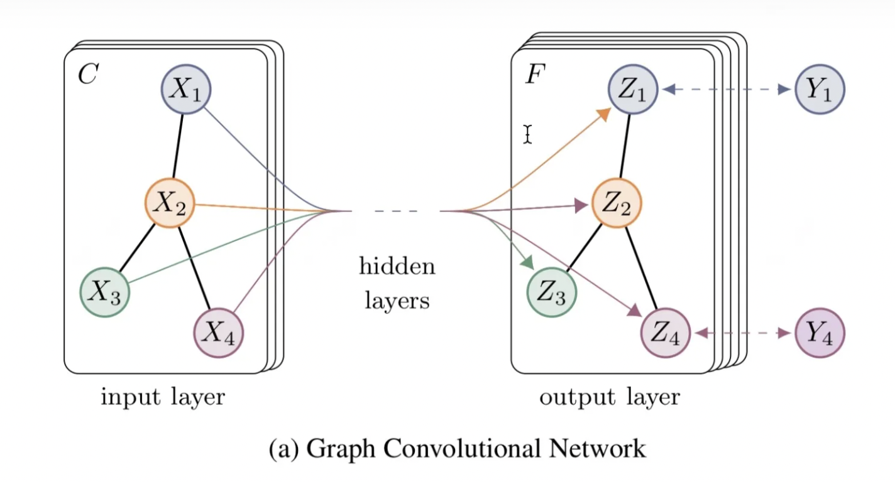
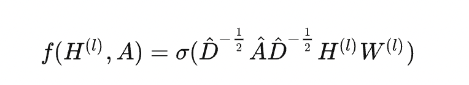

# Multi-layer GCN model to carry out a semi supervised multi-class node classification using Facebook Large Page-Page Network dataset
Author: Donghao Yang 45930032
## Algorithm and problem description
### GCN algorithm introduction
As we know, the input of traditional CNN is a graph structure with a Euclidean structure. However, more general graph structure we encounter a lot is 
social networks or topological networks. This kind of graph structure is irregular since there're different number of adjacency nodes or edges for each 
nodes, which means CNN cannot work on it. Luckily, Graph Convolutional Network appears and can solve this difficulties. The application of GCN includes 
recommendation system, natural language processing, computer vision and biochemisry. If GCN works on the edges of the graph, then it can conduct edge 
prediction. If GCN works on the nodes of the graph, then it can conduct nodes classification, which is the functionality I am going to realize in this 
report.
### The introduction of the theory behind GCN
From the picture below, the graph with C input channels is transferred to a graph with F channels after a multi layers of GCN operations. Channels here 
forms the features' matrix of the GCN input. Another input is the adjacency matrix of the graph.

The below picture is the core mathematical theory behind the GCN. In a word, it represents the information of every node of the next layer is obtained 
by weighting and summing the information of the previous layer itself and its neighboring nodes. After that, conduct linear and nonlinear transformations. 
Let's explain the meaning of symbols one by one. A(hat) is actually A+I(A is the adjacency matrix of the graph, and I is the identity matrix of the graph) 
. By doing this, we can reserve the information of the nodes themselves when calculating. D^(-1/2)A(hat)D^(-1/2) is the symmetric normalization of A(hat) 
in case the scale of output of each GCN layer increases. Why we do like this is related to the Laplacian Matrix. H(l) is the feature matrix of the graph 
in layer "l". D^(-1/2)A(hat)D^(-1/2)H(l) is just matrix multiplication and then conducting a linear transformation by a weighting matrix W(l). After that, 
we get the input feature matrix of the next layer by a non-linear activation function.

## Reference
[1] https://arxiv.org/abs/1609.02907
