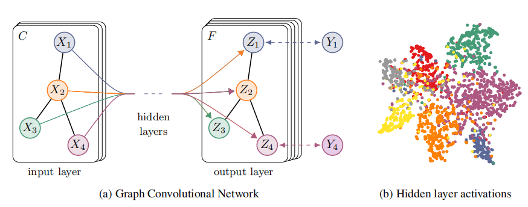
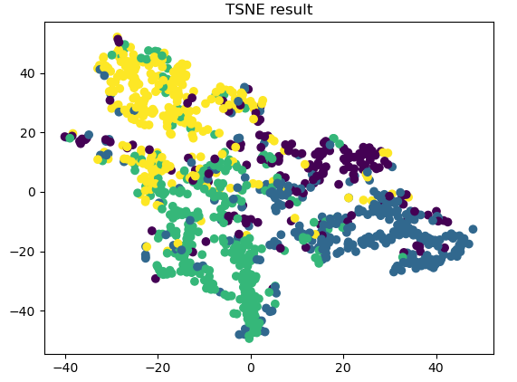

# TASK 2 : Multi-Layer GCN model by Facebook Large Page-Page Network dataset

## Xuacnhe.Liu / S4654830

## Description

This project is for the Facebook Large Page-Page Network dataset. Also used the "facebook.npz" as the partially processed dataset where the features are in the form of 128 dim vectors.

- Directed: No.
- Node features: Yes.
- Edge features: No.
- Node labels: Yes. Binary-labeled.
- Temporal: No.

Facebook  |

|---|---|

| Nodes |22,470   | 

| Edges | 171,002  |

| Density |  0.001 | 

| Transitvity | 0.232| 

<https://snap.stanford.edu/data/facebook-large-page-page-network.html>

Create a suitable multi-layer GCN model to carry out a semi supervised multi-class node classification. include a TSNE embeddings plot with ground truth in colors.

## Project process

- Data prepare

For the data preprocessing part, I first observed the data type and found that the data is a structure without phase diagram, and there are four classes, namely "tvshow", "company, "politician", "government". So The predicted classification results are four classes.

For the problem of data processing, I set up three functions, namely LOAD_DATA, STANDARD_ADJ, STANDARD_FEATURE, which are used to return the adjacency matrix, feature matrix and target matrix respectively. Standardize the adjacency matrix and standardize the feature matrix.

- GCN-Layer

For the class that builds the GCN layer, I set up three functions, namely the INIT function, which is used to set variables and judge the USE_BIAS variable. The second is reset parameters, and the third is the FORWARD function. The layer structure used to output settings.

- GCN-model-define

For the class that builds the GCN model, the main purpose is to use the previously set layers to build the GCN model. Two functions are set. The first is INIT, which is used to load the two build layers. The second is the FORWARD function, which is used to construct the model based on the adjacency matrix and the feature matrix.

- GCN-test-train

The main purpose of this file for test training is to reference the previously set classes and data to build the training logic. First, set the hyperparameters and the number of cycles to 200, introduce the constructed GCN model, and set the variable references used in the model. It contains two functions, test and train, which return accuracy and Loss history, and the history of the accuracy of the verification set.

- GCN-test-script

The main function of this file is to run the script commands of the GCN model, including the accuracy results of the training, and the visualization of the final classification results.

## Classify results

According to the visualization results, the data is roughly divided into four categories, completing the classification task of the GCN model.

## Self thinking

In the process of completing this task, I think that because the data set does not have a big reason, the result may have an over-fitting problem. For the problem of semi-supervised learning, the most direct way to prevent over-fitting is to increase the data set. . The second method is to reduce the number of layers of the network, but this does not apply to the GCN model. The last method is to add noise. I think we can consider adding some noise to the input layer, so that the noise can be amplified as the layer deepens and transmitted to the output layer to avoid overfitting. The disadvantage of this may reduce the accuracy of the output.
I also searched for a way to avoid overfitting and achieve higher accuracy by combining multiple models, such as fitting a Bagging model or a Boosting model, which is still being tried.

## Author
- Name & ID
Xuanche.Liu  /  S4654830

