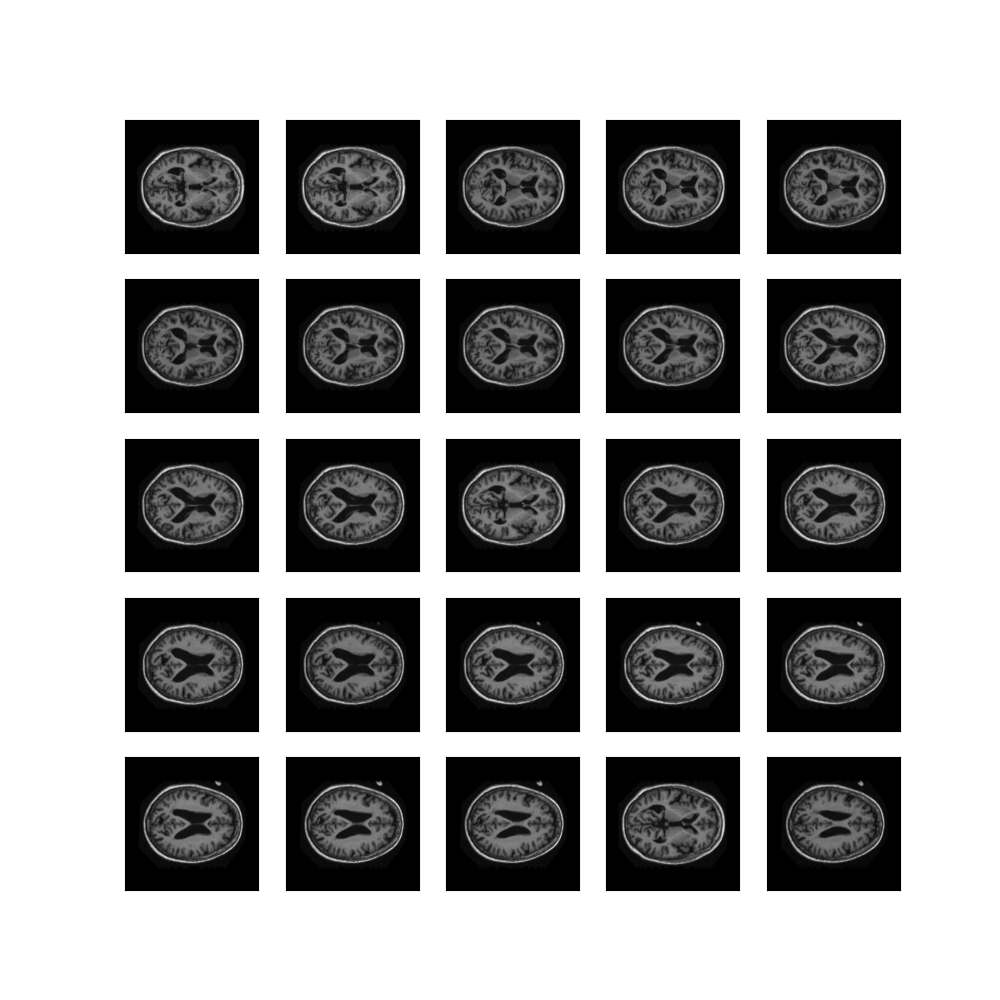
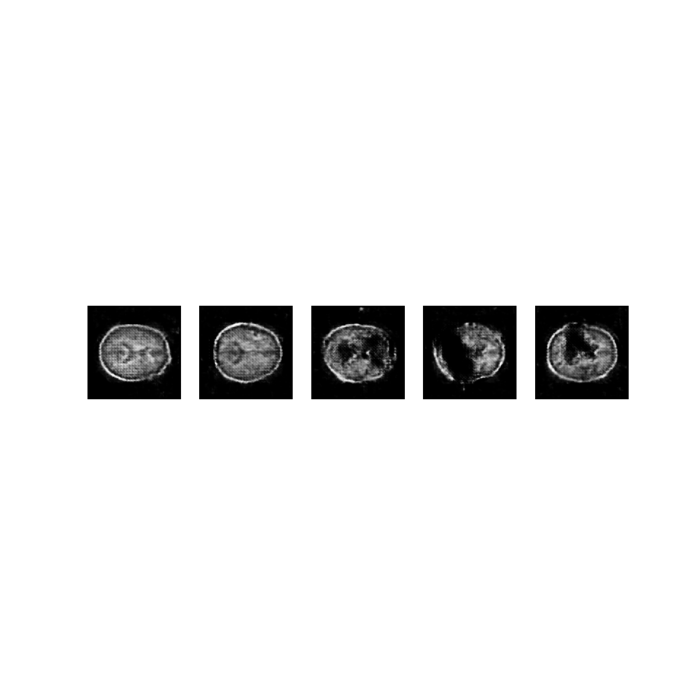
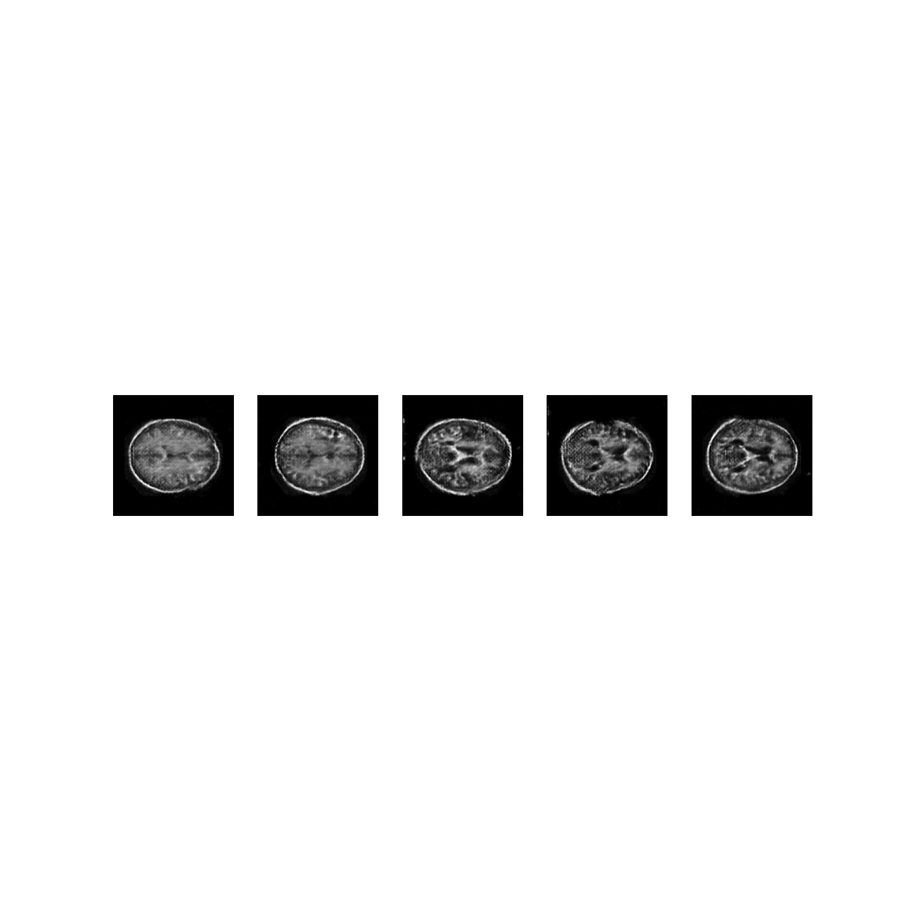
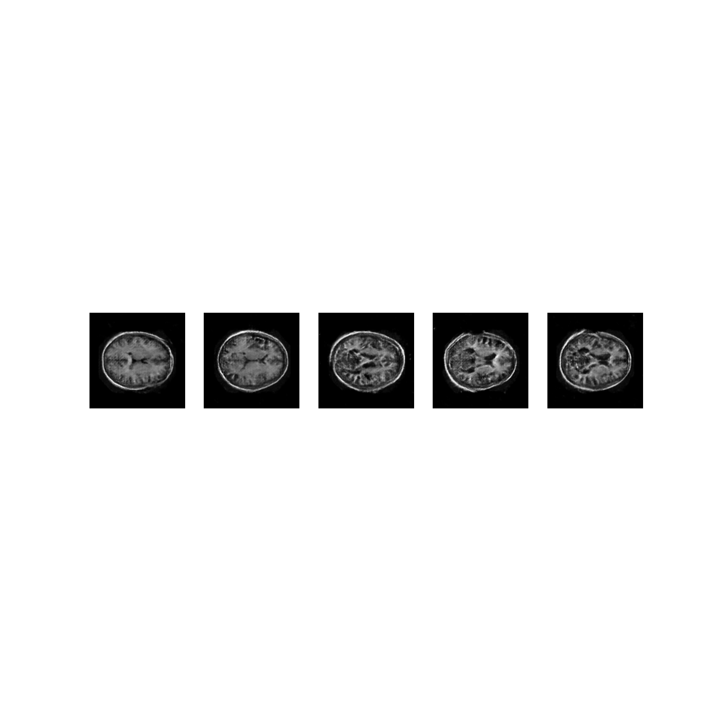
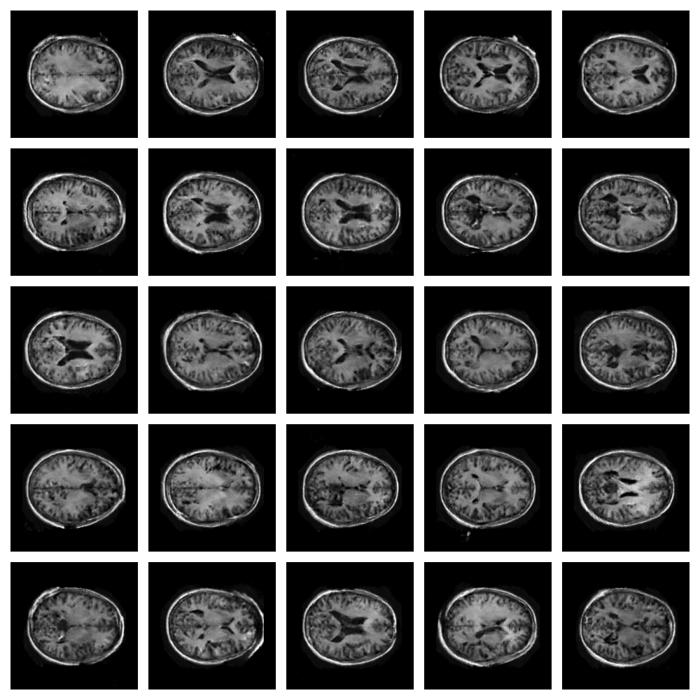
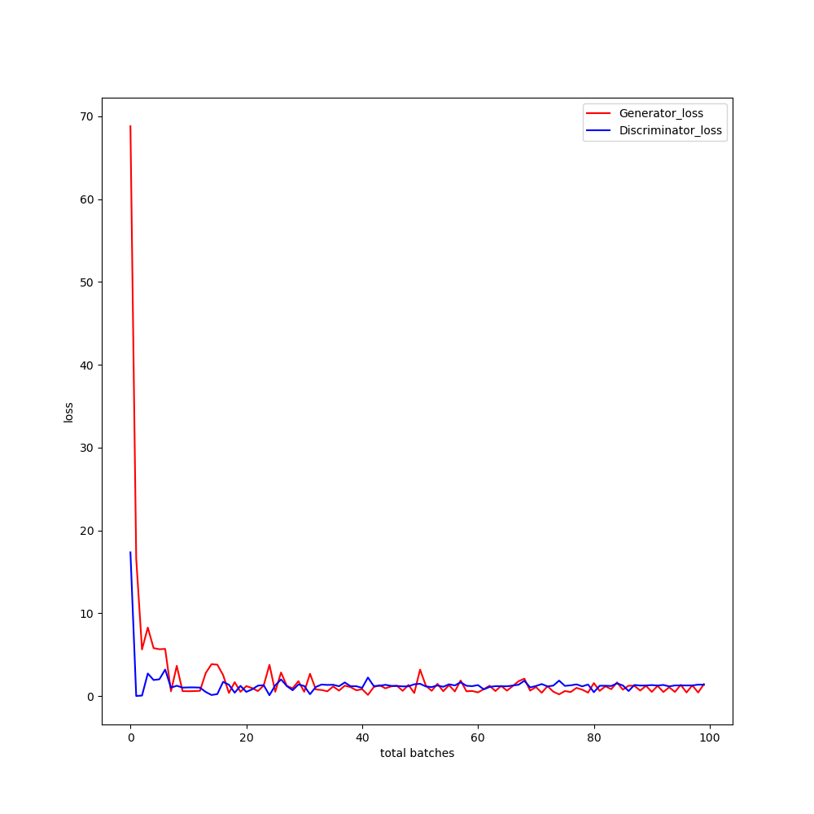

# DCGAN for OASIS dataset

Tensorflow implementation of Deep Convolutional Generative Adversarial Networks that solves COMP3710 Report Problem 6 (OASIS brain dataset).

## Prerequisites
* Python 3.7
* Tensorflow 2.1
* Matplotlib

## Usage
### Dataset
The OASIS preprocess dataset can be downloaded [here](https://cloudstor.aarnet.edu.au/plus/s/n5aZ4XX1WBKp6HZ) and need to be put inside the main folder to train the network.
### Train
To train the DCGAN network, run

    python main.py

## Results
After 10th epoch:

After 50th epoch:

After 80th epoch:

After training:

### Loss Curve
Losses of Generator and Discriminator.

## Author
Ganze Zheng(44570776)
