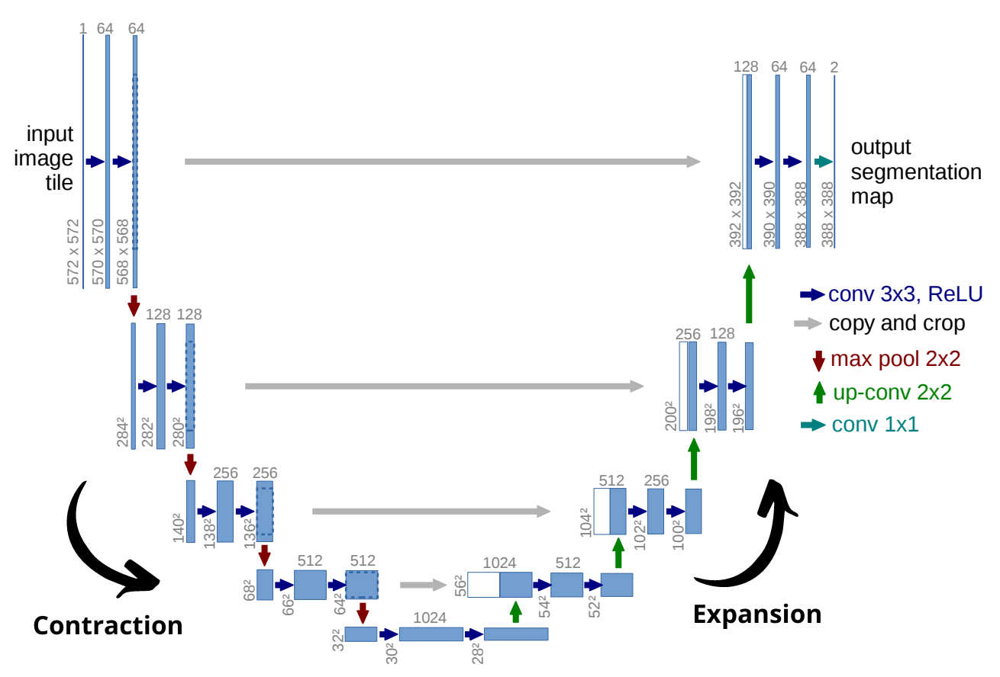

# ISIC Data Segmentation Using Improved UNet Model

<!-- Author Information -->
## Author
Name: Mujibul Islam Dipto

Student Number: 44961374

Email: mujibulislamdipto@gmail.com

<!-- TABLE OF CONTENTS -->

  
Table of Contents

  <ol>
    <li>
      <a href="#goal"> Project Goal </a>
    </li>
    <li>
      <a href="#the-data---isic-2018-challenge-data-for-skin-cancer"> Dataset Information </a>
      <ul>
          <li><a href="#overview"> Overview </a></li>
          <li><a href="#contents"> Contents </a></li>
          <li><a href="#processing"> Processing </a></li>
      </ul>
    </li>
    <li><a href="#the-improved-unet-model"> About the Model </a></li>
    <li><a href="#quick-links"> Quick Links </a></li>
    <li><a href="#references"> References </a></li>
  </ol>

<!-- Goal the project -->
## Goal
The goal of this project is to utilize the Improved UNet Model to segment skin lesions in the ISIC dataset. 

<!-- About the dataset -->
## The Data - ISIC 2018 Challenge Data For Skin Cancer

### Overview
The ISIC 2018 challenge had three main goals:
1. Lesion Segmentation
2. Lesion Attribute Detection
3. Disease Classification

As mentioned before, this project aims to solve the first problem.

### Contents

### Processing

<!-- About the Model -->
## About The Model

### Background
Contrary to image classification, semantic image segmentation aims to classify each pixel of an image to respective classes. Prior to the introduction of the original Unet model,
the inudustry standard was to perform a sliding window computation on a patch around each pixels. However, as expected this method was computationally expensive.

The original UNet model is a convolutional network that was designed to provide more accurate segmentations with fewer training data and at a much quicker time. The architecture follows a "U" shaped structure (hence the name), where the contracting path that downsamples the image leads to an expansive path that later on upsamples it. The image below shows the original UNet architecture.

  

UNet performs a _semantic segmentation_, where each pixel of the image is mapped to a class label. Here, the input image has one channel (because it is greyscaled), and the output image has two channels representing two classes.

### The Improved UNet Model

<!-- Links to the data set and model paper -->
## Quick Links
[The ISIC 2018 Challenge Data](https://challenge2018.isic-archive.com/)

[The Improved UNet Model](https://arxiv.org/abs/1802.10508v1)

## References
[1] Noel Codella, Veronica Rotemberg, Philipp Tschandl, M. Emre Celebi, Stephen Dusza, David Gutman, Brian Helba, Aadi Kalloo, Konstantinos Liopyris, Michael Marchetti, Harald Kittler, Allan Halpern: “Skin Lesion Analysis Toward Melanoma Detection 2018: A Challenge Hosted by the International Skin Imaging Collaboration (ISIC)”, 2018; https://arxiv.org/abs/1902.03368

[2] Tschandl, P., Rosendahl, C. & Kittler, H. The HAM10000 dataset, a large collection of multi-source dermatoscopic images of common pigmented skin lesions. Sci. Data 5, 180161 doi:10.1038/sdata.2018.161 (2018).

[3] https://www.tensorflow.org/tutorials/images/segmentation 

[4] https://arxiv.org/abs/1505.04597
