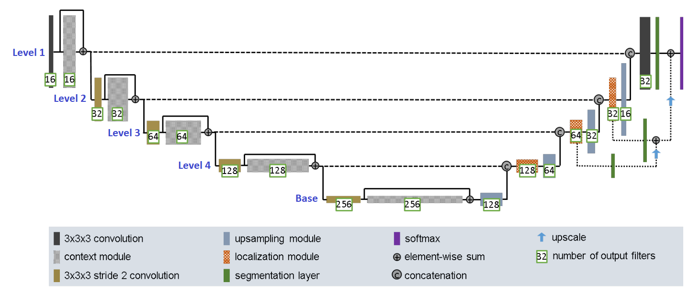

# ISIC Data Segmentation Using Improved UNet Model

<!-- Author Information -->
## Author
Name: Mujibul Islam Dipto

Student Number: 44961374

Email: mujibulislamdipto@gmail.com

<!-- TABLE OF CONTENTS -->

  
Table of Contents

  <ol>
    <li>
      <a href="#goal"> Project Goal </a>
    </li>
    <li>
      <a href="#the-data---isic-2018-challenge-data-for-skin-cancer"> Dataset Information </a>
      <ul>
          <li><a href="#overview"> Overview </a></li>
          <li><a href="#contents"> Contents </a></li>
          <li><a href="#processing"> Processing </a></li>
      </ul>
    </li>
    <li><a href="#about-the-model"> About the Model </a></li>
          <ul>
          <li><a href="#background"> Background </a></li>
          <li><a href="#the-improved-unet-model"> The Improved UNet Model </a></li>
      </ul>
    <li><a href="#quick-links"> Quick Links </a></li>
    <li><a href="#references"> References </a></li>
  </ol>

<!-- Goal the project -->
## Goal
The goal of this project is to utilize the Improved UNet Model to segment skin lesions in the ISIC dataset. 

<!-- About the dataset -->
## The Data - ISIC 2018 Challenge Data For Skin Cancer

### Overview
The ISIC 2018 challenge had three main goals:
1. Lesion Segmentation
2. Lesion Attribute Detection
3. Disease Classification

As mentioned before, this project aims to solve the first problem.

### Contents
The dataset for the first problem contains two sets of data.
1. Input images in jpeg format - these are scan images of the lesions
2. Output (mask) images in png format - these are the groundtruth.

The images below illustrate a skin lesion (input) image and its corresponding mask.

  <kbd>
  
  </kbd>
  <kbd>
  
   </kbd>

The **blacks** (**0**) in the mask images represents the **background** and the **whites** (**255**) represents the **lesion**.

### Processing

<!-- About the Model -->
## About The Model

### Background
Contrary to image classification, semantic image segmentation aims to classify each pixel of an image to respective classes. Prior to the introduction of the original Unet model,
the inudustry standard was to perform a sliding window computation on a patch around each pixels. However, as expected this method was computationally expensive.

The original UNet model [4] is a convolutional network that was designed to provide more accurate segmentations with fewer training data and at a much quicker time. The architecture follows a "U" shaped structure (hence the name), where the contracting path that downsamples the image leads to an expansive path that later on upsamples it. The image below shows the original UNet architecture.

  <kbd>
  
  </kbd>

UNet performs a _semantic segmentation_, where each pixel of the image is mapped to a class label. The contracting path starts with two 3x3 valid Convolutions, followed by downsampling using MaxPooling. This doubles the number of feature channels. This pattern repeats for a total of four 3x3 valid Convolutions with their corresponding max pooling layers.

The expansive path utilizes Transpose Convolutions to upsample the image. Similar to the previous path, it performs four 3x3 valid Convolutions with corresponding 2x2 upsampling operations. This upsampling now halves the number of feature channels. 

The grey arrows as referred to as "skip connections", are concatenation layers that actually gives this U shape through the connections and provides "context" at these levels.

Lastly, a 1x1 Convolution is performed that does not change the input size, rather changes the number of channels to the number of classes, which in this case is two.

### The Improved UNet Model

  <kbd>
  
  </kbd>

The Improved UNet  Model [5] still follows the "U" shaped structure as the original UNet, but further improvements have been made. The _context module_ in the image above refers to the contracting path and now consists of pre-activation residual blocks. Some key specifications of this model are:
* Usage of LeakyReLU with an alpha of 0.01 instead of ReLU
* Replacement of traditional batch with instance normalization
* Integration of segmentation layers at different levels
* Use of Dropout with probability 0.3
* Use of context modules which are pre-activation residual blocks with two 3x3x3 convolutional layers and a dropout layer in between [5]
* Use of localization modules to recombine features 

<!-- Links to the data set and model paper -->
## Quick Links
[ISIC 2018 Challenge Data](https://challenge2018.isic-archive.com/)

[UNet Model](https://arxiv.org/abs/1505.04597)

[Improved UNet Model](https://arxiv.org/abs/1802.10508v1)

## References
[1] Noel Codella, Veronica Rotemberg, Philipp Tschandl, M. Emre Celebi, Stephen Dusza, David Gutman, Brian Helba, Aadi Kalloo, Konstantinos Liopyris, Michael Marchetti, Harald Kittler, Allan Halpern: “Skin Lesion Analysis Toward Melanoma Detection 2018: A Challenge Hosted by the International Skin Imaging Collaboration (ISIC)”, 2018; https://arxiv.org/abs/1902.03368

[2] Tschandl, P., Rosendahl, C. & Kittler, H. The HAM10000 dataset, a large collection of multi-source dermatoscopic images of common pigmented skin lesions. Sci. Data 5, 180161 doi:10.1038/sdata.2018.161 (2018).

[3] https://www.tensorflow.org/tutorials/images/segmentation 

[4] O. Ronneberger, P. Fischer, en T. Brox, “U-Net: Convolutional Networks for Biomedical Image Segmentation”, arXiv [cs.CV]. 2015.

[5] F. Isensee, P. Kickingereder, W. Wick, M. Bendszus, en K. H. Maier-Hein, “Brain Tumor Segmentation and Radiomics Survival Prediction: Contribution to the BRATS 2017 Challenge”, arXiv [cs.CV]. 2018.
