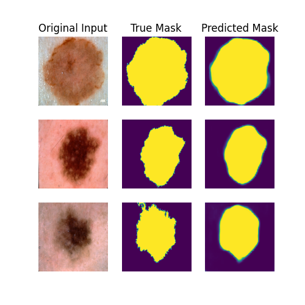
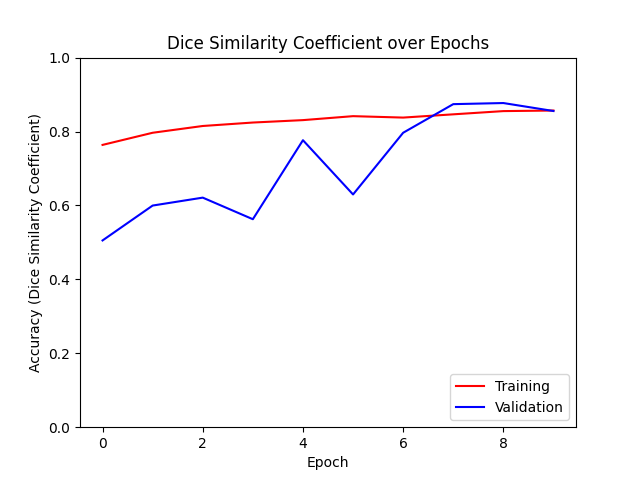
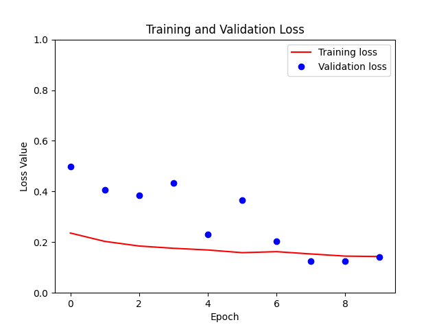
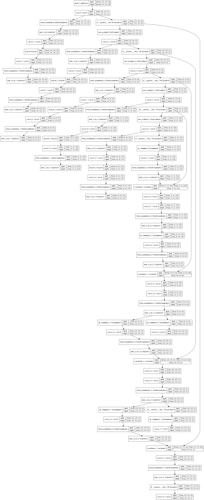

# ISICs dataset segmentation with an Improved UNet Model
#### Author: Tompnyx
##### Student Number: 45872093
## Introduction
In this project an improved UNet model is used for image segmentation to identify Melanoma.
## Algorithm Description
The UNet is an architectural model that consists of two paths: Contraction and Expansion. Contraction is the process
of capturing the context of an image by reducing its features. This is done traditionally through stacks of
convolutional and max pooling layers [3]. Expansion is the process of reintroducing information into higher resolution
layers [3]. In the improved UNet model used, other techniques like dropout, batch normalization, leaky ReLU layers, and
segmentation are used to improve upon the initial model.
## Dataset Description
The ISIC 2018 dataset is a dataset that was released as a resource for an automated image analysis tool development
competition [2]. The dataset consists of images split into two different folders: Pictures of skin lesions and masks
that segment the lesions. The goal of this dataset was to promote automated Melanoma detection [2].
## Choices made for the model
I chose to stick closely to the UNet picture specified in [1]. This involved five layers of contraction and five layers
of expansion, with leaky ReLU layers and Batch Normalisation sprinkled throughout. Each contraction layer included a
context module, with the expansion layers containing a localisation module. Finally, segmentation layers taken from
stages in between the up-sampling and localisation modules were summed together (element-wise) at the end of the model.

After modifying the hyperparameters of the model, I found that the best performance occurred with the following values:
- Training/Validation/Testing split of 80%/10%/10%
- Batch Size = 16
- Epochs = 10
- Initial filters used in the convolutional layer = 16
- Convolutional layer padding = 'same'
- Convolutional layer activation = 'relu'
- Dropout rate of 0.3 (30%)
- Leaky ReLU alpha parameter (Zero substitution value) = 0.1
- Model optimizer = 'adam'
- If the dataset should be shuffled (Set to True be default)

The accuracy and loss metric measured for training is the dice similarity coefficient, to achieve what was asked in
the assessment specification.
## Accuracy of the model
Trained models with this architecture was able to consistently achieve a dice similarity coefficient of greater or equal
to 80% in training, validation, and testing. With the default parameters, the following performance was achieved:
### Figure 1: Example image segmentation achieved by the model, presented next to the original model and the true mask

### Figure 2: Example performance of the model's training and validation accuracy over epochs run

### Figure 3: Example performance of the model's training and validation loss over epochs run

### Figure 4: Architecture of the improved UNet model

## Parameters for visualisation and saving
Included in the model are parameters that the user can modify to generate and save certain plots that show the
performance of the model. Included are:
- The number of displayed examples displayed per generated plot (Default set to 3)
- If a subset of the original photos are to be displayed (Image and equivalent Mask)
- If a subset of the processed photos are to be displayed (Image and equivalent Mask)
- If a subset of the predicted masks are to be displayed alongside the original photo and true mask
- If plots generated should be saved in the subdirectory '/Results'
- If the model should be saved, so it can be loaded and used later (Saved in the subdirectory '/Saved_Model')
- If the saved model located in the '/Saved_Model' should be used
#### NOTE: If the subdirectories needed are not present, they will be created automatically
#### NOTE: If there are files present before the program is run, these files will be overwritten with new data
#### NOTE: A visual representation of the model is generated automatically and saved to the subdirectory '/Results'
## How to build and run
To run the program, the downloaded dataset or a hyperlink to the dataset is needed before running the **driver.py**
script. To allow the program to detect this dataset, the link saved in the ISIC2018_data_link variable in driver.py
should be replaced with the correct directory. The following dependencies will also be needed:
## Dependencies
- Python (Tested: 3.9.7)
- Tensorflow (Tested: 2.7.0)
- matplotlib (Tested: 3.4.3)
- graphviz (Tested: 2.38)
- pydot (Tested: 1.4.2)
- cuDNN (Tested: 8.1)
- CUDA (Tested: 11.2)
## Limitations
The aforementioned model was trained on custom hardware with access to an AMD Ryzen 5 5600X CPU and a GTX 1070 GPU,
with each epoch taking on average 64s at 490ms/step. Environments with more computational power might be able to run
the model with a higher batch size/ initial filter number which would result in a better result and a faster processing
speed.
## References
- [1] "Brain Tumor Segmentation and Radiomics Survival Prediction: Contribution to the BRATS 2017 Challenge", Fabian Isensee,
Philipp Kickingereder, Wolfgang Wick, Martin Bendszus, Klaus H. Maier-Hein, 2018.
[Online]. Available: https://arxiv.org/abs/1802.10508v1. [Accessed: 28-Oct-2021].
- [2] "ISIC 2018: Skin Lesion Analysis Towards Melanoma Detection", ISIC, 2018.
[Online]. Available: https://challenge2018.isic-archive.com/. [Accessed: 30- Oct- 2021].
- [3] H. Lamba, "Understanding Semantic Segmentation with UNET", Medium, 2019.
[Online]. Available: https://towardsdatascience.com/understanding-semantic-segmentation-with-unet-6be4f42d4b47.
[Accessed: 30- Oct- 2021].
- [4] "An overview of semantic image segmentation.", Jeremy Jordan, 2021.
[Online]. Available: https://www.jeremyjordan.me/semantic-segmentation/. [Accessed: 26-Oct-2021].
- [5] "Image segmentation", TensorFlow, 2021.
[Online]. Available: https://www.tensorflow.org/tutorials/images/segmentation. [Accessed: 28-Oct-2021].