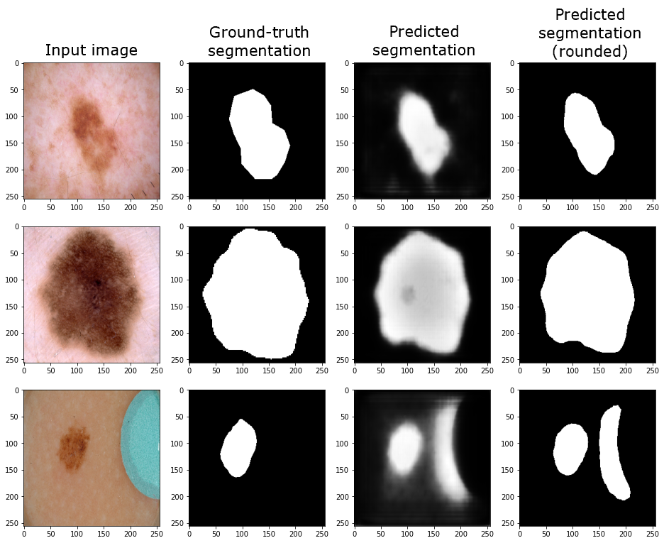

# ISIC image segmentation using Improved UNet

**Author:** Isabel Peters  
**Student number:** 45371756

The ISIC (International Skin Imaging Collaboration) dataset is a collection of images of skin cancer, and accompanying segmentationg maps. The skin cancer images are in colour, and the segmenation maps have two classes - the foreground/cancer in white, and the background in black. This algorithm trains a deep-learning model based on the [Improved UNet](https://arxiv.org/abs/1802.10508v1) architecture to produce these segmentation maps.

The Improved UNet architecture comprises of two pathways - the context pathway, and the localisation pathway. The context pathway repeats the same layers 5 times, with the number of filters doubling and the layer size halving between them. The localisation pathway repeats the same layers 4 times, with the number of filters halving and the layer size doubling during these layers. This results in the output prior to the final segmentaion being the same size as the first context layer.  
As in standard UNet, skip connections, in the form of concatenation, link the context layer and the localiation layer of the same depth. Improved UNet also has connections within each level of the context pathway. After layer size is reduced, a series of convolutions and a dropout layer is applied - the 'context module'. The result of the layer after the context module is then summed element-wise with the layer prior to the application.  
The final step of Improved UNet is producing the segmentation map. This incorporates the segmentation results of the final 3 localisation layers, by upsampling and element-wise summation, to produce the overall segmentation output.  
This algorithm implements an Improved UNet architecture similar to the above image. However, convolutions were 2D not 3D; the activation function ReLU was used instead of leaky ReLU; and the number of filters in the first layer was 8, instead of 16.

## Installation

#### Software dependencies
* Python
* Tensorflow 
* Matplotlib

#### File dependencies
* ISIC image data must be saved in a directory. The location of this directory (containing subdirectories `ISIC2018_Task1-2_Training_Input_x2` and `ISIC2018_Task1_Training_GroundTruth_x2`) should be specifed as the `image_root_folder` in `driver.py`. The ISIC image data can be downloaded from [here](https://cloudstor.aarnet.edu.au/sender/?s=download&token=f0d763f9-d847-4150-847c-e0ec92d38cc5) (approximately 3Gb) until 10/12/2020. 
* Code can either downloaded directly of by cloning the repository. The location of the code directory should be specifed as the `code_root_folder` in `driver.py`.

## How to use

The driver script `driver.py` downloads the images; and creates and trains the model; and prints results.

Parameters that can be altered in this script include:
* `filters = 8` - The number of filters the first layer of the model will have
* `batch_size = 4` - The batch size that will be used when training and evaluating the model
* `total_prop = 1` - The proportion of the total image set to use
* `val_prop = 0.1` - The proportion of the (reduced) image set to use as a validation set
* `test_prop = 0.1` - The proportion of the (reduced) image set to use as a test set
Note that the ISIC dataset contains only 2,596 images. Thus small validation and test proportions (both 0.1) were chosen as defaults to ensure adequate data remained for training.

The size of the images used can also be changed. Currently, all images are resized to squares with side length `image_size = 256`. Note `image_size` must be specified in both `driver.py` and `load_images.py`.

Example model results:

