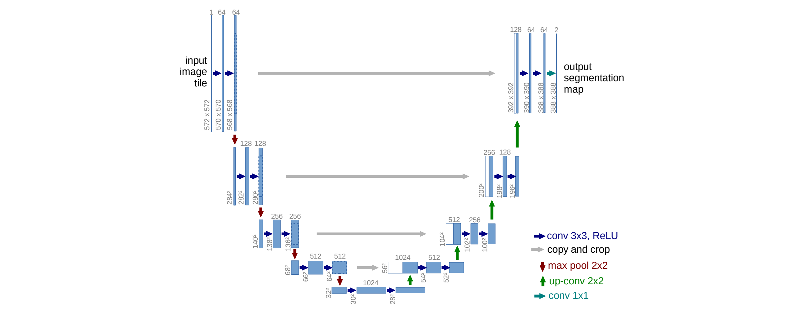

<<<<<<< HEAD
# ISIC image segmentation using UNet

**Author:** Isabel Peters  
**Student number:** 45371756

The ISIC (International Skin Imaging Collaboration) dataset is a collection of images of skin cancer and their corresponding segmentation maps. The skin cancer images are in colour, and the segmentation maps have two classes - the foreground/cancer in white, and the background in black. This algorithm trains a deep-learning model based on the [UNet](https://arxiv.org/abs/1505.04597) architecture to produce these segmentation maps.

This algorithm implements the UNet architecture similar to the above image. The UNet architecture comprises of two pathways - the context (down/encoding) pathway, and the localisation (up/decoding) pathway. The context pathway repeats the same layers 4 times, with the number of filters doubling and the layer size halving each time. The localisation pathway repeats the same layers 4 times, with the number of filters halving and the layer size doubling each time. This results in the output prior to the final convolution and segmentaion layers being the same size as the first context layer. Skip connections, in the form of concatenation, link the context layer and the localiation layer of the same depth and aid in recovering lost information to enhance model performance. Segmentation output is done via a convolution with 2 filters (as there are two segmentation classes) and a softmax activation to output probabilities.

## Installation

#### Software dependencies
* Python (3.7.9)
* Tensorflow (2.1.0)
* Matplotlib (3.3.1)

#### File dependencies
* ISIC image data must be saved in a directory. The location of this directory (containing subdirectories `ISIC2018_Task1-2_Training_Input_x2` and `ISIC2018_Task1_Training_GroundTruth_x2`) should be specifed as the `image_root_folder` in `driver.py`. The ISIC image data can be downloaded from [here](https://cloudstor.aarnet.edu.au/sender/?s=download&token=f0d763f9-d847-4150-847c-e0ec92d38cc5) (approximately 3Gb) until 10/12/2020. 
* Code can either downloaded directly of by cloning the repository. The location of the code directory should be specifed as the `code_root_folder` in `driver.py`.

## How to use

The driver script `driver.py` downloads the images; creates and trains the model; and prints test set results.

Parameters that can be altered in this script include:
* `filters = 12` - The number of filters the first layer of the model will have
* `batch_size = 16` - The batch size that will be used when training and evaluating the model
* `total_prop = 1` - The proportion of the total image set to use
* `val_prop = 0.1` - The proportion of the (reduced) image set to use as a validation set
* `test_prop = 0.1` - The proportion of the (reduced) image set to use as a test set

Note that the ISIC dataset contains only 2,596 images. Thus small validation and test proportions (both 0.1) were chosen as defaults to ensure adequate data remained for training. Images are allocated at random to training, validation and test sets each time the images are loaded.

The size of the images used can also be changed. Currently, all images are resized to squares with side length `image_size = 256`. Note `image_size` must be specified in both `driver.py` and `load_images.py`.

The training of the model can also be altered as required. Note that the model has a tendency to converge to assigning only the background class. To minimise this, an adam optimiser with a low learning rate (5 x 10^(-5)) is used by default. Categorical crossentropy loss was found to improve model performance compared to average Dice Similarity Coefficient (DSC) loss (although this metric is defined in `metrics.py` if required). The metrics of foregound DSC and background DSC are currently passed to the model. 

#### Example test set results:

#### Example test set evaluation results:
`17/17 [==============================] - 17s 984ms/step - loss: 0.2945 - dsc_fore: 0.9724 - dsc_back: 0.9541`
=======
# Improved Unet on the 2018 ISIC dataset 
**Author:** Mark Coulon (45797954)

The ISIC dataset is a collection of images that contain Skin Lesions. This module was written to have better classification of those skin lesions. The model that was used to accomplish this task was an improved UNET, described [here](https://arxiv.org/abs/1802.10508v1). The loss of the model was the Dice-coefficient which is a measurement, described [here](https://en.wikipedia.org/wiki/S%C3%B8rensen%E2%80%93Dice_coefficient). This model had a dice score of above 80% as described in the task given.
The algorithm involves multiple layers of convolution and extra element-wise sums. These added residual connections make it the improved version of the Unet. This can be seen below:

## Dependencies
The following packages are required to use this. Only tensorflow is used in the model itself, the other packages are used for data preparation and displaying graphs and images.
- Tensorflow
- glob
- sklearn
- matplotlib

## File location
The ISIC image data must be saved in the same folder as the program. This folder must have 2 subdirectories (ISIC2018_Task1-2_Training_Input_x2, ISIC2018_Task1_Training_GroundTruth_x2). The image path can be changed in the driver file, and the subdirectories can be changed in the UnetData file.

## Usage
the driver file is the file that contains most of the logical flow and calls functions from the other 2 files, UnetData and ImprovedUnet. The UnetData handles the data preparation and the ImprovedUnet file is the model. To make the model, the driver file has to be run. Some important features that can be altered in the diver file is the batch size, the number of images used and the learning rate. All of these were altered until the dice co-efficient was above 80%.

The size of the images were also reshaped to be 256 by 256 pixels. 
The images were split, 60% into training, 20 % into testing and 20% into validation, this split worked well and was also altered to get the maximum efficiency. 

## Example output
The screenshots below show the accuracy, loss and dice over the epochs. In the second screenshot it shows 3 examples of the model working. This was with a accuracy above 90% and a dice-coefficient score above 80%. 

>>>>>>> master
