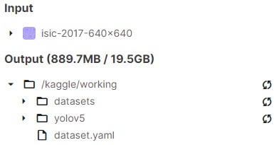
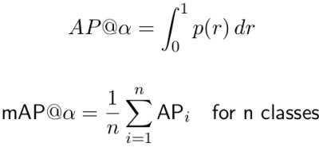
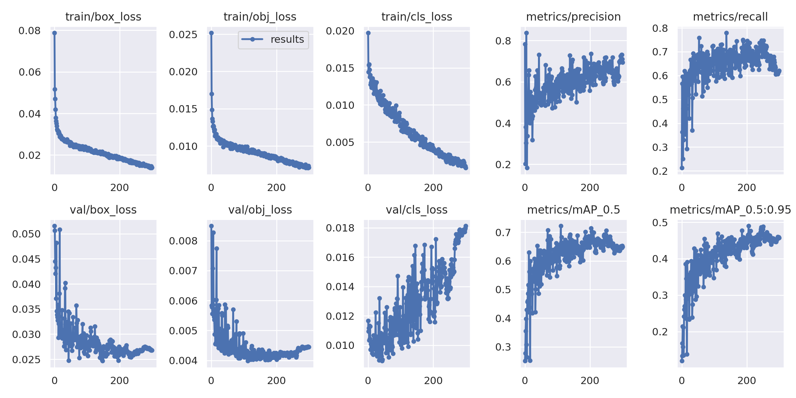
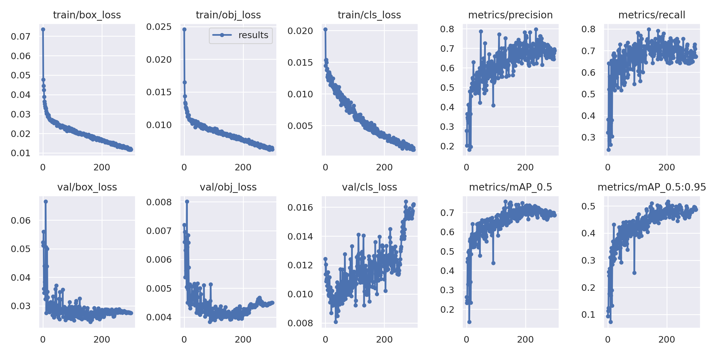
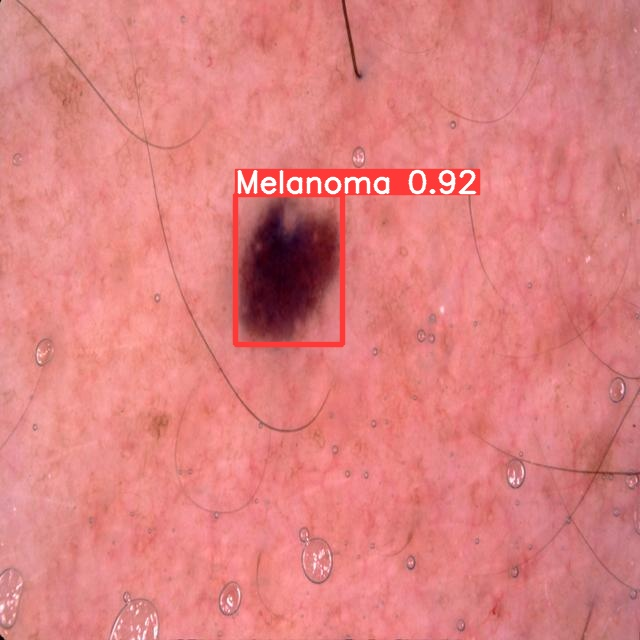
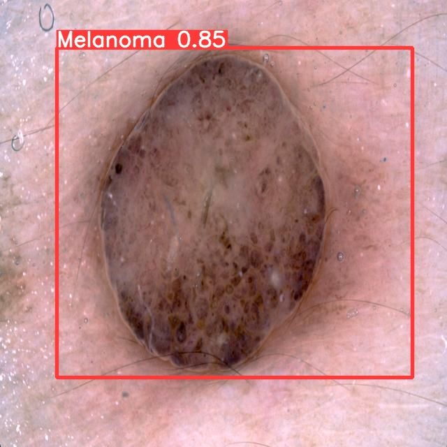

# ISIC 2017 Melanoma (Lesion) Detection with YOLO v5
## Aim
The aim of this project is to prepare the 2000 lesion images inside the ISIC 2017 challenge training dataset to train a YOLO v5 network that is capable of producing a suitable detection accuracy, with a Intersection Over Union of over 0.8 on the test set for detecting Melonoma.

## YOLO v5
*You Only Look Once*, or YOLO is a real-time object detection neural network. It is known to be a fast performing, lightweight model and thus can be deployed on slower hardware to achieve impressive performance. 

### How it works
The architecture splits the input image in a *m* x *m* grid and generates 2 bounding boxes for each grid. The bounding boxes and class probabilities are determined, and when the centre of an object falls inside of the 2 x 2 bounding box, it creates the overall bounding box for the object, showing both its confidence score (0-1) and class label.

The relationship between these probabilities are as follows:
```
Pr(Classi|Object)∗Pr(Object)∗IOU = Pr(Classi)∗IOU
```
### Model Architecture

The model backbone is mainly used to extract the important features from the given input image, whereby it is passed into the neck. The backbone for YOLOv5 is pre-trained on the COCO dataset, and Cross Stage Partial Networks (CSPs) are used as the backbone. The neck of model is used to generate feature pyramids, which improves the detection of objects particularly when scaling said object. PANet is used as the neck to acquire the feature pyramids of the input data. The head consitutes the output, meaning performing a dense prediction and apply anchor boxes, generating class probabilities and bounding boxes.

### Model Choices

The creators of YOLOv5 had state that the *S* and *M* versions of YOLOv5 were suitable for quick, mobile deployment, whilst those bigger than that such as *L* are suited more towards cloud deployment or data centre deployment. Therefore, the *S* and *M* versions were chosen to be trained as Kaggle has a strict memory limit which prevents any of the larger models to be trained successfully.

### Loss Function

The multi-part loss function above was used during training by the YOLO v5 model, which sums the loss between the localisation loss, object confidence loss and classification loss.

## ISIC Challenge 2017 Dataset
The ISIC Challenge 2017 includes images of skin abnormalities, whereby they are known to be either unharmful, melanoma or seborrheic keratosis. The dataset has already split its data into individual training, validation and test datasets. The training data includes 2000 lesion images in JPEG format, along with the ground truth in PNG format. The validation set and test set includes 150 and 600 JPEG images respectively and, like the training data, includes the ground truth for each image. The dataset includes extra information such as the patients age and gender, these are not within the scope of the project and will not be encoded during training. 

## Setting Up
### Dependencies
- Python -> 3.9
- YOLOv5 from their GitHub Page and its associated dependencies
- numpy
- matplotlib
- pillow (PIL)

### File Structure
The files used for training on kaggle should be set out in the following file structure:



## Pre-processing
The dataset downloaded from the ISIC website was then processed for training/test/validating as follows:
- Resized both the skin images and segmentation (ground truth) to 640 x 640 as per YOLOv5's default image size
- Encoded the ground truth images to the YOLO v5 label structure for bounding boxes-> (label, center_x, center_y, width, height)
- Split into training/validation/test folders in the same form as on the ISIC webpage (2000/150/600)

## Running the Model
The training was done in Kaggle, a machine learning based competition website with GPU cluster of Nvidia P100s. No hyperparameters files were inputted, meaning that default hyperparameters used to train the YOLOv5 neural network was used. 
When running the small version of the YOLO v5 model, the following model architecture is shown:
```
                 from  n    params  module                                  arguments                     
  0                -1  1      3520  models.common.Conv                      [3, 32, 6, 2, 2]              
  1                -1  1     18560  models.common.Conv                      [32, 64, 3, 2]                
  2                -1  1     18816  models.common.C3                        [64, 64, 1]                   
  3                -1  1     73984  models.common.Conv                      [64, 128, 3, 2]               
  4                -1  2    115712  models.common.C3                        [128, 128, 2]                 
  5                -1  1    295424  models.common.Conv                      [128, 256, 3, 2]              
  6                -1  3    625152  models.common.C3                        [256, 256, 3]                 
  7                -1  1   1180672  models.common.Conv                      [256, 512, 3, 2]              
  8                -1  1   1182720  models.common.C3                        [512, 512, 1]                 
  9                -1  1    656896  models.common.SPPF                      [512, 512, 5]                 
 10                -1  1    131584  models.common.Conv                      [512, 256, 1, 1]              
 11                -1  1         0  torch.nn.modules.upsampling.Upsample    [None, 2, 'nearest']          
 12           [-1, 6]  1         0  models.common.Concat                    [1]                           
 13                -1  1    361984  models.common.C3                        [512, 256, 1, False]          
 14                -1  1     33024  models.common.Conv                      [256, 128, 1, 1]              
 15                -1  1         0  torch.nn.modules.upsampling.Upsample    [None, 2, 'nearest']          
 16           [-1, 4]  1         0  models.common.Concat                    [1]                           
 17                -1  1     90880  models.common.C3                        [256, 128, 1, False]          
 18                -1  1    147712  models.common.Conv                      [128, 128, 3, 2]              
 19          [-1, 14]  1         0  models.common.Concat                    [1]                           
 20                -1  1    296448  models.common.C3                        [256, 256, 1, False]          
 21                -1  1    590336  models.common.Conv                      [256, 256, 3, 2]              
 22          [-1, 10]  1         0  models.common.Concat                    [1]                           
 23                -1  1   1182720  models.common.C3                        [512, 512, 1, False]          
 24      [17, 20, 23]  1     18879  models.yolo.Detect                      [2, [[10, 13, 16, 30, 33, 23], [30, 61, 62, 45, 59, 119], [116, 90, 156, 198, 373, 326]], [128, 256, 512]]
Model summary: 214 layers, 7025023 parameters, 7025023 gradients, 16.0 GFLOPs
```
When running the medium version of the YOLO v5 model, the following model architecture is shown:
```
                 from  n    params  module                                  arguments                     
  0                -1  1      5280  models.common.Conv                      [3, 48, 6, 2, 2]              
  1                -1  1     41664  models.common.Conv                      [48, 96, 3, 2]                
  2                -1  2     65280  models.common.C3                        [96, 96, 2]                   
  3                -1  1    166272  models.common.Conv                      [96, 192, 3, 2]               
  4                -1  4    444672  models.common.C3                        [192, 192, 4]                 
  5                -1  1    664320  models.common.Conv                      [192, 384, 3, 2]              
  6                -1  6   2512896  models.common.C3                        [384, 384, 6]                 
  7                -1  1   2655744  models.common.Conv                      [384, 768, 3, 2]              
  8                -1  2   4134912  models.common.C3                        [768, 768, 2]                 
  9                -1  1   1476864  models.common.SPPF                      [768, 768, 5]                 
 10                -1  1    295680  models.common.Conv                      [768, 384, 1, 1]              
 11                -1  1         0  torch.nn.modules.upsampling.Upsample    [None, 2, 'nearest']          
 12           [-1, 6]  1         0  models.common.Concat                    [1]                           
 13                -1  2   1182720  models.common.C3                        [768, 384, 2, False]          
 14                -1  1     74112  models.common.Conv                      [384, 192, 1, 1]              
 15                -1  1         0  torch.nn.modules.upsampling.Upsample    [None, 2, 'nearest']          
 16           [-1, 4]  1         0  models.common.Concat                    [1]                           
 17                -1  2    296448  models.common.C3                        [384, 192, 2, False]          
 18                -1  1    332160  models.common.Conv                      [192, 192, 3, 2]              
 19          [-1, 14]  1         0  models.common.Concat                    [1]                           
 20                -1  2   1035264  models.common.C3                        [384, 384, 2, False]          
 21                -1  1   1327872  models.common.Conv                      [384, 384, 3, 2]              
 22          [-1, 10]  1         0  models.common.Concat                    [1]                           
 23                -1  2   4134912  models.common.C3                        [768, 768, 2, False]          
 24      [17, 20, 23]  1     28287  models.yolo.Detect                      [2, [[10, 13, 16, 30, 33, 23], [30, 61, 62, 45, 59, 119], [116, 90, 156, 198, 373, 326]], [192, 384, 768]]
Model summary: 291 layers, 20875359 parameters, 20875359 gradients, 48.2 GFLOPs
```
It is clear that whilst they have the same architecture, the *m* version of the YOLOv5 has increased layer sizes over the *s* version.  

After training, a .pt file which contained the nest weights of the model was created for each model. These are located for each model (yolov5s and yolov5m) under:

```
./Trained/
```

## Accuracy Metrics
### Intersection over Union (IOU)


The ratio between the intersection and the union of the predicted boxes and the ground truth boxes. This determines the accuracy of the bounding box drawn around the detected object.

### Mean Average Precision (mAP)
The mAP is derived from the average precision, which is a summary of the precision-recall curve by taking the area under the curve evaluated at a certain IOU threshold. The precision and recall values can be a good indicator of a how well performing a model is, with higher precision and recall values being better.




## Results
### YOLOv5s
The results of training on the YOLOv5s model with 300 epochs are as follows:
- mAP of 61.7% overall
- 83.6% in detecting non melanoma cases
- 39.9% in detecting melanoma cases
- IOU - 0.8237

### YOLOv5m
The results of training on the YOLOv5m model with 300 epochs are as follows:
- mAP of 63.2% overall
- 84.9% in detecting non melanoma cases
- 41.6% in detecting melanoma cases
- IOU - 0.8357

### Sample Predictions
The following images are the output of the *detect.py* function, where a prediction is made on the class of the object detected:




## Discussion
From the results of both models, it is clear that in its current state, it is much more capable of detecting non-melanoma cases, where as it struggles to detect positive-melanoma cases. With a mAP of over 60%, but only 40% in detecting melanoma cases, it is clear there are still ways to improve the model further. The training results also showed that towards the end of both models, after around 215 epochs, the validation mAP started to drop, this is likely due to overfitting of data due to the small number of samples provided in the training dataset. The YOLOv5 creators recommended to train the model with more than 1500 images per class, and more than 10000 instances (labeled objects) per class, and it is clear that the ISIC challenge dataset would not be sufficient in this case.

Another reason that the model performed badly in detecting melanoma would be the uneven spread of Melanoma positive images vs Non Melanoma. Currently a lot of objects inside the entire dataset are not melanoma cases, with almost a 4:1 ratio of non-melanoma to melanoma cases. This would also support the results in that it was able to successfully detect a lot more of the non-melanoma cases.

The IOU was calculated to be 0.8237 and 0.8357 for YOLOv5s and YOLOv5m respectively, a lot of the error came from sources where the ground truth had a extremely large area (almost the whole image), and the image itself contained nothing that was visibly distringuishable to the eye (no sign of any black spots or damaged tissue). Once again, this could prove to be a potential improvement to the dataset as the YOLOv5 was trained with COCO, which contained 1000 background images (1%) that had no classes within the image. Therefore, an increase in the number of background images during training should potentially improve this metric.

Lastly, it is clear that the bigger the model, the better the results. Therefore, training on the Larger models (such as YOLOv5L etc) may result in even better results, however it could also reduce accuracy due to the relatively small sample size of the ISIC dataset due to overfitting.


## References
https://challenge.isic-archive.com/data/#2017

https://github.com/ultralytics/yolov5/wiki/Train-Custom-Data

https://github.com/ultralytics/yolov5/issues/5851

https://towardsdatascience.com/yolo-you-only-look-once-real-time-object-detection-explained-492dc9230006

https://docs.ultralytics.com/