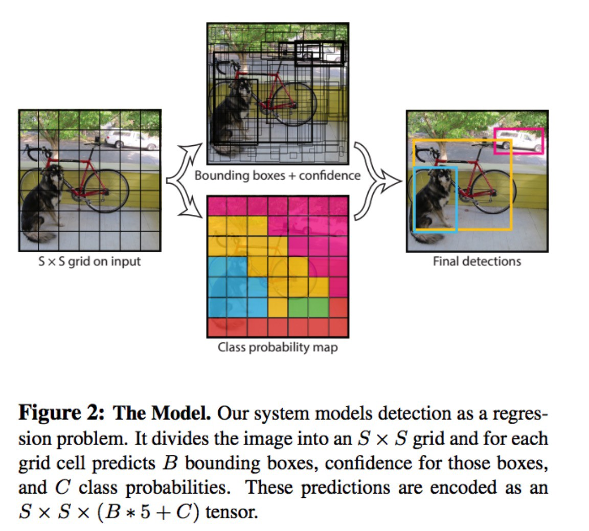
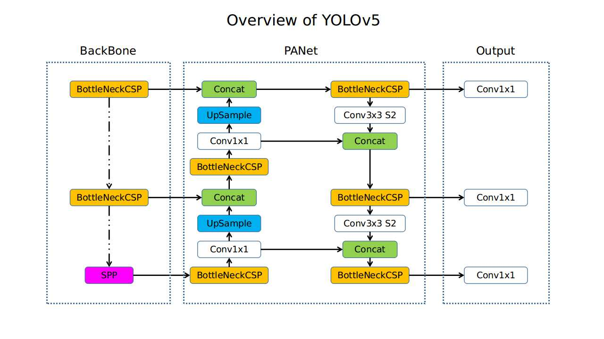
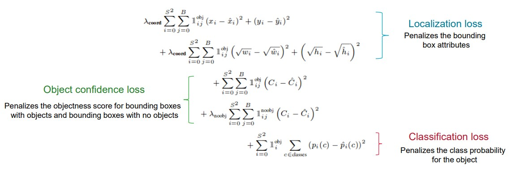

# ISIC 2017 Melanoma (Lesion) Detection with YOLO v5
## Aim
The aim of this project is to prepare the 2000 lesion images inside the ISIC 2017 challenge training dataset to train a YOLO v5 network that is capable of producing a suitable detection accuracy, with a Intersection Over Union of over 0.8 on the test set for detecting Melonoma.

## YOLO v5
*You Only Look Once*, or YOLO is a real-time object detection neural network. It is known to be a fast performing, lightweight model and thus can be deployed on slower hardware to achieve reasonable performance. 

### How it works
The architecture splits the input image in a *m* x *m* grid and generates 2 bounding boxes for each grid. 

```
Pr(Classi|Object)∗Pr(Object)∗IOU = Pr(Classi)∗IOU
```
### Model Architecture

### Model Choices


### Loss Function

The multi-part loss function above was used during training by the YOLO v5 model, which sums the loss between the localisation loss, object confidence loss and classification loss. 

## ISIC Challenge 2017 Dataset
The ISIC Challenge 2017 includes images of skin abnormalities, whereby they are known to be either unharmful, melanoma or seborrheic keratosis. The dataset has already split its data into individual training, validation and test datasets. The training data includes 2000 lesion images in JPEG format, along with the ground truth in PNG format. The validation set and test set includes 150 and 600 JPEG images respectively and, like the training data, includes the ground truth for each image. The dataset includes extra information such as the patients age and gender, these are not within the scope of the project and will not be encoded during training. 

## Setting Up
### Dependencies
- Python -> 3.9
- YOLOv5 from their GitHub Page and its associated dependencies
- numpy
- matplotlib
- pillow (PIL)

### File Structure


## Pre-processing
The dataset downloaded from the ISIC website was then processed for training/test/validating as follows:
- Resized both the skin images and segmentation (ground truth) to 640 x 640 as per YOLOv5's default image size
- Encoded the ground truth images to the YOLO v5 label structure for bounding boxes-> (label, center_x, center_y, width, height)
- Split into training/validation/test folders in the same form as on the ISIC webpage (2000/150/600)

## Running the Model
The training was done in Kaggle, a machine learning based competition website with GPU cluster of Nvidia P100s. No hyperparameters were inputted, meaning that default hyperparameters used to train the YOLOv5 neural network was used. 
When running the small version of the YOLO v5 model, the following model architecture is shown:
```
                 from  n    params  module                                  arguments                     
  0                -1  1      3520  models.common.Conv                      [3, 32, 6, 2, 2]              
  1                -1  1     18560  models.common.Conv                      [32, 64, 3, 2]                
  2                -1  1     18816  models.common.C3                        [64, 64, 1]                   
  3                -1  1     73984  models.common.Conv                      [64, 128, 3, 2]               
  4                -1  2    115712  models.common.C3                        [128, 128, 2]                 
  5                -1  1    295424  models.common.Conv                      [128, 256, 3, 2]              
  6                -1  3    625152  models.common.C3                        [256, 256, 3]                 
  7                -1  1   1180672  models.common.Conv                      [256, 512, 3, 2]              
  8                -1  1   1182720  models.common.C3                        [512, 512, 1]                 
  9                -1  1    656896  models.common.SPPF                      [512, 512, 5]                 
 10                -1  1    131584  models.common.Conv                      [512, 256, 1, 1]              
 11                -1  1         0  torch.nn.modules.upsampling.Upsample    [None, 2, 'nearest']          
 12           [-1, 6]  1         0  models.common.Concat                    [1]                           
 13                -1  1    361984  models.common.C3                        [512, 256, 1, False]          
 14                -1  1     33024  models.common.Conv                      [256, 128, 1, 1]              
 15                -1  1         0  torch.nn.modules.upsampling.Upsample    [None, 2, 'nearest']          
 16           [-1, 4]  1         0  models.common.Concat                    [1]                           
 17                -1  1     90880  models.common.C3                        [256, 128, 1, False]          
 18                -1  1    147712  models.common.Conv                      [128, 128, 3, 2]              
 19          [-1, 14]  1         0  models.common.Concat                    [1]                           
 20                -1  1    296448  models.common.C3                        [256, 256, 1, False]          
 21                -1  1    590336  models.common.Conv                      [256, 256, 3, 2]              
 22          [-1, 10]  1         0  models.common.Concat                    [1]                           
 23                -1  1   1182720  models.common.C3                        [512, 512, 1, False]          
 24      [17, 20, 23]  1     18879  models.yolo.Detect                      [2, [[10, 13, 16, 30, 33, 23], [30, 61, 62, 45, 59, 119], [116, 90, 156, 198, 373, 326]], [128, 256, 512]]
Model summary: 214 layers, 7025023 parameters, 7025023 gradients, 16.0 GFLOPs
```
## Accuracy Metrics
### Intersection over Union (IOU)

The ratio between the intersection and the union of the predicted boxes and the ground truth boxes. 
### Mean Average Precision (mAP)

## Results
### YOLOv5s

### YOLOv5m


## Discussion
Recommends more than 1500 images per class, and more than 10000 instances (labeled objects) per class
Lack of background images, COCO has 1000 background images or about 1%
Even spread of Melanoma positive images vs Non Melanoma, currently a lot of objects inside the images are not melanoma


## References
https://challenge.isic-archive.com/data/#2017

https://github.com/ultralytics/yolov5/wiki/Train-Custom-Data

https://github.com/ultralytics/yolov5/issues/5851

https://towardsdatascience.com/yolo-you-only-look-once-real-time-object-detection-explained-492dc9230006