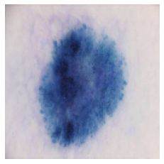
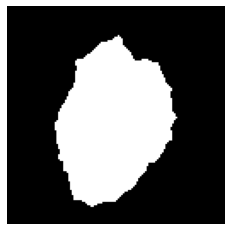
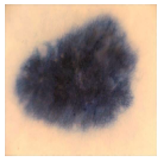
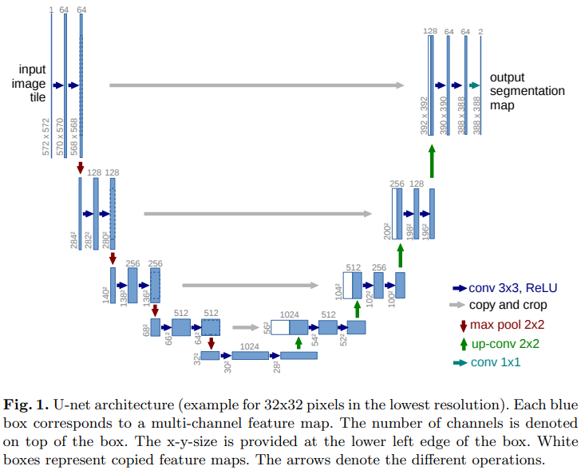
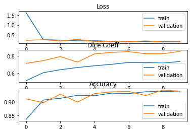

# Image Segmentation Keras : Implementation of Segmentation on the ISICs data set with the [Improved UNet](https://arxiv.org/abs/1802.10508v1)
## Motivation
The agenda of this project is to apply the improved U-Net architecture on the ISICs data set to predict the segmentation response of the lesion image in the test data set, and the overall minimum Dice score is 0.8.  
The data set is challenged by "Analysis of Skin Lesions for Melanoma Detection" using a data set of annotated skin lesion images from ISIC archives. The data set contains raw (input data) and segmented (response data) images of skin patches, which are used to detect skin lesions. The response data includes a binary mask image in PNG format, which indicates the position of the original skin lesion in each input lesion image.

I used Keras with a Tensorflow backend. This UNet was built for the pre-processed version of ISICs data set (as provided by COMP3710 teaching team).  
However, if you are intereted in to download the original dataset, it is on: https://challenge2018.isic-archive.com/

## Models
Example results for the pre-trained models provided :

Input Image            |  Original Segmentation Image|  Output Segmentation Image
:-------------------------:|:-------------------------:|:-------------------------:
  |  |  
  |  |  

## Getting Started

### Prerequisites

* Keras 2.4.3
* Tensorflow 2.3.0
* Numpy 1.18.5 
* Matplotlib 3.2.2
* Skimage 0.16.2

if you have not already install any package, you can use command 
```shell
pip install [package name]
```

### Preparing the data for training

You need to make two folders

* Images Folder - For all the training images
* Masks Folder - For the corresponding ground truth segmentation images

after you download the dataset, you can use command 
```shell
mkdir dataset
cd dataset
mkdir images
mkdir masks
cd folder_contain_train_images
cp * dataset/images
cd folder_contain_mask_images
cp * dataset/masks
```
Then you are good to load the dataset images!

After the loading process of data preparation, we then ***split the images set into training, validating and testing set by ratio of 0.8:0.1:0.1***, the reason behind this decision is our whole dataset is size of 2,594, which 80% is sufficient to train the model.

### Data Generator
The filenames of the mask images should have the id which is same as the filenames of the RGB images with "_segmentation" ending.
The size of the mask image for the corresponding RGB image should be same.
Even our preprocessed dataset have 2,594 train images and its corresponding segmentation mask, which is quite large dataset.

and you will see that during the training phase, data is generated in parallel by the CPU and then directly fed to the GPU.
For more detailed reference of implementation of data generation part, check this tutorial:
[A detailed example of how to use data generators with Keras](https://stanford.edu/~shervine/blog/keras-how-to-generate-data-on-the-fly)
This class can be run independently by using:
```shell
python dataGenerator.py
```

## [Basic Unet Structure](https://arxiv.org/pdf/1505.04597.pdf)
<p align="center">
  
</p>
You can check the detailed implementation of U_net structure by using the following command:
```shell
python model_basic.py
```
Then see its result on our dataset in jupyter notebook file:
```shell
jupyter notebook ISIC2018_Segmentation.ipynb
```

## [Improved Unet Structure](https://arxiv.org/abs/1802.10508v1)
<p align="center">
  
</p>
The figure above shows the structure of the improved UNet.  

- The context module is a pre-activation residual block, with two 3x3 convolutional layers and a dropout layer with p=0.3 in the middle. Noted that, the activation layer uses Leaky ReLU, and batch normalization is changed to instance normalization.
- The upsampling module is simply a upsampling2D layer followed by a 3x3 convolution that halves the number of feature map.
- The localization module contains a 3x3 convolution and then a 1x1 convolution which halves the number of feature maps.  
You can check the detailed implementation of Improved_U_net structure by using the following command:
```shell
python model_improved.py
```
Then see its result on our dataset in jupyter notebook file:
```shell
jupyter notebook ISIC2018_Segmentation_improved_u_net.ipynb
```

## Evaluation Metrics

Predicted responses are scored using a threshold [Dice coefficient](https://en.wikipedia.org/wiki/S%C3%B8rensen%E2%80%93Dice_coefficient) metric.

Image segmentation is basically the same as classification problem which means trying to determine the class of pixels. Given an image, we want to detect the scar on the skin. The problem is that usually the image is very high-dimentional, it has like around ten thousand pixels and we want to classify each pixel in the image whether it is a background pixel or if it is a foreground pixel - the pixels belonging to the class we are trying to detect.  
By nature, usually these problems are highly unbalanced, so these classification problems are unbalanced because most of the pixels are usually the background pixels, usually around 90% of them, so the remaining 10% could be e.g. 10 different classes if you are trying to segment.  
Therefore, if the datasets or the images are unbalanced, the pixel wise accuracy which we usually use to evaluate classification problems will no longer be valid or proper matrix to use. The reason is that if you for example predict every pixels as background then your accurary will already be 90% which is too high, it is biased. So what we want to do is instead use matrix that specifically target the pixels in the foreground classes.  
The Sorensen-Dice coefficient is used as a similairty metric and is commonly used as a metric for segmentation algorithms.  
The original formula was intended to be applied to binary data. Given two sets, X and Y, it is defined as 2|X||Y|/|X|+|Y|, where |X| and |Y| are the cardinalities of the two sets.

## Result
A separated test file was created to check model dice coefficiency by import pretrained model, run the file, we can use command:
```shell
jupyter notebook Test.ipynb
```
By training our model through the improved unet structure, we got final average dice similarity coefficiency 0.8285 on test set.  
Below is the dice-accuracy-loss plot while training our model:
<p align="center">
  
</p>

