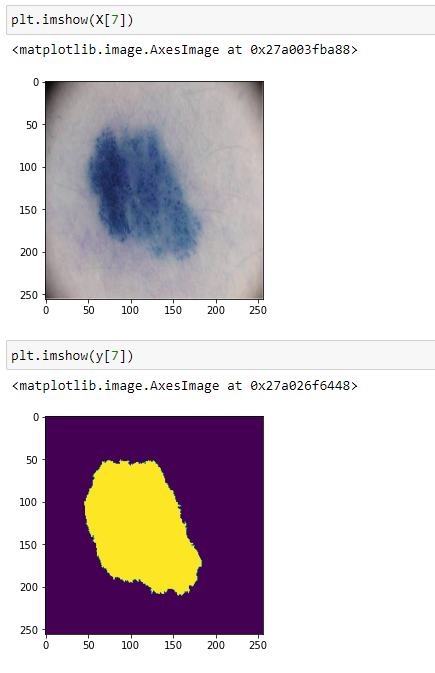
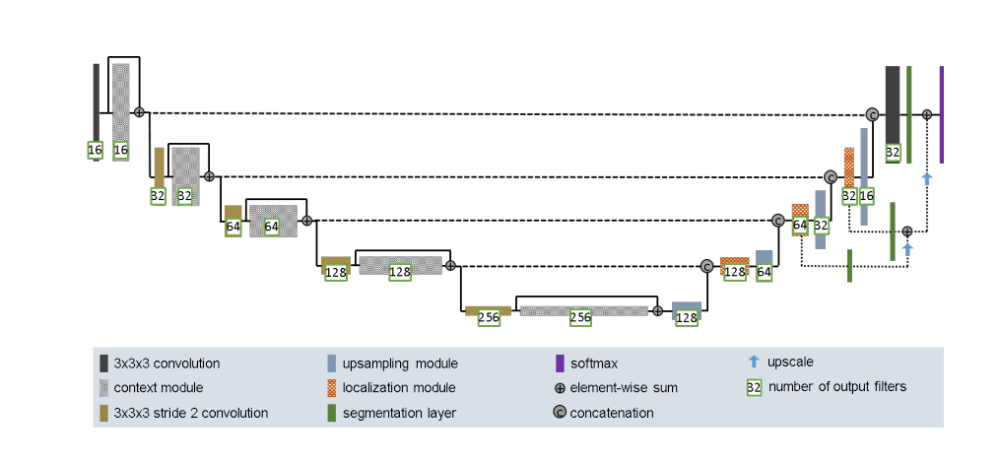
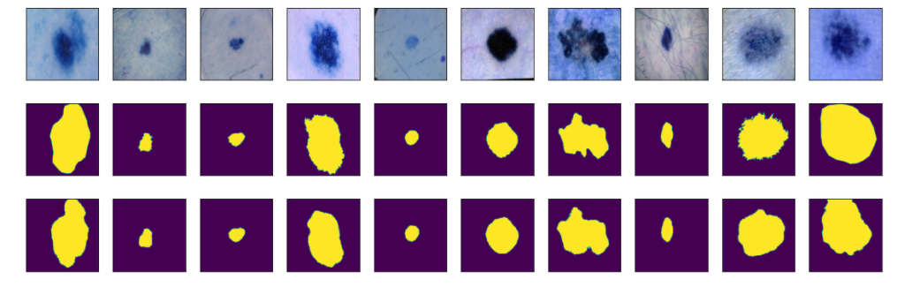
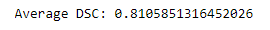
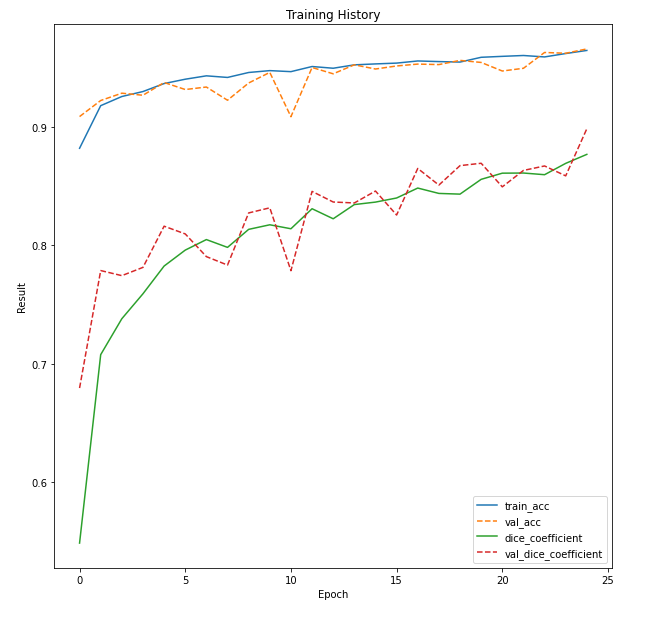

# Improved Unet For ISICs data set
Segment the ISICs data set with the Improved UNet with Dice similarity coefficient as evaluation metric

Submitted by Linyuzhuo Zhou, 45545584

## Description
Image segmentation technology can be widely used in various fields. For example, we can detect abnormal lesions of the brain, knee or skin by processing medical images.  Now I use a improved unet mode to be constructed in TensorFlow, which is segmenting the skin cancer data set provided by the ISIC2018 Challenge. 

This folders include:

 a README.md, 

a folder 'resources' containing some images of the output and network architecture, 

an improved Unet model named 'improved_unet.py', 

a main.py.

## Processing Data

The skin cancer data set provided by the ISIC2018 Challenge. I normalized and resized the image dataset to (256,256).  The picture below is the processed image 

I split them into training set, validation set and test set.

and the value of ground truth and output should be converted to 0 or 1

## Model Architecture

Network architecture. Our architecture is derived from the U-Net. Thecontext pathway (left) aggregates high level information that is subsequently localized precisely in the localization pathway (right). 

In  'improved_unet.py', context_module, localization_module, upsampling module and improved unet model can be found

## Output

#### pictures of prediction

#### Average Sørensen–Dice coefficient

#### Plot training history 

## Environment

python: 3.7.9

Tensorflow: 2.3.1

## Reference

F. Isensee, P. Kickingereder, W. Wick, M. Bendszus, and K. H. Maier-Hein, “Brain Tumor Segmentation and Radiomics Survival Prediction: Contribution to the BRATS 2017 Challenge,” Feb. 2018. [Online]. Available: https://arxiv.org/abs/1802.10508v1

[Wikipedia - Sørensen Dice coefficient](https://en.wikipedia.org/wiki/Sørensen–Dice_coefficient)

[Dataset - SICI2018 Challenge](https://challenge2018.isic-archive.com)