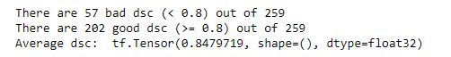

# Image Segmentation of the ISIC 2018 Melanoma Dermoscopy Dataset with Improved U-Net

This project is done for the COMP3710 - Pattern Recognition Course 

The algorithm will directly contribute to the [open source PatternFlow library on GitHub](https://github.com/shakes76/PatternFlow).


## Dataset Description
The dataset is taken from the ISIC 2018 Challenge for Task 1 (Lesion Boundary Segmentation). Further info on the challenge can be seen [here](https://challenge2018.isic-archive.com/task1/).

To run this project, download the dataset from this link: [https://cloudstor.aarnet.edu.au/sender/?s=download&token=f0d763f9-d847-4150-847c-e0ec92d38cc5](https://cloudstor.aarnet.edu.au/sender/?s=download&token=f0d763f9-d847-4150-847c-e0ec92d38cc5)

### Input Data
The input data are dermoscopic lesion images in JPEG format.

### Response Data
The response data are binary mask images in PNG format, indicating the location of the primary skin lesion within each input lesion image.

Mask images must have the exact same dimensions as their corresponding lesion image. Mask images are encoded as single-channel (grayscale) 8-bit PNGs (to provide lossless compression), where each pixel is either:

* 0: representing the background of the image, or areas outside the primary lesion
* 255: representing the foreground of the image, or areas inside the primary lesion

However, the mask images from the dataset link has pixel in range of 0-255 which is caused by edge information of the segmentation. A convertion to binary images is needed.

### Examples

<p align="center"> 
	
</p>

<p align="center"> 
	Figure 1. Example of the original image and the ground truth label
</p>

## Model Architecture

Here is the Advanced U-Net Network Architecture taken from the paper [[1]](#References) which is inspired by the original U-Net Architecture from [[2]](#References). This network is originally designed to process large 3D input blocks and thus using a 3D convolutional layer (3x3x3). 

However, because the ISIC datasets are 2D images, the network in this project is modified to use a 2D convolutional layer (3x3).

<p align="center"> 
	
</p>

<p align="center"> 
	Figure 2. Advanced U-Net Network Architecture
</p>

This architecture includes a _context module_ that encodes increasingly abstract representations of the input as it progress deeper into the network. Then, a _localization module_ is used to recombine the representations with shallower feature to precisely localize the structures of interest. 

It is done by doing an upsampling, and concatenating the result with the corresponding context module, then followed by the localization module.

_Segmentation layers_ are also integrated at different levels of the network and combining them via element-wise summation to form the final network output.

Throughout the network we use **_Leaky ReLU_** nonlinearities with a negative slope of 10^−2 for all feature map computing convolutions.

**The input layer** is _(image height, image width, 3)_, with 3 as the image channel.

**Context Module**, context_module() in model.py
 - Instance Normalization
 - Leaky ReLU nonlinearities with a negative slope of 10−2
 - Conv2D 3x3
 - A dropout layer (pdrop = 0.3)
 - Instance Normalization
 - Leaky ReLU nonlinearities with a negative slope of 10−2
 - Conv2D 3x3

**Upsampling Module**, upsampling_module() in model.py
 - Upsampling2D()
 - Conv2D 3x3 with Leaky ReLU as activation function

**Localization Module**, localization_module() in model.py
 - Conv2D 3x3 with Leaky ReLU as activation function 
 - Conv2D 1x1 with Leaky ReLU as activation function

**The output layer** uses a _sigmoid_ activation function because it is a binary classification.

The model is then compiled with _adam_ optimizer (default learning rate 0.001).

### Metrics
The metrics used in this model is Dice Similarity Coefficient [(DSC)](https://en.wikipedia.org/wiki/S%C3%B8rensen%E2%80%93Dice_coefficient), which is the most used metric in validating medical volume segmentations

The DSC used in this project is the following:
<p  align="center">
	
</p>


## Dependencies
 - Python 3.7.9
 - Tensorflow 2.1.0
 - Tensorflow addons 0.9.1 (compatible with tensorflow 2.1)
 - Numpy 1.19.1
 - Opencv python 4.4.0.44
 - Matplotlib 3.3.1
 
 You can also use the following conda [environment.yml](./environment.yml)
 
## Usage
Make sure that you have downloaded the dataset.

Create a folder called 'dataset' in the same directory as the driver.py and unzip the dataset inside that folder.

Then you can run the following command:

```>>> python driver.py```

### [model.py](./model.py)
This file is for creating the U-Net model. There are 2 model, the original U-Net and the Advanced U-Net.

 - `unet()`
 - `improved_unet()`
	 
	 This one is what this project is using. The model takes as input an array of RGB image data with shape (batch_size, 192, 256, 3) and predicts a segmented 1 class label image of shape (192, 256, 1).

### [driver.py](./driver.py)
This file is to run the whole project. It includes:

 - Splitting the dataset into training, validation, and testing
	 - The split ratio used is the common one which is 0.7, 0.15, 0.15 respectively. The dataset is large enough so that the model can have more training data to learn.
 - Data preprocessing (using tensorflow.data.Dataset)
	 - The images are resized to 192x256.
	 - Both input and label images are normalized (divided by 255). The label images are then rounded off to 0 or 1 (binary images).
	 - The label image is not one-hot encoded since there is only 1 foreground class. Also, it seems that doing the one hot encoding overfits the training.
 - Model training
	 - The model is trained over 10 epochs with a batch size of 32 in each epoch.
 - Model evaluation
	 - Model evaluation on the test set (with 32 batch size) using the tensorflow model evaluate function.
 - Predicting the test set
	 - Predict all images on the test set and calculating the DSC of each label manually and getting the average.

## Results

<p align="center"> 
	
</p>

<p align="center"> 
	Figure 3. Example of the original image, ground truth label, and prediction label
</p>

In the above result, the dice similary coefficients are:
<p align="center"> 
	
</p>

<p align="center"> 
	Figure 4. DSC for Figure 3
</p>

Here is the example of plots of the metrics after 10 epochs:
<p align="center"> 
	
</p>

<p align="center"> 
	Figure 5. DSC Loss and Metrics Plots
</p>

Using the tensorflow model evaluate function, here is the result:
<p align="center"> 
	
</p>

<p align="center"> 
	Figure 6. Model Evaluate Result
</p>

And here is the average DSC result from the manual calculation of the predicted test images:
<p align="center"> 
	
</p>

<p align="center"> 
	Figure 7. Average DSC
</p>

You can also access the notebook [here](./notebooks/driver-notebook-improvedUnet.ipynb).

## References

[1] F. Isensee, P. Kickingereder, W. Wick, M. Bendszus, and K. H. Maier-Hein, “Brain Tumor Segmentation and
Radiomics Survival Prediction: Contribution to the BRATS 2017 Challenge,” Feb. 2018. [Online]. Available:
https://arxiv.org/abs/1802.10508v1

[2] O. Ronneberger, P. Fischer, and T. Brox, “U-Net: Convolutional Networks for Biomedical Image Segmentation,”
in Medical Image Computing and Computer-Assisted Intervention – MICCAI 2015, ser. Lecture Notes in
Computer Science, N. Navab, J. Hornegger, W. M. Wells, and A. F. Frangi, Eds. Cham: Springer International
Publishing, 2015, pp. 234–241.
