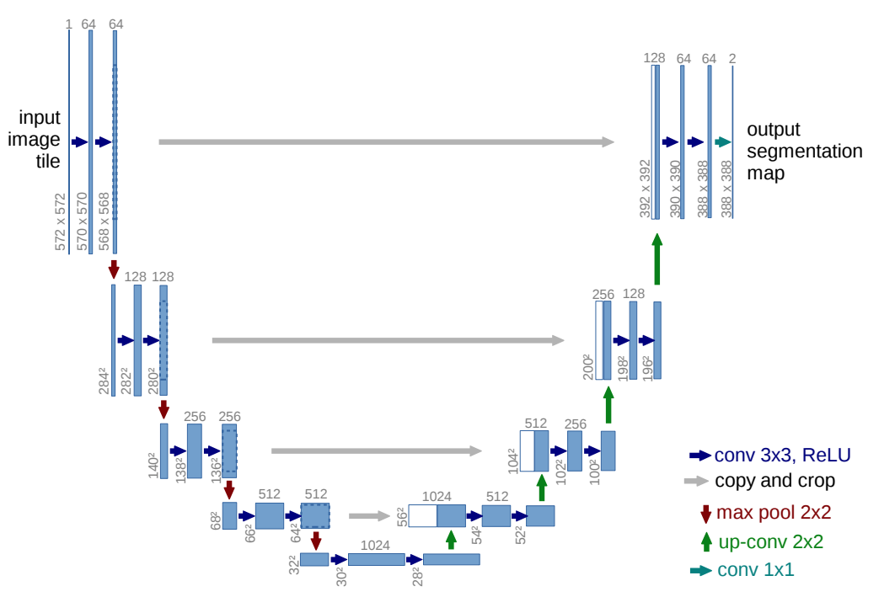
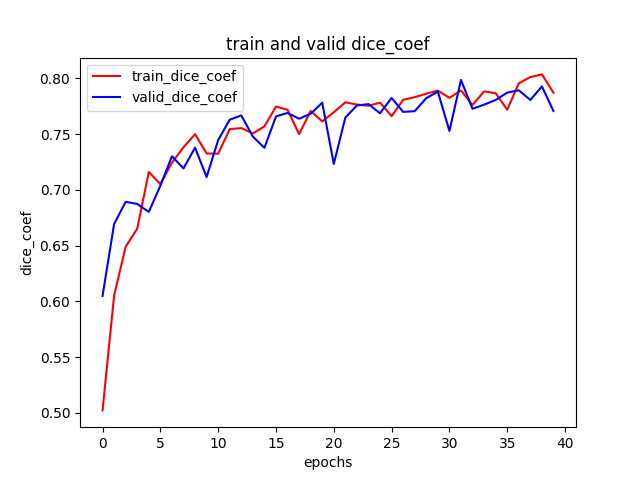

# Segment the ISICs data set with the U-net

## Project Overview
This project aim to solve the segmentation of skin lesian (ISIC2018 data set) using the U-net, with all labels having a minimum Dice similarity coefficient of 0.7 on the test set[Task 3].

## ISIC2018


Skin Lesion Analysis towards Melanoma Detection

Task found in https://challenge2018.isic-archive.com/


## U-net


U-net is one of the popular image segmentation architectures used mostly in biomedical purposes. The name UNet is because it’s architecture contains a compressive path and an expansive path which can be viewed as a U shape. This architecture is built in such a way that it could generate better results even for a less number of training data sets.

## data set structure

data set folder need to be stored in same directory with structure same as below
```bash
ISIC2018
  |_ ISIC2018_Task1-2_Training_Input_x2
    |_ ISIC_0000000
    |_ ISIC_0000001
    |_ ...
  |_ ISIC2018_Task1_Training_GroundTruth_x2
    |_ ISIC_0000000_segmentation
    |_ ISIC_0000001_segmentation
    |_ ...
```

## Usages

- Run `train.py` for training the UNet on ISIC data.
- Run `evaluation.py` for evaluation and case present.

## Advance

- Modify `setting.py` for custom setting, such as different batch size.
- Modify `unet.py` for custom UNet, such as different kernel size.

## Algorithm

- data set: 
    - The data set we used is the training set of ISIC 2018 challenge data which has segmentation labels.
    - Training: Validation: Test = 1660: 415: 519 = 0.64: 0.16 : 0.2
    - Training data augmentations: rescale, rotate, shift, zoom, grayscale
- model: 
    - Original UNet with padding which can keep the shape of input and output same.
    - The first convolutional layers has 16 output channels.
    - The activation function of all convolutional layers is ELU.
    - Without batch normalization layers.
    - The inputs is (384, 512, 1)
    - The output is (384, 512, 1) after sigmoid activation.
    - Optimizer: Adam, lr = 1e-4
    - Loss: dice coefficient loss
    - Metrics: accuracy & dice coefficient
    
## Results

Evaluation dice coefficient is 0.805256724357605.

plot of train/valid Dice coefficient: 



case present:


## Reference

https://medium.com/the-owl/k-fold-cross-validation-in-keras-3ec4a3a00538

https://github.com/zhixuhao/unet

https://github.com/NifTK/NiftyNet/blob/a383ba342e3e38a7ad7eed7538bfb34960f80c8d/niftynet/layer/loss_segmentation.py

https://keras.io/api/losses/#creating-custom-losses

https://gist.github.com/abhinavsagar/fe0c900133cafe93194c069fe655ef6e

https://stackoverflow.com/questions/35911252/disable-tensorflow-debugging-information
