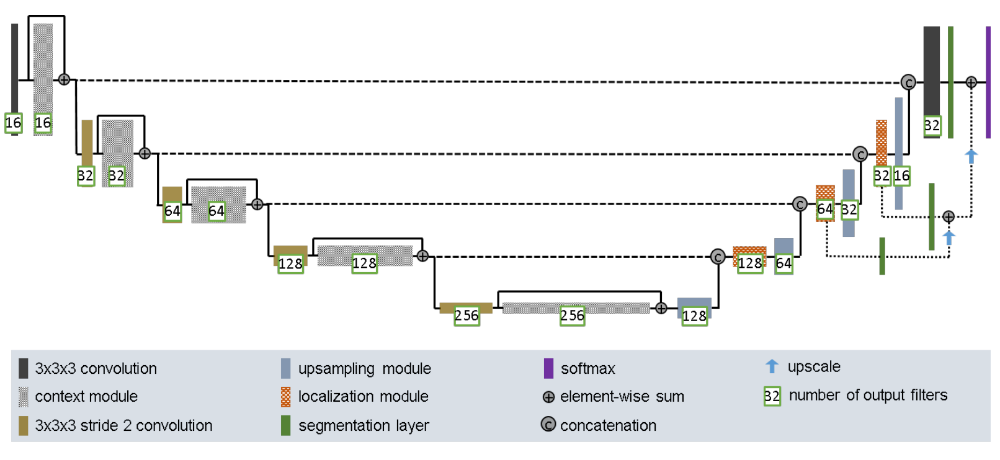
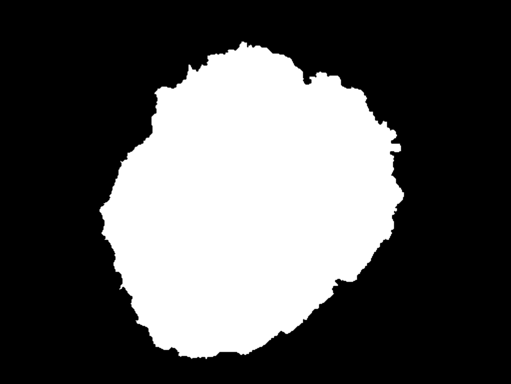
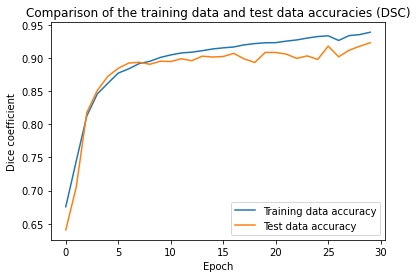
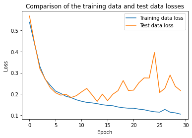
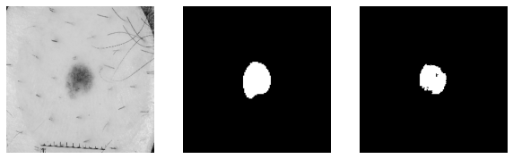
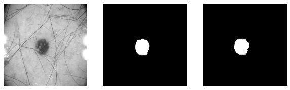
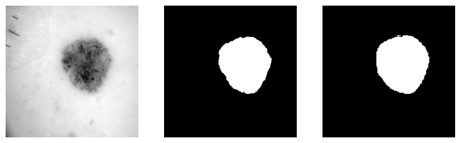
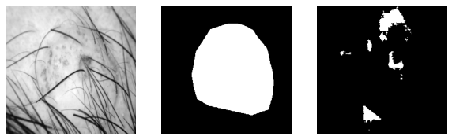
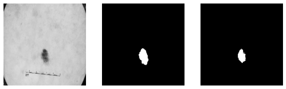
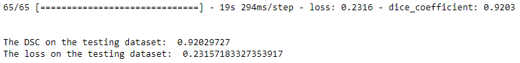

# Application of an Improved U-Net Neural Network on the ISIC 2018 dataset

## Author
Navin Sivasankaran 

## Overview/Summary
This repository contains the code for the application of the Improved U-Net [1] on the ISIC 2018 dataset, which contains the data of images, related to dermoscopy. These images can be, "...used to evaluate pigmented skin lesions... [which can] make it easier to diagnose melanoma." [2]. The segmentation masks are also provided in this dataset as well. 

Using this dataset, a variation of a U-Net network was applied, which allowed for image segmentation to help better detect such skin features, such as lesions.

The requirement for this segmentation task challenge was to achieve a minimum Dice similarity coefficient of 0.8 on the test set [3].

## Dependencies of the Scripts
- Python
    - Tested with Python 3.7.7
- TensorFlow
    - Tested with TF GPU 2.1.0
- Matplotlib
    - Tested with version 3.3.1
- Scikit-Learn
    - Tested with version 0.23.2
- ISIC 2018 challenge dataset for skin cancer
    - https://cloudstor.aarnet.edu.au/sender/?s=download&token=f0d763f9-d847-4150-847c-e0ec92d38cc5

## Explanation of Files
- main.py
    - The main driver script, which can be called. 
    - Contains everything, except for the model.
- model.py
    - The script containing the Improved U-Net model
    - Called automatically by main.py
- report.ipynb
    - The Jupyter Notebook containing both main.py and model.py in one file.
    - Will show outputs in a cleaner format.
    - All the graphs and outputs will be here to see, for easier access.

## How to Run the Script?
1. Call the file 'main.py' through Python without any arguments.
    - If you want to set the number of epochs to run it for, go to the start of the main() function in the 'main.py' file and change the variable/constant 'EPOCHS' to the number that you desire.

## Explanation of the Architecture

### Description of a U-Net
Before explaining the architecture of the U-Net, there are a few topics that are to be explained to gain a full understanding. U-Net uses semantic segmentation, which is the concept of classifying all the pixels in a given image to a specific class/label. For example, if the objects in a given image consisted of bananas and pineapples, each pixel in that image will be analysed and categorised into either the 'Banana' class or the 'Pineapple' class, due to the approach of semantic segmentation.

Likewise, in the images provided in the ISIC dataset, the classes that can be used in the semantic segmentation process are 'Lesion' and 'No Lesion'. As there are 2 classes, this becomes a case of binary classification.

Therefore, when coming back to the architecture of the U-Net, it contains two pathways: the contracting and expanding pathways. The contracting pathway is used firstly to understand the features that can be learnt from the image. After the pathway understands the context behind it, the expanding pathway then uses this understanding to recreate the segmentation masks, based on its learning. It mimics the encoder-decoder structure, where the image is encoded into features at multiple levels and then, the features are decoded for the purpose of recreation and classification. 

### Improved U-Net

*Figure 1: The Improved U-Net architecture, used for the BRATS 2017 Challenge [1]*

The architecture displayed above was used by researchers from Heidelberg to further improve the performance of a U-Net and achieve better results with the performance of brain tumour segmentation.

Much like a normal U-Net, the contracting and expanding pathways exist. However, where it differs from the normal one is through the addition of context and localisation modules. 

In the contracting pathway, the activations are done through context modules, which consist of a pre-activation residual block (a normalisation layer and a leaky ReLu layer), followed by, "...2 3x3x3 convolutional layers and a dropout layer in between." [1].  

In the expanding pathway, the localisation modules uses a 3x3x3 convolution layer followed by a 1x1x1 convolution layer. The usage of the 1x1x1 layer is so that the number of feature maps are halved [1].

#### An example of what the Improved U-Net will be working with

<table><tr>
<td>Input image (scan)</td>
<td>Segmentation image (label/mask)</td>
</tr>
<tr>
<td></td>
<td></td>
</tr>
</table>

*Table 1: Comparison of a randomly selected sample from the dataset*

It can be seen that the input image displays the existence of a lesion. Hence, the corresponding segmentation image/mask is as shown, where the background of the picture is black and the foreground (the region of the lesion) is white.

Therefore, based on such input images that will be fed into the Improved U-Net, the network will come to learn of such features and will be able to recreate masks, as shown on the right to a similar degree.

## Structure of the Developed Model

### Data Pre-Processing

Data pre-processing has been completed by using these following steps:

1. Retrieve and save all filenames of the input and segmentation images into respective arrays
2. Shuffle the arrays, so that before being split, the U-Net could also go through a different order of images to hopefully get access to images of varying difficulties. 
3. Split the data into 3 datasets:
    - Training dataset containing 50%;
    - Validation dataset containing 25%; and
    - Testing dataset containing 25%.
4. Convert every filename into a processed image
    - Decode it into the right format (JPEG / PNG)
    - Resize it into a 256x256px image
        - The reason as to why this was done is because this maintains consistency and uniformity amongst all samples, and also preserves a square shape.
    - Normalise the image:
        - If input, divide all pixels by 255
        - Else, convert all pixels to either 0 or 1, dependent on if they have 0 or 255. 
5. Save all these images into their respective TensorFlow dataset (tf.data.Dataset).

### Preparation before the Construction of the Model

Before implementing the model and its contained layers, helper methods were created to make the process of building the model much easier. They are as follows:

- Metrics
    - A function to calculate the Dice Similarity Coefficient
        - This coefficient calculates the overlap between the actual segmentation mask (ground truth) and the predicted segmentation image. 
    - A function to calculate the Dice loss (distance)
        - The subtraction of the Dice Similarity Coefficient from 1
- Helper modules for the model
    - A helper method for the context module
        - Implements the same functionality as mentioned above, but with adaptable tensors and filter sizes
    - A helper method for the upsampling module
        - Implements the upsampling functionality of a U-Net, with adaptable tensors and filter sizes
    - A helper method for the localisation module
        - Implements the same functionality as mentioned above, but with adaptable tensors and filter sizes
    - A helper method for the segmentation layer
        - Implements the functionality for the decoder phase for deep supervision in the localisation module

### Actual Model

#### Model Summary
After the combination of the data pre-processing, helper modules and other layers, the model used the same implementation as the Improved U-Net architecture. However, the only changes that were made to the model was to change the filter sizes by dividing them by 2.

Furthermore, the optimiser that was used to compile this model was 'Adam' with the default learning rate of 0.01. The loss function that was used was the Binary Cross-entropy function, as there are only 2 possible values for the mask. Lastly, the metric that was used to measure the performance of the model was the Dice Similarity Coefficient. 

Initially, when the model was being run on this dataset, it was realisable that the data was being overfitted to. Therefore, the number of filters were decreased by a factor of 2 in hopefulness. This change brought better results, as the model seemed to be fitting the data just about right.

The model was trained for 30 epochs (with a batch size of 10) to preserve a balance of efficiency and performance.

## Discussion of Results

After running the model for 30 epochs on the training dataset, comparing against the validation dataset, the following results were attained:

<table>
<tr>
<td>Accuracy (DSC)</td>
<td>Loss</td>
</tr>
<tr>
<td></td>
<td></td>
</tr>
</table>

*Table 2: The graphs for the accuracy and the loss on the training and validation datasets, after the model has run for 30 epochs*

The first thing that can be observed is that the model comfortably goes past a DSC of 0.9 after the 10th epoch, for both the training and validation datasets. Both accuracies follow a similar pathway (mimicking an asymptotic exponential function), as they seem to start to plateau as the number of epochs increase. 

Furthermore, when considering the graph of losses, it can be seen that the training and test data losses start off in a similar shape. However, towards the 15th epoch, the test data loss begins to reach its elbow point and starts increasing in rather a jagged manner. What this indicates is the potential instability of the model in having to handle certain images. One interesting thought to consider is if the data wasn't shuffled and if that would have any drastic effect on the performance on the model. 

<table>
<tr>
<td></td>
<td>Order: Actual input image | Ground truth segmentation mask | Predicted segmentation mask</td>
<tr>
<td>Testing sample 1</td>
<td></td>
</tr>
<tr>
<td>Testing sample 2</td>
<td></td>
</tr>
<tr>
<td>Testing sample 3</td>
<td></td>
</tr>
<tr>
<td>Testing sample 4</td>
<td></td>
</tr>
<tr>
<td>Testing sample 5</td>
<td></td>
</tr>
</table>

*Table 3: The comparison of the actual input image, the ground truth segmentation mask and the predicted segmentation mask for 5 samples from the testing dataset*

From the above comparisons, it can be seen that the Improved U-Net is quite successful in detecting lesions from the input image. However, there are some unstable parts of the model, due to specific input images being fed in. For example, in Testing sample 4 of Table 3, it can be seen that the input image has some hairs covering the lesion. Even though the ground truth mask shows the region that the lesion is in, the model's generated prediction did not succeed at all in finding the lesion. Therefore, this indicates that this model does not succeed with scenarios with such visual distractions. A thing to consider for the future is to potentially train it for more epochs or to get more samples like these and feed it into the U-Net.

Furthermore, when considering the main challenge of this task, it was to achieve a minimum Dice Similarity Coefficient of 0.8 on the testing dataset. This was successfully achieved and the results are as follows:

*Figure 2: Results of the DSC and the loss, based on the testing dataset*

This model achieved a DSC of 0.92 after being run on the testing dataset, with a loss of approximately 0.23. This surpasses the expected value of 0.8 for this challenge.

## References

[1] 	F. Isensee, P. Kickingereder, W. Wick, M. Bendszus and K. Maier-Hein, "Brain Tumor Segmentation and Radiomics Survival Prediction: Contribution to the BRATS 2017 Challenge," in Brainlesion: Glioma, Multiple Sclerosis, Stroke and Traumatic Brain Injuries, Heidelberg, 2018. 

[2] 	A. Oakley, "Dermoscopy," Dermnet NZ, 2004. [Online]. Available: https://dermnetnz.org/topics/dermoscopy/. [Accessed 2020].

[3] 	S. Chandra, "COMP3710 Report Task Sheet," 2020. [Online]. 

