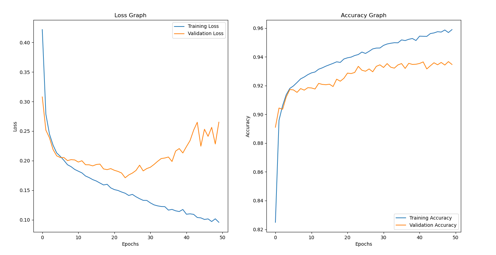

# Applying The Improved UNET on the ISIC Data Set
### Name: Morgan Nierfeld
### Student Number: 45307906

## Overview

The code in this repository uses an Improved UNET model to segment skin lesions within the ISIC dataset with a dice coefficient above 0.8.

## The improved UNET and it's use for the ISIC Data set

The Improved UNET is an updated version derived from the design of an auto-encoder in the shape of a U that was created by Ronnenberger and colleagues from the University of Freiburg (2015). The Improved UNET created by Isensee and colleagues, it adapts the idea of the UNET structure with there being an encoder and decoder stage with skip steps, however, it also includes context modules and localization modules which can be seen in Figure 1 below (2017).

*Figure 1:Improved Unet model design by Isensee and colleagues (2017).*

The context modules contain two 3x3 convolutional layers with a dropout layer in between and the localization module includes a 3x3 convolution followed by a 1x1 convolution (Isensee et. al, 2017).

The Improved UNET has been used in this context to complete segmentation of skin lesions from the ISIC dataset. The aim is to train the model to identify between the foreground and the background in each image, the foreground being the skin lesion, and the background being anything else. Figure 2 below shows and example training and label image for training.

*Figure 2: Example of an image of a skin lesion and a segmentation of that lesion.*

We can see in Figure 2 that there are some challenges imposed with this as the model needs to successfully distinguish between the lesion and other aspects such as hair, markings and other obstructions (considered as noise).

To confirm the accuracy of this model, the Dice coefficient is calculated for all test predictions. The dice coefficient is a measurement of overlap between the predicted label and the ground truth label.

## How the Model Works

In this repository there are two main files used to preprocess, create the model, train the model and display the results. Firstly, the model.py script contains the design of the Improved UNET model which the improved_unet function is then called upon on the driver.py script. The driver.py script conducts the following preprocessing tasks:
* Shuffles the data
    * This was done as it allows for more difficult training images to be more likely included in the training process of the model.
* Conducts a train, validate and test split on the data
* Converts the data into data sets
    * Within this preprocessing, the data is extracted from images to tensors and one-hot encoded for the label images.

After the preprocessing, the model is then called from model.py and then compiled and trained for 50 epochs with training and validation batch sizes of 10. Plots of epoch vs loss and accuracy are then displayed to visualise the training. The training set is then used to predict each label image. Currently, driver.py script displays every prediction, howoever, the code for this can be commented out depending on user preference and whether or not the predicted labels need to be observed. Refer to Figure 4 for an example on how the predicted label is displayed. Finally, the average dice coefficient is calculated by first calculating the dice coefficient for each predicted label and then calculating the average dice coefficient for each layer.

## Results and Observations

The goal of this model was to segment the ISIC dataset with a minimum dice coefficient of 0.8 on the test dataset. To achieve this, the number of training epochs were set to 50 epochs, and the number of filters in which the model will start with was set to 4 (see Figure 1 and the documentation for the improved_unet function). The reason why the initial number of starting filters were set to 4 and not 16 as per Figure 1, was because it was found that 16 starting filters appeared to cause over fitting of the data. This is likely because there are only two segments and classify and 16 filters is causing there to be over classification. It was also found from testing with lower epochs (30 epochs) that 4 starting filters produced the highest dice coefficient on the test dataset compared to numbers such as 8 and 2 starting filters.

Figure 3 below shows the results of running the Improved UNET for 50 epochs with 4 initial starting filters.

*Figure 3: Graphs representing the loss and accuracy from training the model. The loss graph appears to decrease exponentially and the accuracy appears to be increasing logarithmically*

We can see that there is little deviation between the training and validation accuracy. However, there does appear a deviation in trend for the loss indicating that the model is unstable with data that it has not seen before. This is evident in some of the predicted segmentations below from the model after training. 

Firstly, Figure 4 and 5 show a good predictions from the model with an accurate segmentation.

*Figure 4: Prediction showing the model being able to segment the lesion despite 'noise' in the image*

*Figure 5: Another example prediction showing the model being able to segment the lesion despite 'noise' in the image*

In Figures 4 and 5 it is evident that the model has successfully selected the lesion amognst the markings and hair (which could be considered as noise) on the skin.

Unfortunately there are some predictions in which the model does appear to under perform in. This appears to occur when there is a high amount of noise covering the lesion in the image, or when there are markings that look similar to the original skin lesion.

Figure 6 below shows an example where the model cannot segment the lesion due to the high amount of hair in the way.

*Figure 6: An example of the model unable to predict a segmentation due to a high amount of hair covering the skin lesion*

Figures 7 and 8 below shows the inability of the model to segment the skin lesion with other markings similar to the lesion itself.

*Figure 7: An example where the model has made no prediction for a segmentation.*

*Figure 8: An example where the model is unable to clearly distinguish the lesion itself, however, it still is close.*

Despite some of these failures in the test dataset, the average dice coefficient for each segment layer both appear above 0.8 as seen in Figure 9 below.

*Figure 9: Average Dice Coefficient for layers 0 and 1 for all test images. Results similar to this were produced multiple times.*

As expected, the background (layer 0) is easier to classify under this model compared to the foreground (layer 1) which represents the actual skin lesion istelf. Thus, these results indicated that overall on the test set, the model performs well when segmenting the skin lesions.

## Dependencies

It is recommended that this program is ran on a computer containing and RTX graphics card that is 2080 or above due to their architecture. Couple this with tensorflow-gpu installed, the training process can run much faster compared to running the program on a CPU.

This program also requires the ISIC dataset to be pre-downloaded in the working directory as this code does not automatically download the data if it isn't already contained within the system. The data can be downloaded on the following link:
https://cloudstor.aarnet.edu.au/sender/?s=download&token=505165ed-736e-4fc5-8183-755722949d34

## Training, Validation and Test Split

The data was split into 85% for training, 10% for validation and 5% for testing. The reason for this was because there were only 2954 images within the dataset with some images posing some very difficult segmentations due to noise within the images. Due to this, it was decided to split the majority of the images into the training set so that when the dataset is split, it is more likely to contain more noisy images due to the shuffling. 10% of the images were dedicated for the validation set as this allowed for 260 images to confirm each epoch. Finally, the remaining 5% of images (130 images) were used to test the trained model on as this appeared to still allow for the ability to contain a wide variety of images with and without noise.

## References

Ronneberger O., Fischer P., Brox T. (2015) U-Net: Convolutional Networks for Biomedical Image Segmentation. In: Navab N., Hornegger J., Wells W., Frangi A. (eds) Medical Image Computing and Computer-Assisted Intervention – MICCAI 2015. MICCAI 2015. Lecture Notes in Computer Science, vol 9351. Springer, Cham. https://doi.org/10.1007/978-3-319-24574-4_28

Nazi, Z. A. (2020, April 29). How calculate the dice coefficient for multi-class segmentation task using Python? Retrieved from Stack Overflow: https://stackoverflow.com/questions/61488732/how-calculate-the-dice-coefficient-for-multi-class-segmentation-task-using-pytho

F. Isensee, P. Kickingereder, W. Wick, M. Bendszus, and K. H. Maier-Hein, “Brain Tumor Segmentation and
Radiomics Survival Prediction: Contribution to the BRATS 2017 Challenge,” Feb. 2018. [Online]. Available:
https://arxiv.org/abs/1802.10508v1

