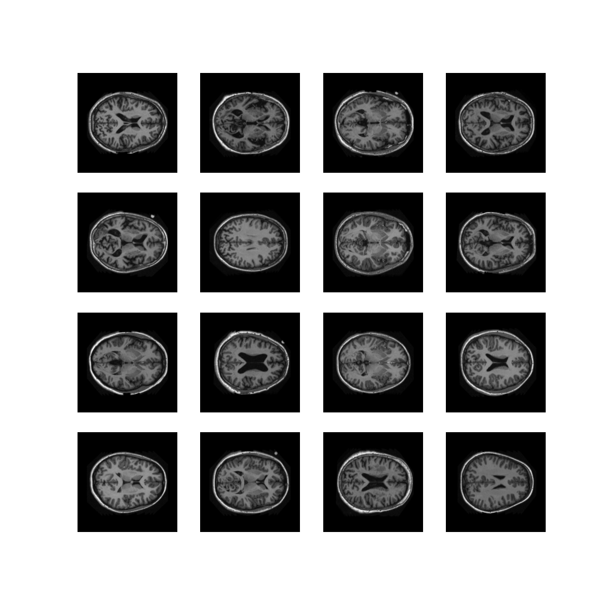

# COMP3710 PatternFlow project submission

InfoVAE implementation by Ishraque Zahin, 45129256

Original:



Generated (at epoch 5):


## Background

VAEs (Variational Auto Encoders) work by trying to model the encoded data as a sample from a prior distribution (usually something simple like Gaussian). Thus, any encoding is not only a compression of the data, but a probability of various input data. This allows us to reconstruct the original data accurately (just by taking the *most probable* input) or with some variations -We can generate random samples with the same dimensions as our *lantent space* (model of the prior distribution sampling) and feed it into our decoder to obtain newly generated data.<sup>1 2</sup>

VAEs need some method of determining how different the modeled distribution is to the reference distribution (e.g usually assumed Gaussian). Traditionally the evidence lower bound (ELBO) loss function uses KL divergence to measure the similarity between the modeled and reference distribution. This results in some issues, such as an *uninformative latent coding* due to preferencing modeled samples that come directly from the reference, and *over fitting* of the data as a trivial way to maximise the similarity to a gaussian is to just model a distribution using the mean of the data and near zero variance which -is a valid gaussian distribution- but results in encodings that are close to that mean.<sup>1 2</sup>

InfoVAEs (Information Maximising VAEs) improved on this using MMD (Maximum-Mean Discrepancy) for the loss function, which doesn't only look to match the type of distribution, but all the *moments of that distribution*. This ensures that variance is taken into account, and allows us to better represent salient features in the latent space.<sup>1 2</sup>

## How it works

This implementation uses a simple auto encoder model that uses convolutional layers to scale down/up the data while inferring structure and a few fully connected dense layers to map to/from the latent space. The size of the dense layers are scaled according to the input image size (256 by default). The decoder is symmetrical to the encoder. The MMD loss function used for the encoder is adapted from Shengjia Zhao's InfoVAE implementation.<sup>3</sup> The decoder uses a MSE (Mean Squared Error) loss to minimise the difference between the reconstruction and original image. The model is defined in `model.py`.

We use the [OASIS MRI scan dataset](https://learn.uq.edu.au/webapps/blackboard/content/listContent.jsp?course_id=_132224_1&content_id=_5540995_1) to demonstrate the generation of images that look like brain scans. Data imports are handled by `data.py`

The script for the training loop, plotting images, and random latent encoding generation have been adapted from the Tensorflow CVAE tutorial<sup>4</sup>, and are used in the driver notebook/script `run.ipynb`.

## Running Locally

Ensure you have `jupyter` and `tensorflow` version 2.3.0 or higher installed in your python environment. A conda environment can be replicated using `conda_env.yml`, but be sure to change the prefix (i.e location of virtual environment). For more info on conda environments, see [here](https://docs.conda.io/projects/conda/en/latest/user-guide/tasks/manage-environments.html).

Update the input data directories in `config.py`. Optionally, update the variables/ingestion methods in `data.py` if desired.

In your terminal, run the following to start the driver notebook/script:
```bash
jupyter notebook run.ipynb
```

## Resources

1. [InfoVAE: Balancing Learning and Inference in Variational Autoencoders by Shengjia Zhao, Jiaming Song, Stefano Ermon](https://arxiv.org/pdf/1706.02262.pdf)
2. [Shengjia Zhao's InfoVAE tutorial](https://ermongroup.github.io/blog/a-tutorial-on-mmd-variational-autoencoders/)
3. [Shengjia Zhao's InfoVAE implementation](https://github.com/ShengjiaZhao/MMD-Variational-Autoencoder/)
4. [Tensorflow CVAE tutorial](https://www.tensorflow.org/tutorials/generative/cvae)
5. [SSIM and DSSIM](https://en.wikipedia.org/wiki/Structural_similarity)
